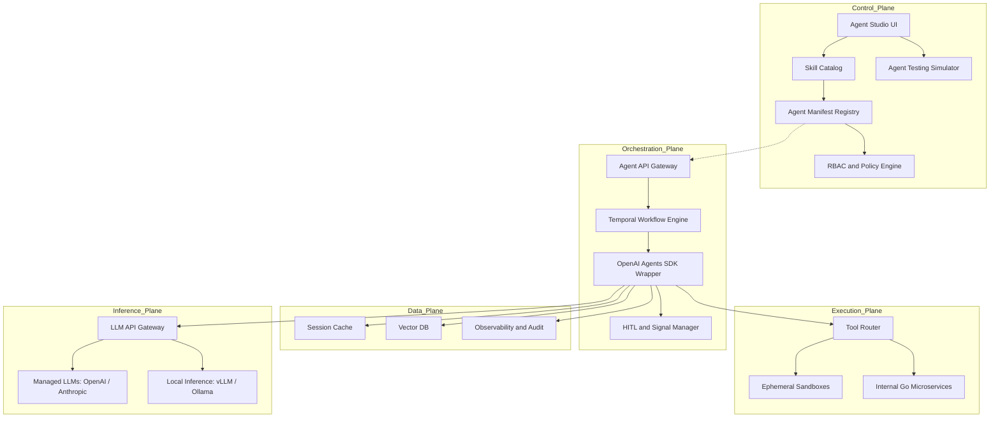
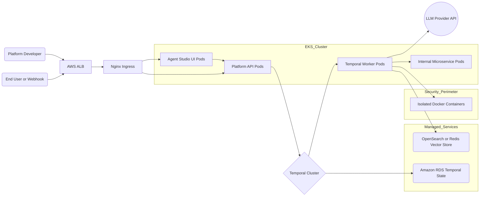
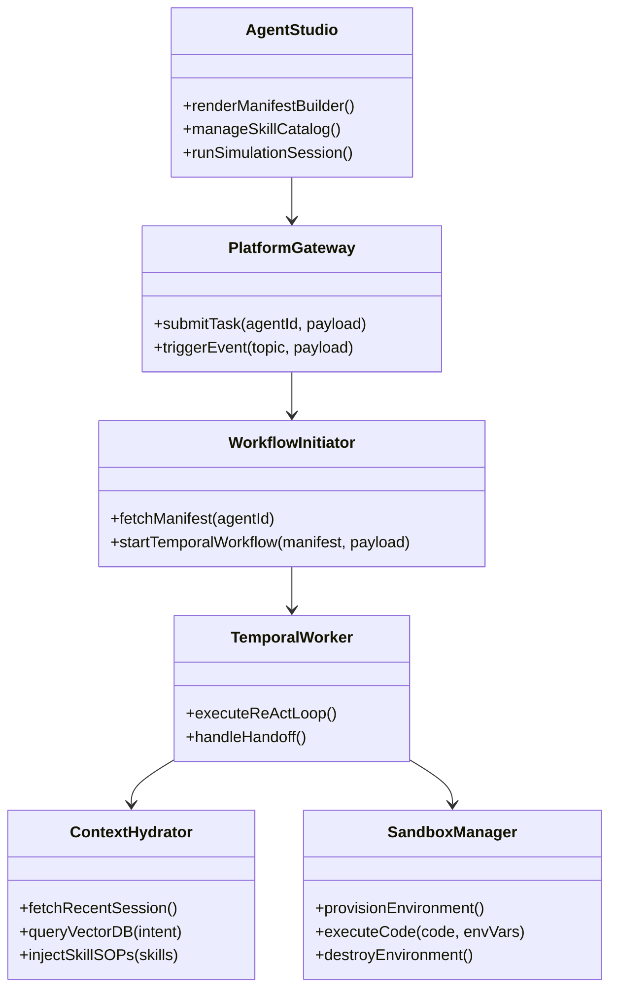
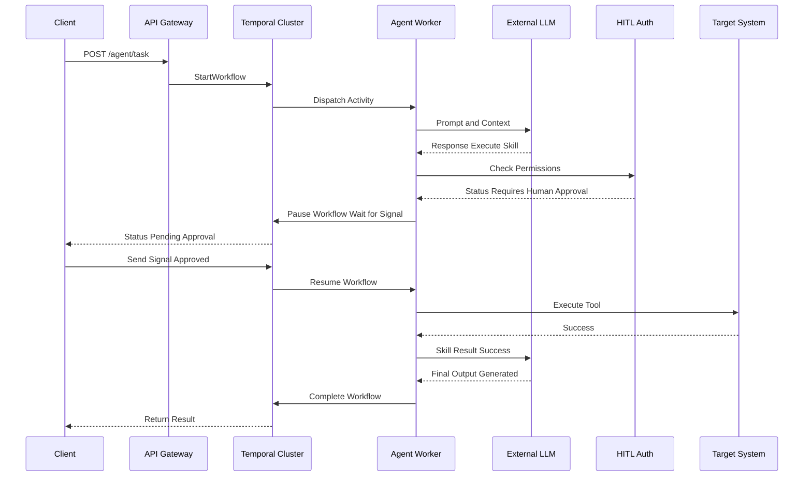

# Enterprise Agentic PaaS: Architecture & Design Spec


## Platform Vision & Capability Requirements

### Architecture Vision
To provide a secure, highly-scalable, and developer-friendly Platform-as-a-Service (PaaS) that democratizes the creation of resilient, stateful AI agents across the enterprise. By abstracting away the complex "plumbing" of LLM orchestration, state management, and security guardrails, the platform empowers product teams, SREs, and domain experts to deploy autonomous solutions (both interactive and event-driven) using a simple "No-Code" manifest approach.

### Core Capability Goals
Architecturally, the system is designed from the ground up to fulfill several strict enterprise requirements:
- **Democratize Creation**: Provide a visual **Agent Studio** and manifest builder, relying on a robust Skill Catalog so domain experts can deploy agents in hours rather than weeks.
- **Enterprise-Grade Resilience**: Guarantee zero-data-loss execution via **Durable ReAct loops**. By relying on Temporal for orchestration, if a node crashes or an API rate limit is triggered, the AI agent resumes its reasoning trace exactly where it left off.
- **Strict Execution Security**: Ensure AI actions execute using short-lived, least-privilege machine identities. Untrusted code or tools run securely inside isolated **Docker Containers** for maximum multi-cloud portability.
- **Human-in-the-Loop (HITL)**: Transparently throttle agent workflows requiring manual authorization for mutating actions, pausing execution indefinitely while awaiting secure MFA sign-off.
- **Universal Auditability**: Keep a 100% immutable log of all LLM reasoning trees, prompts, and tool triggers via OpenTelemetry tracing for regulatory compliance and SRE review.
- **Event-Driven Invocation**: Ensure agents can be triggered persistently via automated webhooks, supporting autonomous background remediation tasks without requiring interactive chat.

---

## 1. Logical Architecture
The logical architecture decouples the definition of an agent from its execution, ensuring platform engineers can manage the underlying infrastructure while developers focus on use cases. It clearly separates "Tools" (raw APIs) from "Skills" (governed logic).



- Control Plane: Features the Agent Studio, acting as the command center for users to build manifests. Senior engineers assemble raw APIs into governed items in the Skill Catalog, which No-Code users select to build their agents in the Agent Manifest Registry.
- Orchestration Plane (The Brain): An Agent API Gateway routes requests to a Temporal Workflow Engine. This engine runs the OpenAI Agents SDK inside a durable loop, handling state and Human-In-The-Loop (HITL) signaling.
- Execution Plane (The Hands): Completely isolated from the reasoning engine. Routes underlying tool calls to ephemeral sandboxes or internal Go microservices.
- Data Plane: Manages short-term session cache, long-term Vector DB storage, and OpenTelemetry observability.
- Inference Plane: A centralized proxy routing all prompt inferences strictly outward to SaaS providers or inward toward self-hosted GPU edge nodes.

## 2. Physical Architecture (AWS Native)
Maps the logical components to an AWS cloud-native environment, utilizing managed services.



- Ingress: Traffic flows through an AWS ALB to an Nginx Ingress on an Amazon EKS Cluster. Supports both synchronous REST/gRPC traffic and asynchronous webhook events.
- Compute (EKS):
  - Agent Studio UI Pods (e.g., React/Next.js).
  - Platform API Pods (Golang).
  - Temporal Worker Pods (Python/Go) running the SDK.
  - Internal Microservice Pods.
- Isolation Layer: Arbitrary code execution happens in a strictly peered, isolated VPC/Subnet using dedicated ephemeral Docker Containers.
- Managed Persistence:
  - Amazon RDS (PostgreSQL) for Temporal's backend state.
  - Amazon OpenSearch or Elasticache (Redis) for Vector Embeddings.

## 3. Component Design



- Agent Studio (React/Vue): Frontend application for lifecycle management, creating skills, building agent manifests, and simulation.
- Platform Gateway (Golang): The REST/gRPC/Webhook entry point. Handles rate limiting, initial authentication, and event payload mapping.
- Workflow Initiator (Golang): Reads the YAML manifest and translates it into a Temporal workflow request.
- Temporal Worker (Python/Go): The core process running the OpenAI Agents SDK. Executes the ReAct loop and handles handoffs.
- Context Hydrator: Injects relevant context (both from long-term memory and specific Skill SOPs) into the LLM's system prompt before execution.
- Sandbox Manager: Provisions secure execution environments on the fly and destroys them post-execution.

## 4. Execution Sequence (Interaction Flow)



## 5. Deployment Topology
- High Availability: Deployments are spread across multiple Availability Zones (AZ1, AZ2) using standard EKS topology spread constraints.
- Scaling: Temporal Worker Pods scale horizontally via HPA based on Temporal queue depth rather than raw CPU utilization.
- Observability: OTel Collector Daemons run on every EKS node, silently capturing all traces and exporting them to the central observability stack (Prometheus/Grafana) to ensure absolute auditability of the agent's actions. The Agent Studio pulls from this stack to display execution graphs.

## 6. Detailed Tech Stack Choices

- **Frontend (Agent Studio UI)**: React with Next.js for SSR and fast routing. Tailwind CSS for styling. Flowable diagramming libraries (e.g., React Flow) for the Visual Manifest Builder and Execution Trace Visualizer.
- **API Gateway & Routing**: Golang (using Gin or Echo) for high concurrency, low latency, and efficient payload mapping.
- **Orchestration**: Temporal workflow engine for durable execution. Golang Temporal SDK for the Workflow Initiator, and Python Temporal SDK for the Agent Workers (to leverage the Python AI ecosystem).
- **AI Agent Framework**: **OpenAI Agents SDK**. The platform strictly standardizes on the OpenAI Agents SDK using its native Temporal workflow extensions to ensure maximum durability of ReAct reasoning loops within the Python generic workers.
- **LLM Gateway & Inference Proxy**: A centralized router (e.g., LiteLLM) handling load balancing, token governance, and API schema standardization. Bridges uniformly to external endpoints (OpenAI, Bedrock) or locally hosted endpoints (vLLM, Ollama, LMStudio) maintaining strict data sovereignty.
- **State & Persistence**: PostgreSQL (via Amazon RDS) for Temporal state and platform metadata. Amazon OpenSearch / Redis for vector embeddings and short-term session caching.
- **Sandboxed Execution**: Ephemeral sandboxes using isolated Docker Containers for executing untrusted tool code securely and maintaining high portability.
- **Observability**: OpenTelemetry (OTel) collectors on EKS nodes reporting traces to a centralized Prometheus/Grafana and Jaeger stack for immutable auditability.

## 7. Project Structure (Monorepo)

```text
agentic-paas/
├── apps/
│   ├── agent-studio/         # Next.js frontend application
│   └── platform-gateway/     # Golang public API Gateway
├── services/
│   ├── workflow-initiator/   # Golang service submitting Temporal jobs
│   ├── agent-workers/        # Python Temporal workers (ReAct loop execution)
│   ├── context-hydrator/     # Go/Python service interacting with VectorDB
│   └── internal-tools/       # Go microservices for primitive platform tools
├── packages/
│   ├── shared-protos/        # Protocol Buffers / gRPC definitions
│   └── skill-sdk/            # Internal SDK for defining new tool schemas
├── infra/
│   ├── terraform/            # AWS VPC, RDS, EKS, OpenSearch definitions
│   └── k8s/                  # Kubernetes Deployments / Helm charts
└── docs/                     # Architecture and technical specs
```

## 8. Core Service Descriptions

- **Platform Gateway**: The edge entry point. Handles SSO authentication (OIDC/SAML), role-based access control, rate limiting, and translates webhook events into standard platform events.
- **Workflow Initiator & API**: Serves traffic from the Agent Studio (saving manifests, retrieving logs) and acts as the bridge that safely submits workflow configurations to the Temporal Cluster.
- **Agent Workers (Python)**: The heavy-lifting compute nodes horizontally scaled using HPA. These listen to Temporal task queues, manage the ReAct reasoning loops, and handle context injection.
- **LLM Gateway Router**: The unified proxy that Worker nodes channel inferences through. It standardizes API formats, auto-recovers via fallbacks, manages tracking budgets, and connects queries natively to local deployment architectures like `Ollama` and `vLLM`.
- **Tool Proxy / Sandbox Manager**: An isolation service that workers call to safely execute arbitrary code or query internal systems via strict egress-controlled ephemeral Docker containers.
- **Observability Sink**: The unified daemon collectors picking up structured logs and metrics mapping them precisely to execution histories for SRE review and debugging via the Agent Studio.

## 9. Low-Level Component Design & API Contracts

### 9.1 Database & Persistence Specifications
- **Relational DB (Amazon RDS - PostgreSQL)**: Serves as the primary source of truth. It stores:
  - Temporal backend state (workflow histories, queues).
  - Platform configuration (Agent manifest definitions, UI settings).
  - Governance metadata (RBAC rules, Skill definitions, and SOPs).
- **Vector Database (PGVector via RDS)**: Leveraging the `pgvector` extension within the existing PostgreSQL cluster. This minimizes infrastructure footprint while providing highly performant exact/approximate nearest-neighbor searches for long-term agent memory and RAG querying.
- **Cache (Amazon ElastiCache - Redis)**: Interfaced by the Gateway for:
  - Global rate limiting.
  - Short-term conversational memory buffering.
  - Ephemeral session state lock management.

### 9.2 Service Languages & Protocols
Explicitly decoupled communication boundaries:
- **Agent Studio <--> Gateway**: `REST/JSON` over HTTPS. Optimized for standard browser interactions.
- **Gateway <--> Internal Services**: Internal `gRPC` over HTTP/2 using Protobuf schemas. Ensures strict typings, generated client stubs, and multiplexed performance.
- **Workflow Initiator <--> Temporal Workers**: Native `gRPC` via Temporal SDK bridging through the Temporal Cluster.
- **Temporal Workers <--> Internal Microservices**: `gRPC` or `REST` depending on legacy integrations, executed via the Tool Router.
- **Temporal Workers <--> LLM Provider**: `REST/HTTPS` mapping directly to provider APIs exclusively using the standard OpenAI SDK format.

### 9.3 Component Interface Definitions (API Docs)

**1. External REST API (Webhook Trigger)**
A sample inbound request from an external observability service (e.g., Datadog) triggering a remediation agent:

```http
POST /api/v1/agents/{agent_id}/trigger
Content-Type: application/json
Authorization: Bearer <OIDC_TOKEN_HERE>

{
  "event_source": "datadog-monitor",
  "payload": {
    "alert_id": "AL-99238",
    "description": "API latency exceeded 5s threshold",
    "metrics": {
       "latency_ms": 5200,
       "cluster": "prod-us-west-2"
    }
  }
}
```

**2. Internal gRPC Interface (Workflow Initiator)**
A Protobuf snippet showing how the public Gateway commands the internal Workflow Initiator service:

```protobuf
syntax = "proto3";
package platform.workflow.v1;

service WorkflowInitiator {
  // Dispatches a new async reasoning loop into the Temporal cluster
  rpc StartAgentSession(StartAgentRequest) returns (StartAgentResponse);
}

message StartAgentRequest {
  string agent_id = 1;         // Manifest ID from Postgres
  string session_id = 2;       // Request trace / idempotency key
  map<string, string> context = 3; // Initial injected telemetry
}

message StartAgentResponse {
  string workflow_id = 1;
  string run_id = 2;
  string status = 3;
}
```

### 9.4 Temporal Worker Internal Design (Python)
The Worker is implemented iteratively, wrapping the OpenAI Agents SDK into durable Temporal blocks:
- **Activities (`@activity.defn`)**: Any non-deterministic external calls (e.g., LLM inference, calling the Sandbox Manager, querying PGVector) are wrapped as discrete activities. This ensures the cluster automatically handles timeout retries.
- **Workflow (`@workflow.defn`)**: The core ReAct loop is implemented as a strict, stateful workflow function. It orchestrates the activities and pauses execution natively using Temporal's `workflow.wait_condition` to suspend itself while awaiting off-system Human-In-The-Loop (HITL) approval signals via the Gateway.

## 10. Architectural Solutions for Non-Functional Requirements

### 10.1 Execution Sandboxing (NFR1)
- **Solution**: The Tool Proxy service isolates mutating capabilities by forwarding untrusted logic to ephemeral Docker container infrastructure. All agent tool execution running arbitrary scripts is natively containerized with restricted egress blocking lateral internal network movement.

### 10.2 Immutable Auditability (NFR2)
- **Solution**: OpenTelemetry (OTel) instrumentation across all Go/Python microservices. Every LLM prompt, context injection, and agent tool execution is logged with a trace ID and exported to an immutable data store (e.g., centralized Prometheus/Grafana stack). The Agent Studio UI queries this trace backend to reconstruct visual DAG graphs for post-incident review.

### 10.3 Fault Tolerance & Concurrency (NFR3, NFR4)
- **Solution**: By using **Temporal** as the core orchestrator, the agent ReAct loop executes asynchronously. If an underlying EKS worker node terminates abruptly, Temporal detects the lost heartbeat and restarts the isolated Python execution loop directly from the last successful persisted activity, ensuring massive concurrency and 100% resilience against transient crashes.

### 10.4 Model Agnosticism (NFR5)
- **Solution**: By routing all model requests through an internal centralized **LLM Gateway** (e.g., LiteLLM), the `Agent Workers` only ever implement one standardized API format (like the OpenAI schema). The gateway automatically intercepts the stream and proxies it to Anthropic, Gemini, Azure, or crucially—safely routes sensitive inference requests into isolated local computational nodes running open-source models via **vLLM**, **Ollama**, or **LMStudio**. This inherently completely eradicates vendor lock-in.

### 10.5 Cost & Token Governance (NFR6)
- **Solution**: The **LLM Gateway** functions as a global token choke-point. It intercepts all inbound/outbound tokens and rigorously enforces exact budgets natively. Additionally, hard configurations inside the Agent Manifest govern a "Maximum Tool Execution Count" directly shutting down the Temporal Loop itself to prevent infinite ReAct generation bleed.

### 10.6 Agent Machine Identities (NFR7)
- **Solution**: Standardizing on **OIDC Identity Federation**. Agents do not have statically assigned internal passwords. Before querying internal microservices, the Temporal Worker authenticates itself to an internal STS module, swapping its Agent ID for a short-lived OIDC token matching its strict RBAC manifesto constraints.

## 11. Configuration & Secrets Management

To maintain enterprise security postures and streamline MLOps deployments, configuration and secrets are strictly segregated into three architectural layers:

### 11.1 Infrastructure & Application Config (GitOps)
- **Pattern**: Kubernetes ConfigMaps managed declaratively via GitOps (e.g., ArgoCD or Flux).
- **Usage**: Used for static, service-level configurations that bind the platform topology together. Examples include database connection strings (excluding passwords), Temporal cluster addresses, OpenTelemetry collector endpoints, and environment-specific flags (Dev, Staging, Prod). This ensures infrastructure immutability.

### 11.2 Dynamic Agent & Platform Config (Database / Cache)
- **Pattern**: Polled Relational State (PostgreSQL + Redis).
- **Usage**: Unlike static infrastructure, Agent capabilities (System Prompts, Max Token limits, Attached Skills, Fallback Models) change rapidly. To avoid requiring software redeployments for behavior changes, the Agent Studio UI mutates these configurations directly in Postgres. The API Gateway and Context Hydrator read and locally cache these definitions dynamically at task initiation to instantiate the correct ReAct loop parameters on the fly.

### 11.3 Enterprise Secrets & Vault Management (AWS Native)
- **Pattern**: **AWS Secrets Manager** deeply integrated with Kubernetes via the **External Secrets Operator (ESO)**.
- **Usage**: Hardcoded LLM API keys (for external SaaS providers), OIDC STS signing secrets, and highly sensitive legacy system passwords are NEVER stored in Git repositories or injected as raw environment variables.
- **Just-In-Time (JIT) Tool Execution**: When the reasoning agent decides to utilize a mutating skill on a sensitive external system, the Sandbox Service dynamically fetches the required API key from the Vault exclusively for the lifespan of that specific Docker container execution. This ensures the reasoning agent's memory and state are strictly isolated from the physical underlying raw credentials.

## 12. Local Development Architecture (DevEx)

To ensure rapid iteration cycles without incurring unnecessary cloud costs or bottlenecking on strict IAM policies, the architecture is designed to map cleanly onto a developer's local machine (macOS/Linux) via a hybrid configuration.

### 12.1 Local Backing Services (Docker Compose)
Heavy infrastructure state and dependencies should **not** be installed natively. A unified `docker-compose.yml` spins up the essential ecosystem backbone locally:
- **`postgres`**: Customized container running the `pgvector` extension.
- **`redis`**: For caching mock session locks.
- **`temporal-server` & `temporal-ui`**: The standalone orchestration cluster (available at `localhost:8233`).
- **`prometheus` & `grafana`**: Providing immediate local access to the OpenTelemetry tracing UI.

### 12.2 Service Execution & Hot-Reloading
Rather than stuffing complex Go/Python build pipelines heavily inside Docker—where debugger attachments drop and iteration loops slow to a crawl—developers run the actual microservices natively to leverage their IDEs (VS Code/Cursor):
- **Agent Studio (Frontend)**: Runs natively via standard React tooling: `npm run dev` (targeting `localhost:3000`).
- **Golang Gateway & Initiator**: Runs natively using `air` to parse code changes automatically and trigger near-instant hyper-local recompilations.
- **Python Agent Workers**: Runs securely via isolated virtual environments (`venv` or `poetry`) combined with `watchfiles` to automatically recycle the Temporal worker instances the moment custom core Agent prompt changes are detected.

### 12.3 Offline Testing & Mocking Constraints
To iterate offline or avoid executing dangerous tools accidentally during testing:
- **Local LLM Interference**: The Internal proxy is reconfigured via `.env` files to point to a local **Ollama** daemon (running completely offline, e.g., on a MacBook's M2 GPU) utilizing models like `Llama-3` or `Mistral` instead of burning public OpenAI billing budgets.
- **Execution Sandbox Compatibility**: Because the platform universally standardizes on Docker Containers for tool execution rather than complex MicroVMs, the sandboxing layer ports natively onto Mac hardware. Untrusted tools smoothly spawn inside isolated **Docker Containers** (via standard Docker-out-of-Docker socket mounting) locally exactly as they do in production, fully preventing environment mismatches.
