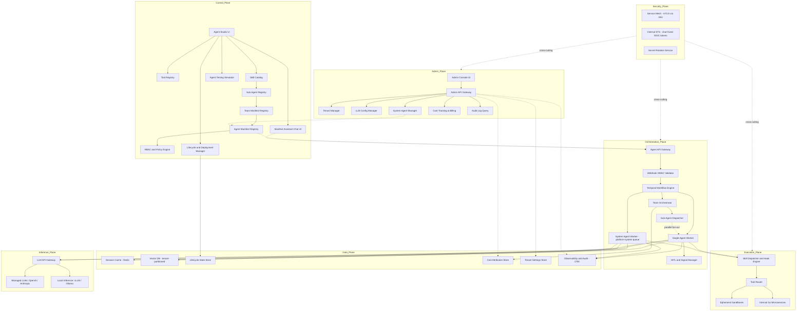
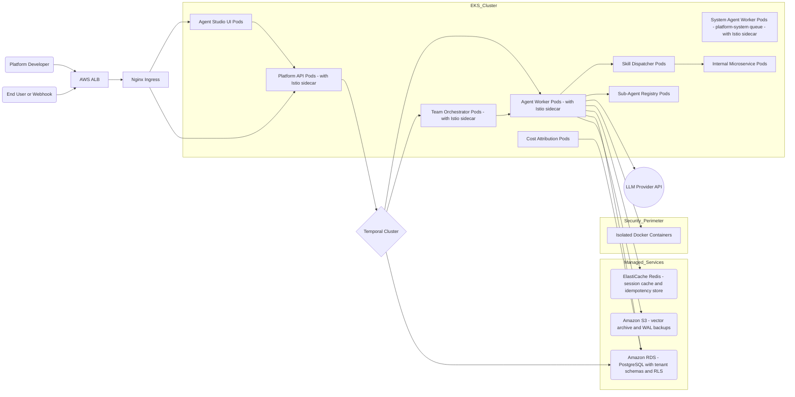
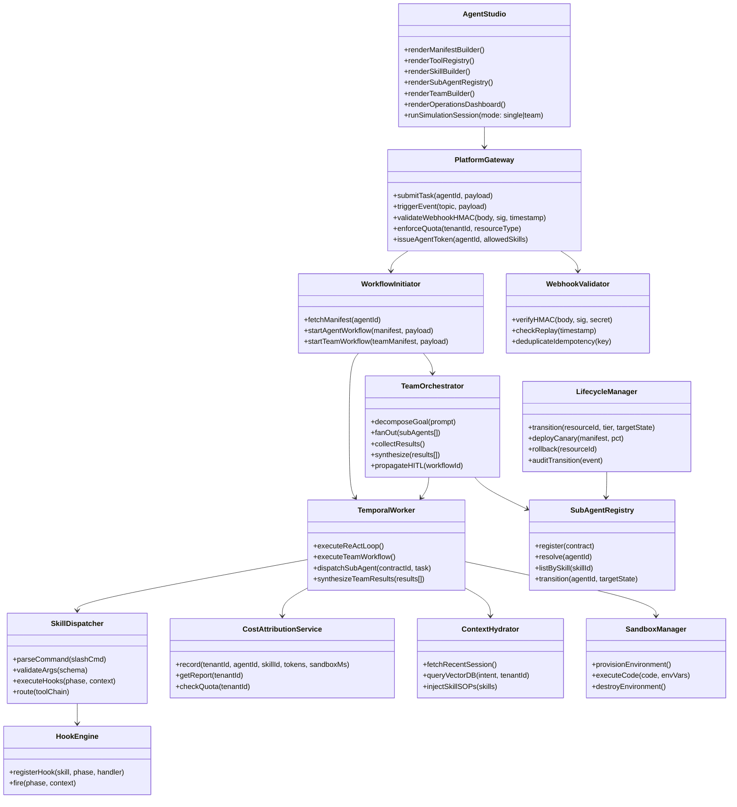
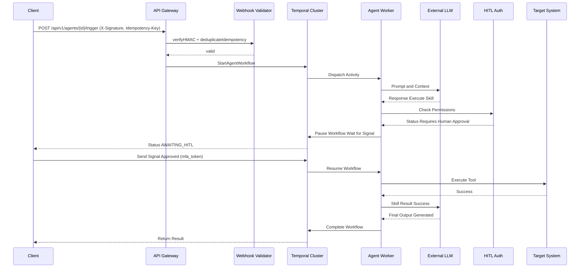
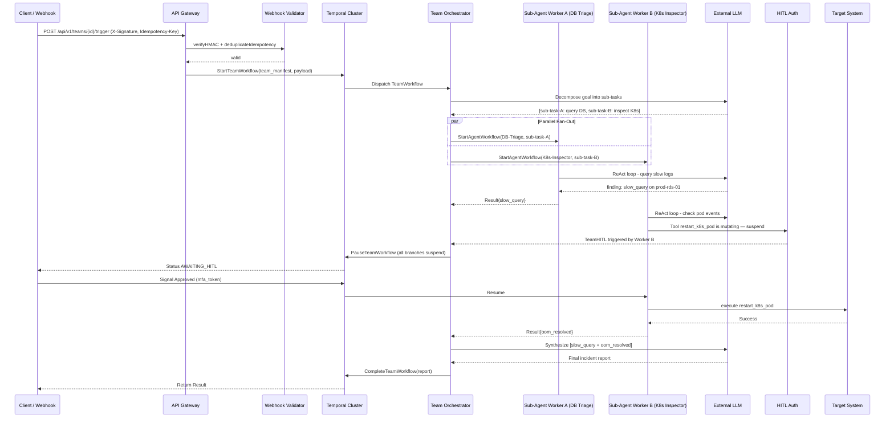
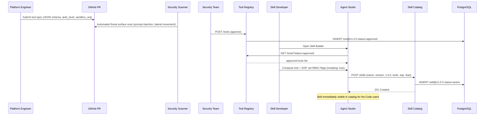

# Enterprise Agentic PaaS: Architecture & Design Spec


## Platform Vision & Capability Requirements

### Architecture Vision
To provide a secure, highly-scalable, and developer-friendly Platform-as-a-Service (PaaS) that transforms how enterprises build and operate AI-driven automation. The platform is structured around a four-tier capability hierarchy — **Tools**, **Skills**, **Sub-Agents**, and **Agent Teams** — that separates primitive execution from governed composition, and single-agent reasoning from coordinated multi-agent workflows. This architecture enables platform engineers to govern every primitive while domain experts assemble sophisticated, self-orchestrating workflows without writing code.

### Core Capability Goals
Architecturally, the system is designed from the ground up to fulfill several strict enterprise requirements:
- **Composable Agent Workforce**: A four-tier hierarchy (Tools → Skills → Sub-Agents → Agent Teams) allows incremental composition — from raw API operations through governed skill bundles to coordinated specialist pipelines that decompose and solve complex multi-domain tasks in parallel.
- **Enterprise-Grade Resilience**: Guarantee zero-data-loss execution via **Durable ReAct loops** and **Team Orchestration** backed by Temporal. Sub-agent failures within a team are retried independently; the team orchestrator resumes without restarting the entire workflow.
- **Zero-Trust Security by Design**: Every tool invocation uses a short-lived, scoped OIDC token. All inter-service communication runs over mTLS. Inbound webhooks require HMAC-SHA256 signature validation. Secrets rotate automatically with leak-detection scanning.
- **Human-in-the-Loop (HITL)**: Any agent or team member invoking a mutating tool suspends the entire team workflow pending MFA-backed approval, with full execution trace context visible to the Approver.
- **Governed Extensibility Without Lock-in**: Security-reviewed tool registration, independently versioned skills, and per-sub-agent model selection prevent both accidental capability sprawl and vendor lock-in.
- **Operational Accountability**: SLOs are tracked at workflow, skill, and tool granularity. Every platform action is costed and attributed per tenant, agent, and skill. Incident runbooks and SLO burn-rate alerts ensure predictable operation at enterprise scale.

---

## 1. Logical Architecture
The logical architecture decouples the definition of an agent from its execution across seven planes. It separates primitive capability registration (Tools) from governed composition (Skills), single-agent reasoning from coordinated multi-agent execution (Agent Teams), and agent creation from platform administration. A dedicated Security Plane enforces zero-trust policy across all planes as a cross-cutting concern.



- **Control Plane**: The command center for all four tiers. Platform engineers register Tools via the Tool Registry (security review required). Skill Developers compose Tools into Skills in the Skill Catalog. Sub-Agent Developers define capability contracts in the Sub-Agent Registry. No-Code creators wire Sub-Agents into Team Manifests and Agent Manifests. The Lifecycle Manager governs state transitions and deployment strategies across all tiers. The **Manifest Assistant Chat UI** is embedded in the Agent Creation dialog, allowing users to interactively design agent manifests with AI assistance.
- **Admin Plane (Platform Governance)**: A dedicated governance layer for platform operators. The **Admin Console UI** (Next.js frontend on port 3001) provides graphical administration. The **Admin API Gateway** (Go service on port 8089) enforces bearer-token authentication and aggregates cross-tenant data without tenant filtering. Responsibilities: tenant CRUD (creation, quotas, status), LLM provider configuration (proxy URL, API keys, per-tenant model allowlists), system agent management (lifecycle transitions for Manifest Assistant and other platform agents), cost attribution and billing (per-tenant/agent/skill aggregation from `cost_events`), audit log queries (immutable records of all lifecycle events across resources), and cross-tenant execution visibility (no tenant isolation for admin queries). The Admin Plane integrates with Tenant Store, Cost Store, and OTel Data Plane for governance data.
- **Orchestration Plane (The Brain)**: The Agent API Gateway validates inbound requests (HMAC on webhooks) and routes to the Temporal Workflow Engine. For single agents, the engine dispatches to an Agent Worker. For teams, it dispatches to the Team Orchestrator, which fans out to the Sub-Agent Dispatcher, launching parallel Agent Workers per sub-agent. HITL signals propagate team-wide, suspending all parallel branches. A **System Agent Worker** pool runs on the isolated `platform-system-agent-queue` for platform system agents (e.g., Manifest Assistant), keeping platform automation separate from user workflows.
- **Execution Plane (The Hands)**: The Skill Dispatcher receives slash-command-style invocations, validates arguments, fires pre/post hooks, and routes tool chains through the Tool Router. The Tool Router dispatches to Ephemeral Sandboxes (arbitrary code) or Internal Go Microservices (typed platform APIs).
- **Data Plane**: Redis for short-term session context; pgvector (tenant-partitioned) for long-term semantic memory; a Lifecycle State Store for immutable audit trails of all four-tier transitions; a Cost Attribution Store (TimescaleDB) for per-tenant/agent/skill cost metering; OTel collectors for unified observability. The Tenant Settings Store (`tenant_settings` table) is managed by the Admin Plane for storing tenant metadata, quotas, and status.
- **Security Plane (Cross-Cutting)**: Istio enforces mTLS between all services. The Internal STS issues short-lived (5-min TTL), scoped OIDC tokens for every agent and sub-agent invocation. The Secret Rotation Service manages automated credential rotation and leak detection.
- **Inference Plane**: A centralized LLM API Gateway (e.g., LiteLLM) proxies all model requests. Model selection is configurable per sub-agent — members of the same team can target different providers without changing the team manifest structure.

## 1.1 Platform System Agents (Manifest Assistant Architecture)

Platform system agents are specialized agents owned and operated by the platform to enhance user experience and operator efficiency. They are distinct from user agents in several ways:

**Tenant Strategy (No Schema Changes)**
- System agents operate under a reserved `tenant_id: "platform-system"` — no database schema changes required.
- User tenant queries (e.g., `GET /api/v1/agents` with header `X-Tenant-ID: my-tenant`) never return platform system agents. They are visible only via explicit platform-system requests.
- This is a **convention-based isolation** pattern: the frontend and API Gateway enforce multi-tenancy via headers; the database does not distinguish platform agents from user agents.

**Isolated Execution Queue**
- Platform system agents run on an isolated Temporal task queue: `platform-system-agent-queue`.
- A dedicated **System Agent Worker** instance (scaled independently from user Agent Workers) consumes tasks from this queue.
- This isolation ensures platform automation (e.g., Manifest Assistant drafting prompts) does not contend for resources with user workflows.

**Manifest Assistant Agent (V1 Reference Implementation)**
The **Manifest Assistant** is the first platform system agent. It helps no-code users design agent manifests conversationally:

1. **Catalog Context Injection**: 
   - Frontend fetches active skills and approved tools via `skillsApi.list("active")` and `toolsApi.list("approved")`.
   - These are serialized into a compact `<catalog>` XML block: `<catalog>\nskills:\n  - name: "...", version: "...", description: "..."\ntools:\n  - name: "...", version: "..."\n</catalog>`
   - User's first message is enriched: `<catalog>...\n\nUser request: [user input]`
   - **No API changes needed** — catalog awareness is purely a frontend concern.

2. **Threefold Guidance**:
   - **System Prompt Drafting**: Generates a persona-driven system prompt (starting with "You are...") based on user description.
   - **Skill Recommendation**: Recommends exact skills from the catalog by name and version. Never hallucinations.
   - **Skill Gap Detection**: When catalog lacks a capability, proposes a new skill manifest (`## Skills/Tools to Create`) — users can export and hand to Skill Developers.

3. **Streaming Response via SSE**:
   - `POST /api/v1/agents/manifest-assistant/chat` accepts `{ message: string, tenant_id: "platform-system" }`.
   - Returns Server-Sent Events stream with events: `{ type: "thinking" | "tool_call" | "text" | "done" | "error", ... }`.
   - Frontend renders thinking blocks (collapsible), tool calls (code execution logs), and final structured response in real-time.

4. **One-Click Apply**:
   - Frontend parses response for `## System Prompt Draft` and `## Recommended Skills` headers using regex.
   - Displays preview of system prompt and skill recommendations.
   - User clicks "Apply to Form" → values are auto-populated into the Agent Creation form via React Hook Form's `setValue()` and `replace()`.

**Message Format Compatibility**
- Manifest Assistant is powered by a capable LLM (e.g., Claude Sonnet).
- Messages follow Anthropic API format: assistant messages with tool_call blocks; user messages with tool_result blocks (not "role": "tool").
- LLM Gateway routes system agent requests to the configured proxy endpoint (e.g., custom Anthropic inference endpoint with Bearer token auth).

**Idempotency & Resilience**
- System agent workflows follow the same durable execution model as user agents.
- On failure (LLM provider timeout, activity retry exhaustion), the workflow emits a `type: "error"` event; frontend gracefully handles errors and displays fallback UI.
- Multiple sequential messages from the same user form a **session** (tracked by session ID); memory is preserved across turns.

---

## 1.2 Admin Plane (Platform Governance Architecture)

The **Admin Plane** is a dedicated governance layer that separates platform operations from user-facing agent creation and execution. It provides platform administrators with tenancy management, LLM provider configuration, cost attribution, audit logging, and cross-tenant observability.

### Admin API Service (`services/admin-api`, port 8089)

A thin Go aggregator service acting as the single source of truth for platform governance data. Key design principles:

1. **Strong Authentication**: Every endpoint (except `/health`) requires `Authorization: Bearer <ADMIN_API_KEY>` validation. Admin API keys are long-lived secrets, rotated quarterly.

2. **Cross-Tenant Visibility**: Unlike user APIs which enforce tenant isolation via `X-Tenant-ID` headers, the Admin API queries Temporal and PostgreSQL **without tenant filters**, providing platform-wide aggregation. Example: `GET /api/v1/admin/executions` returns execution traces across all tenants; user `GET /api/v1/agents` would only return agents in the caller's tenant.

3. **DB-Backed Configuration**: LLM provider config (URLs, API keys) is persisted to the `platform_config` table, enabling durability across service restarts. Changes via `PUT /api/v1/admin/llm/config` update both the LLM Gateway in-memory state and the database immediately.

4. **Data Aggregation**:
   - **Tenant CRUD**: Direct queries to `tenant_settings` table. Updates enforce constraints (e.g., token_budget must be > 0). Quota enforcement is delegated to the API Gateway (soft/hard limits).
   - **Cost Aggregation**: Queries `cost_events` table grouped by tenant, agent, skill, model. Computes estimated costs using configurable rate tables.
   - **Audit Log**: Direct queries to `lifecycle_events` table with resource type and state change filtering.
   - **LLM Config Proxying**: Acts as a proxy to LLM Gateway's internal `/admin/config` endpoint; persists updates to DB.

5. **Rate Limiting & DDoS Protection**: 1000 req/min per admin key; 10000 req/min aggregate. Excess requests return `429 TooManyRequests`. IP-based circuit breaker blocks IPs exceeding 10k req/min for 5 minutes.

### Admin Console (`apps/admin-console`, port 3001)

A Next.js web application providing graphical administration interfaces. Key architectural decisions:

1. **Auth via SessionStorage**: Admin API key is stored in `sessionStorage` (cleared on browser close) after verification via `POST /api/v1/admin/auth/verify`. All subsequent requests include the key in the `Authorization` header.

2. **React Query for State**: Uses TanStack Query with 5-minute `staleTime` for data freshness and retry logic (1 retry on failure). Dashboard auto-refreshes every 30 seconds.

3. **Independent Deployment**: Runs on a separate hostname/port from Agent Studio. No cross-console communication allowed. CORS restricted: Admin Console only talks to Admin API.

4. **Page Structure**:
   - **`/login`** — Accepts admin key; validates via `POST /api/v1/admin/auth/verify`
   - **`/dashboard`** — Summary cards, health checks, recent executions
   - **`/tenants`** — Full CRUD: list, create (modal), detail view with quota editing and status toggles
   - **`/llm-config`** — Mode selection, provider config (URL, keys), per-tenant model allowlists
   - **`/system-agents`** — List/edit system agents; deploy transitions
   - **`/executions`** — Cross-tenant execution visualizer with DAG rendering and live streaming
   - **`/cost`** — Per-tenant cost breakdown by agent, skill, model with CSV export
   - **`/audit`** — Immutable audit log with filtering and export

### Admin-Specific Data Model

Three new PostgreSQL tables persist admin governance state:

```sql
CREATE TABLE tenant_settings (
    tenant_id TEXT PRIMARY KEY,
    display_name TEXT NOT NULL,
    status TEXT NOT NULL DEFAULT 'active',  -- active | suspended | archived
    max_concurrent_workflows INT DEFAULT 50,
    token_budget_monthly BIGINT DEFAULT 10000000,
    created_at TIMESTAMPTZ DEFAULT NOW(),
    updated_at TIMESTAMPTZ DEFAULT NOW()
);

CREATE TABLE tenant_model_access (
    tenant_id TEXT NOT NULL,
    model_id TEXT NOT NULL,
    enabled BOOLEAN DEFAULT TRUE,
    daily_token_limit BIGINT DEFAULT NULL,  -- NULL = unlimited
    PRIMARY KEY (tenant_id, model_id)
);

CREATE TABLE platform_config (
    key TEXT PRIMARY KEY,
    value TEXT NOT NULL,
    updated_at TIMESTAMPTZ DEFAULT NOW()
);
-- Rows: ('llm_proxy_url', '...'), ('anthropic_api_key_encrypted', '...'), ('mode', 'anthropic')
```

### Admin API Routes

| **Method** | **Route** | **Purpose** |
|---|---|---|
| POST | `/api/v1/admin/auth/verify` | Validate admin key; return role |
| GET | `/api/v1/admin/tenants` | List all tenants with metadata |
| POST | `/api/v1/admin/tenants` | Create new tenant with defaults |
| GET | `/api/v1/admin/tenants/:id` | Fetch tenant detail (counts, quotas) |
| PUT | `/api/v1/admin/tenants/:id/quota` | Update max workflows and budget |
| PUT | `/api/v1/admin/tenants/:id/status` | Activate/suspend/archive |
| GET | `/api/v1/admin/llm/config` | Fetch current LLM config |
| PUT | `/api/v1/admin/llm/config` | Update config + DB persistence |
| GET | `/api/v1/admin/llm/access` | List models and per-tenant access |
| PUT | `/api/v1/admin/llm/access/:tenant_id` | Set model allowlist + limits |
| GET | `/api/v1/admin/system-agents` | List platform system agents |
| GET | `/api/v1/admin/system-agents/:id` | Fetch single system agent manifest |
| PUT | `/api/v1/admin/system-agents/:id` | Update manifest |
| POST | `/api/v1/admin/system-agents/:id/transition` | Lifecycle transition |
| GET | `/api/v1/admin/executions` | Query execution traces (all tenants) |
| GET | `/api/v1/admin/executions/:id` | Fetch single execution + DAG |
| GET | `/api/v1/admin/cost` | Aggregate cost data |
| GET | `/api/v1/admin/cost/:tenant_id` | Per-tenant cost breakdown |
| GET | `/api/v1/admin/audit` | Query audit log |

### Integration Points

- **LLM Gateway**: Admin API proxies config queries to LLM Gateway's internal `/admin/config` endpoint.
- **Temporal**: Admin API queries Temporal SDK for workflow history and execution traces.
- **PostgreSQL**: Reads/writes to `tenant_settings`, `tenant_model_access`, `platform_config`, `cost_events`, `lifecycle_events` tables.
- **Agent Studio API Gateway**: API Gateway enforces tenant-scoped quotas from `tenant_settings` (max_concurrent_workflows, token_budget_monthly).

---

## 1.3 MCP Integration Architecture

The **MCP Integration** layer enables bidirectional tool discovery and invocation via the Model Context Protocol (HTTP + SSE transport). Agents gain access to external tools without platform redeployment, and external MCP clients gain access to platform skills via a token-gated MCP server endpoint.

### MCP Client: `services/mcp-registry` (port 8090)

A Go service managing external MCP server connections per tenant. Responsibilities:

1. **Server Registration & Discovery**:
   - Agents specify `mcp_servers: ["server-id-1", "server-id-2"]` in their manifest
   - At workflow start, the `discover_mcp_tools` activity queries the MCP Registry to fetch available tools
   - Tools are cached in `mcp_tool_cache` to avoid redundant network calls on every workflow invocation
   - Cache is validated on each agent start and refreshed if stale (TTL configurable, default 1 hour)

2. **Tool Naming Convention**:
   - External MCP tools are renamed to `mcp__{server_name}__{tool_name}` to ensure globally unique identifiers
   - This naming prevents collisions with platform skills and allows bidirectional routing (tool name → server mapping)

3. **Tool Invocation**:
   - When a workflow invokes a tool matching `mcp__*`, the `invoke_mcp_tool` activity routes the call to the MCP Registry
   - The registry translates the namespaced tool name back to the original server and tool name
   - HTTP POST to the external MCP server with JSON-RPC 2.0 payload
   - Result is returned to the workflow for further reasoning

4. **Data Model**:
   ```sql
   CREATE TABLE mcp_servers (
       id TEXT PRIMARY KEY,
       tenant_id TEXT NOT NULL,
       name TEXT NOT NULL,          -- e.g., "github-mcp", "filesystem"
       url TEXT NOT NULL,           -- e.g., http://github-mcp:3000
       enabled BOOLEAN DEFAULT true,
       created_at TIMESTAMPTZ DEFAULT NOW(),
       updated_at TIMESTAMPTZ DEFAULT NOW()
   );
   
   CREATE TABLE mcp_tool_cache (
       id TEXT PRIMARY KEY,
       mcp_server_id TEXT NOT NULL REFERENCES mcp_servers(id),
       tenant_id TEXT NOT NULL,
       tool_name TEXT NOT NULL,
       description TEXT,
       input_schema JSONB,          -- OpenAI-compatible parameters schema
       cached_at TIMESTAMPTZ DEFAULT NOW(),
       UNIQUE(mcp_server_id, tool_name)
   );
   ```

5. **REST API**:
   - `POST /api/v1/mcp/servers` — Register MCP server (requires `X-Tenant-ID`)
   - `GET /api/v1/mcp/servers` — List servers for tenant
   - `GET /api/v1/mcp/servers/:id/tools` — Discover tools (caches results)
   - `POST /api/v1/mcp/servers/:id/tools/refresh` — Force refresh cache
   - `POST /api/v1/mcp/servers/:id/call` — Invoke tool (routes to external server)

### MCP Server: `services/mcp-server` (port 8091)

A Go service exposing platform skills as an MCP server endpoint for external MCP clients. Responsibilities:

1. **Token-Gated Authentication**:
   - External clients authenticate with `Authorization: Bearer <token>`
   - Tokens are SHA-256 hashed and stored in `mcp_tokens` table with tenant association
   - Each token is scoped to a single tenant; only that tenant's skills are visible

2. **MCP Protocol Implementation**:
   - Implements JSON-RPC 2.0 over HTTP POST at `/mcp`
   - Supports `initialize` method: returns server capabilities
   - Supports `tools/list` method: queries skill-catalog for available skills, maps each to MCP tool format
   - Supports `tools/call` method: routes invocations to skill-dispatcher with tenant context
   - Implements SSE stream at `/mcp/sse` for spec compliance (no proactive events sent yet)

3. **Tool Discovery**:
   - On `tools/list`, fetches all skills from `skill-catalog` for the token's tenant
   - Converts each skill to MCP tool format:
     ```json
     {
       "name": "skill_name",
       "description": "Skill description from manifest",
       "inputSchema": {
         "type": "object",
         "properties": { ... skill input schema ... },
         "required": [ ... ]
       }
     }
     ```

4. **Tool Invocation**:
   - On `tools/call` with `{"name": "skill_name", "arguments": {...}}`:
   - Extracts tenant from token
   - POSTs to skill-dispatcher at `:8085/api/v1/skills/{name}/invoke`
   - Forwards request with `X-Tenant-ID: {tenant}` header
   - Returns result or error to the external MCP client

5. **Data Model**:
   ```sql
   CREATE TABLE mcp_tokens (
       id TEXT PRIMARY KEY,
       token_hash TEXT NOT NULL UNIQUE,  -- SHA-256 hash of raw bearer token
       tenant_id TEXT NOT NULL,
       description TEXT,
       created_at TIMESTAMPTZ DEFAULT NOW(),
       expires_at TIMESTAMPTZ            -- NULL = never expires
   );
   ```

6. **Admin Console Integration**:
   - New page: `/admin/mcp-servers` for token lifecycle management
   - Issues new tokens (generates 32-byte random, displays once, stores hash)
   - Revokes tokens (soft-delete via expires_at)
   - Shows MCP server URL for external client configuration

### Agent Workflow Changes

`services/agent-workers/workflows.py` — Enhanced ReAct loop:

1. **MCP Tool Discovery** (after manifest load):
   ```python
   if manifest.mcp_servers:
       mcp_tool_defs = await workflow.execute_activity(
           "discover_mcp_tools",
           args=[manifest.mcp_servers, tenant_id],
           start_to_close_timeout=timedelta(seconds=30),
       )
       # Strip __mcp_meta before LLM, store in lookup map for dispatch
       mcp_meta_map = {}
       for t in mcp_tool_defs:
           meta = t.pop("__mcp_meta", None)
           if meta:
               mcp_meta_map[t["function"]["name"]] = meta
       tool_defs.extend(mcp_tool_defs)
   ```

2. **Tool Dispatch** (in ReAct loop tool handling):
   ```python
   elif tool_name.startswith("mcp__"):
       meta = mcp_meta_map.get(tool_name, {})
       result = await workflow.execute_activity(
           "invoke_mcp_tool",
           args=[meta["server_id"], meta["tool_name"], args_dict, tenant_id],
           start_to_close_timeout=timedelta(seconds=60),
       )
   ```

### AgentManifest Extension

`packages/go-shared/pkg/models/models.go`:

```go
type AgentManifest struct {
    // ... existing fields ...
    MCPServers []string `json:"mcp_servers,omitempty"`  // IDs of external MCP servers
}
```

### Integration Points

- **MCP Client ↔ External MCP Servers**: HTTP POST JSON-RPC 2.0, no auth (server responsibility)
- **MCP Client ↔ Agent Workers**: Temporal activities `discover_mcp_tools` and `invoke_mcp_tool`
- **MCP Server ↔ Skill Dispatcher**: HTTP POST to `/api/v1/skills/{name}/invoke` with `X-Tenant-ID`
- **MCP Server ↔ Skill Catalog**: HTTP GET to `/api/v1/skills?tenant_id={id}` for tool discovery
- **Admin Console ↔ MCP Token Management**: Direct DB reads/writes to `mcp_tokens` (no separate API needed)

---

## 2. Physical Architecture (AWS Native)
Maps the logical components to an AWS cloud-native environment, utilizing managed services.



- **Ingress**: Traffic flows through AWS ALB to Nginx Ingress on EKS. Webhook events from external systems (Datadog, PagerDuty) enter through the same ALB; the API Gateway validates HMAC signatures before dispatching to Temporal.
- **Compute (EKS)** — all pods run Istio sidecars enforcing mTLS:
  - Agent Studio UI Pods (Next.js)
  - Platform API Pods (Go) — HMAC validation, RBAC, OIDC token issuance
  - Agent Worker Pods (Python/Temporal) — single-agent ReAct loops
  - Team Orchestrator Pods (Python/Temporal) — team decomposition, fan-out, synthesis
  - Sub-Agent Registry Pods (Go) — contract storage and lookup
  - Skill Dispatcher Pods (Go) — slash-command parsing, hook execution, tool routing
  - Cost Attribution Pods (Go) — OTel span consumption, quota enforcement
  - Internal Microservice Pods (Go) — primitive platform tools
- **Isolation Layer**: Arbitrary code execution runs in ephemeral Docker Containers in an isolated VPC subnet with blocked lateral network movement.
- **Managed Persistence**:
  - Amazon RDS (PostgreSQL) with per-tenant schemas, RLS, and TimescaleDB extension for cost time-series data
  - Amazon ElastiCache (Redis) for session context, rate limiting, and webhook idempotency key cache (24h TTL)
  - Amazon S3 for cold-storage archival of Vector DB embeddings and continuous WAL backups (RPO ≤ 15 min)

## 3. Component Design



- **Agent Studio (Next.js)**: Frontend for all four builder surfaces — Tool Registry, Skill Builder, Sub-Agent Registry, Team Manifest Editor — plus simulation in single-agent or team mode and the Operations Dashboard.
- **Platform Gateway (Go)**: Edge entry point. Validates HMAC signatures on webhook events, enforces per-tenant quotas, issues scoped OIDC tokens for agent executions, and routes to Workflow Initiator.
- **Webhook Validator (Go)**: Standalone middleware inside the Gateway. Computes and compares HMAC-SHA256 signatures, validates timestamps (anti-replay), and deduplicates idempotency keys via Redis.
- **Workflow Initiator (Go)**: Translates platform-level manifest IDs into Temporal workflow requests. Routes single-agent requests to `AgentWorkflow` and team requests to `TeamWorkflow`.
- **Team Orchestrator (Python/Temporal)**: Implements `TeamWorkflow`. Decomposes goals via LLM, fans out to sub-agent workers in parallel via `SubAgentDispatcher`, collects typed results, synthesizes the final response, and propagates HITL suspension team-wide.
- **Sub-Agent Registry (Go)**: Stateless CRUD service backed by PostgreSQL. Stores versioned sub-agent contracts. Resolves capability contracts at workflow start time.
- **Temporal Worker (Python)**: Implements single-agent `AgentWorkflow`. Runs the durable ReAct loop: context hydration → LLM reasoning → skill dispatch → observation → loop.
- **Skill Dispatcher (Go)**: Parses slash-command invocations, validates arguments against skill schemas, fires the Hook Engine for pre/post hooks, and routes tool chains to the Tool Router.
- **Hook Engine (Go)**: Executes declarative YAML-configured hooks at pre/post-skill boundaries for audit logging, cost metering, and HITL interception.
- **Lifecycle Manager (Go)**: Enforces state machines across all four tiers (Draft → Staged → Active ↔ Paused → Archived). Manages canary deployment traffic splitting via Argo Rollouts. Emits immutable lifecycle events to the Lifecycle State Store.
- **Cost Attribution Service (Go)**: Consumes OTel spans from a Kafka topic. Aggregates token counts, sandbox execution time, and Vector DB ops by (tenant, agent, skill). Enforces quota limits in real time.
- **Context Hydrator**: Loads tenant-partitioned vector memories and injects Skill SOPs into the agent's system prompt before each LLM call.
- **Sandbox Manager**: Provisions ephemeral Docker containers for arbitrary code execution and destroys them immediately post-execution.

## 4. Execution Sequences

### 4.1 Single-Agent HITL Flow



### 4.2 Agent Team Execution Flow



### 4.3 Tool Registration and Skill Publication



## 5. Deployment Topology
- **High Availability**: All pods spread across multiple Availability Zones via EKS topology spread constraints. All stateful services (RDS, ElastiCache) run Multi-AZ. Route53 health checks flip traffic to a standby region if the primary ALB is unhealthy for 5+ consecutive minutes.
- **Scaling**: Agent Worker and Team Orchestrator Pods each have independent HPAs driven by their respective Temporal task-queue depths. Sub-Agent Registry and Skill Dispatcher Pods scale on CPU/RPS. Cost Attribution Pods scale on Kafka consumer lag.
- **Service Mesh**: Istio sidecar injection enabled on all namespaces. `PeerAuthentication` set to `STRICT` — all pod-to-pod communication requires mTLS. `cert-manager` rotates mTLS certificates every 30 days automatically.
- **Deployment Strategy**: Argo Rollouts manages canary (10% → 25% → 100%) and blue-green rollouts for Agent Manifests, Skills, and Sub-Agent contracts. Automated analysis rules check workflow success rate and p99 latency; rollback fires automatically if success rate drops more than 10% over 10 minutes.
- **Observability**: OTel Collector Daemons run on every EKS node. Traces export to Prometheus/Grafana/Jaeger. The Cost Attribution Service consumes OTel spans from a Kafka topic to produce per-tenant, per-skill cost records. Agent Studio queries these stacks for the Operations Dashboard and Execution Trace Visualizer.

## 6. Detailed Tech Stack Choices

- **Frontend (Agent Studio UI)**: Next.js (App Router) for SSR and fast routing. Tailwind CSS for styling. React Flow for the Visual Manifest Builder, Team Canvas, and Execution Trace Visualizer DAG with swimlane support.
- **API Gateway & Routing**: Go (net/http or Gin) for high concurrency and low latency. HMAC-SHA256 webhook validation middleware implemented using Go's `crypto/hmac` stdlib (constant-time comparison).
- **Orchestration**: Temporal workflow engine for durable execution. Go Temporal SDK for the Workflow Initiator; Python Temporal SDK for Agent Workers and Team Orchestrator (to leverage the Python AI ecosystem).
- **AI Agent Framework**: Provider-agnostic reasoning loop. Model selection is configurable per sub-agent (`model` field in sub-agent contract). The platform routes through the LLM Gateway rather than binding to any single SDK. Temporal workflow extensions ensure durability of ReAct loops regardless of provider.
- **LLM Gateway & Inference Proxy**: LiteLLM handling load balancing, token governance, and API schema normalization. Bridges to external endpoints (OpenAI, Anthropic, Bedrock) or locally hosted endpoints (vLLM, Ollama, LMStudio).
- **Service Mesh**: Istio with `cert-manager` for automatic mTLS certificate issuance and 30-day rotation. `PeerAuthentication: STRICT` enforced cluster-wide.
- **Deployment Strategy**: Argo Rollouts for canary and blue-green rollouts with automated metric-based analysis and rollback.
- **State & Persistence**: PostgreSQL (Amazon RDS) with per-tenant schemas, Row-Level Security, pgvector extension, and TimescaleDB extension for cost time-series data. Amazon ElastiCache (Redis) for session cache and idempotency key deduplication.
- **Secret Management**: AWS Secrets Manager with per-secret rotation lambdas. External Secrets Operator (ESO) syncs secrets into Kubernetes with zero-downtime rolling restarts.
- **Sandboxed Execution**: Ephemeral Docker Containers with blocked lateral network movement. Destroyed immediately post-execution.
- **Observability**: OTel collectors on every EKS node reporting to Prometheus/Grafana/Jaeger. Cost Attribution Service consumes OTel spans from Kafka to produce per-tenant/agent/skill cost records in TimescaleDB.

## 7. Project Structure (Monorepo)

```text
agentic-paas/
├── apps/
│   └── agent-studio/              # Next.js frontend (Agent Builder, Skill Builder,
│                                  #   Sub-Agent Registry, Team Builder, Ops Dashboard)
├── services/
│   ├── api-gateway/               # Go — REST/gRPC entry point, HMAC validation, RBAC
│   ├── workflow-initiator/        # Go — Temporal workflow dispatcher (agent + team)
│   ├── agent-workers/             # Python — single-agent Temporal workers (ReAct loop)
│   ├── team-orchestrator/         # Python — team Temporal workers (decompose, fan-out, synthesize)
│   ├── sub-agent-registry/        # Go — sub-agent contract storage and versioning
│   ├── skill-dispatcher/          # Go — slash-command parsing, hook execution, tool routing
│   ├── cost-attribution/          # Go — OTel span consumer, quota enforcement, cost reporting
│   ├── context-hydrator/          # Go/Python — vector DB queries, skill SOP injection
│   ├── sandbox-manager/           # Go — ephemeral Docker container lifecycle
│   └── llm-gateway/               # Go — LiteLLM proxy, per-sub-agent model routing
├── packages/
│   ├── go-shared/                 # Shared Go models (AgentManifest, TeamManifest, SubAgentContract)
│   ├── shared-protos/             # Protocol Buffers / gRPC definitions
│   ├── hook-engine/               # Go — shared pre/post skill hook registration and execution
│   ├── webhook-security/          # Go — shared HMAC validation middleware
│   ├── team-sdk/                  # Python — Team Manifest schema, sub-agent client helpers
│   └── skill-sdk/                 # Internal SDK for defining tool schemas
├── infra/
│   ├── terraform/                 # AWS VPC, RDS (with RLS), EKS, ElastiCache, S3, Secrets Manager
│   │   └── secrets-rotation/      # AWS Secrets Manager rotation lambda configs
│   ├── k8s/
│   │   ├── deployments/           # Kubernetes Deployment / Service manifests
│   │   ├── istio/                 # PeerAuthentication, AuthorizationPolicy, VirtualService
│   │   └── argo-rollouts/         # Canary / blue-green Rollout definitions
│   └── local/                     # docker-compose for local development
└── docs/                          # Architecture and technical specs
```

## 8. Core Service Descriptions

- **API Gateway (Go)**: Edge entry point. Validates HMAC-SHA256 signatures on webhook events, enforces per-tenant quotas, issues scoped short-lived OIDC tokens for agent executions, handles SSO authentication (OIDC/SAML), and routes to the Workflow Initiator.
- **Workflow Initiator (Go)**: Translates platform-level manifest IDs into Temporal workflow requests. Routes single-agent triggers to `AgentWorkflow` and team triggers to `TeamWorkflow`. Handles idempotency: duplicate `session_id` values within 24 hours return the cached workflow response.
- **Agent Workers (Python)**: Single-agent Temporal workers. Listen to per-tenant agent task queues, execute the durable ReAct loop (recall → reason → act → observe → learn), and handle HITL signal suspension.
- **Team Orchestrator (Python)**: Team Temporal workers. Implement `TeamWorkflow`: decompose the goal via LLM, fan out to sub-agents via the Sub-Agent Dispatcher, collect typed results, and synthesize a unified response. Propagates HITL suspension team-wide when any sub-agent triggers a mutating action.
- **Sub-Agent Registry (Go)**: Stateless CRUD service backed by PostgreSQL. Stores versioned sub-agent contracts (persona, `allowed_skills`, `model`, `max_iterations`, typed I/O schema). Serves capability contract lookups to the Team Orchestrator and parent Agent Workers at workflow start.
- **Skill Dispatcher (Go)**: Receives skill invocations (slash-command or structured tool call), validates arguments against skill input schemas, fires pre/post hooks via the Hook Engine, and routes tool chains to the Tool Router. Acts as the governed command interface between reasoning and execution.
- **Cost Attribution Service (Go)**: Consumes OTel spans from a Kafka topic. Aggregates LLM token counts, sandbox execution time, and Vector DB ops by (tenant_id, agent_id, skill_id) into TimescaleDB. Enforces quota limits in real time; returns `429 QuotaExceeded` on hard limit breach.
- **Context Hydrator (Go/Python)**: Queries tenant-partitioned pgvector for semantically relevant long-term memories and injects Skill SOPs into the agent's system prompt before each LLM reasoning step.
- **LLM Gateway (Go / LiteLLM)**: Unified inference proxy. Normalizes API formats across providers. Routes per-sub-agent model selections. Enforces token budget limits. Supports fallback to local Ollama/vLLM endpoints for data-sovereign deployments.
- **Sandbox Manager (Go)**: Provisions ephemeral Docker containers with blocked egress for arbitrary tool code execution. Destroys containers immediately post-execution. Returns structured stdout/stderr payloads to the calling worker.
- **MCP Registry (Go)**: External MCP server hub for per-tenant tool discovery and invocation. Caches tool definitions from external MCP servers to avoid redundant discovery calls. Routes workflow tool invocations to external servers via HTTP POST JSON-RPC 2.0.
- **MCP Server (Go)**: Exposes platform skills as an MCP server endpoint for external MCP-compatible clients (e.g., Claude Desktop). Authenticates external clients with SHA-256 hashed bearer tokens scoped to tenant. Implements JSON-RPC 2.0 over HTTP + SSE.
- **Observability Sink**: OTel Collector Daemons on each EKS node. Export structured traces, logs, and metrics to Prometheus/Grafana/Jaeger. Team execution traces include sub-agent swimlane metadata for DAG rendering in Agent Studio.

## 9. Low-Level Component Design & API Contracts

### 9.1 Database & Persistence Specifications
- **Relational DB (Amazon RDS - PostgreSQL)**: Primary source of truth.
  - Temporal backend state (workflow histories, task queues).
  - Platform configuration (agent manifests, skill definitions, sub-agent contracts, team manifests, RBAC rules).
  - Per-tenant schemas with Row-Level Security: `SET LOCAL app.tenant_id = '...'` on every transaction; RLS policies enforce `tenant_id = current_setting('app.tenant_id')`.
  - TimescaleDB extension for cost attribution time-series (`cost_events` hypertable, partitioned by time).
- **Vector Database (pgvector via RDS)**: Tenant-partitioned embeddings for long-term agent and team memory. Team members can access shared memory partitions or isolated per-agent partitions, configured in the Team Manifest.
- **Cache (Amazon ElastiCache - Redis)**: All keys namespaced by `{tenant_id}:` to prevent cross-tenant cache pollution.
  - Global rate limiting.
  - Short-term conversational memory buffering.
  - Webhook idempotency key deduplication (24h TTL per key).
  - Ephemeral session state lock management.

**Key New Schema Objects:**

```sql
-- Sub-Agent contracts (versioned)
CREATE TABLE sub_agent_contracts (
  id            UUID PRIMARY KEY DEFAULT gen_random_uuid(),
  tenant_id     UUID NOT NULL,
  name          TEXT NOT NULL,
  version       TEXT NOT NULL,  -- semver string
  persona       TEXT,
  allowed_skills JSONB,         -- [{name, version}]
  model         TEXT,
  max_iterations INT DEFAULT 10,
  input_schema  JSONB,
  output_schema JSONB,
  status        TEXT CHECK (status IN ('draft','staged','active','paused','archived')),
  created_at    TIMESTAMPTZ DEFAULT now()
);

-- Immutable lifecycle audit log (all four tiers)
CREATE TABLE lifecycle_events (
  id            UUID PRIMARY KEY DEFAULT gen_random_uuid(),
  resource_type TEXT NOT NULL,  -- 'tool'|'skill'|'sub_agent'|'agent'|'team'
  resource_id   UUID NOT NULL,
  tenant_id     UUID NOT NULL,
  from_state    TEXT,
  to_state      TEXT NOT NULL,
  actor         TEXT NOT NULL,
  reason        TEXT,
  created_at    TIMESTAMPTZ DEFAULT now()
);

-- Cost attribution (TimescaleDB hypertable)
CREATE TABLE cost_events (
  time          TIMESTAMPTZ NOT NULL,
  tenant_id     UUID,
  agent_id      UUID,
  skill_id      UUID,
  tokens_in     INT,
  tokens_out    INT,
  sandbox_ms    INT,
  vector_ops    INT
);
SELECT create_hypertable('cost_events', 'time');
```

### 9.2 Service Languages & Protocols

**Port Allocation:**

| Service | Port | Protocol | Purpose |
|---|---|---|---|
| API Gateway | 8080 | REST/JSON | User-facing platform entry point |
| Workflow Initiator | 8081 | gRPC | Temporal workflow submission |
| Sandbox Manager | 8082 | REST/JSON | Ephemeral code execution |
| LLM Gateway | 8083 | REST/JSON | Unified LLM provider proxy |
| Sub-Agent Registry | 8084 | REST/JSON | Versioned sub-agent contracts |
| Skill Dispatcher | 8085 | REST/JSON | Skill command routing + hooks |
| Tool Registry | 8086 | REST/JSON | Tool spec registration |
| Skill Catalog | 8087 | REST/JSON | Skill manifest + version registry |
| Agent Registry | 8088 | REST/JSON | Agent manifest storage |
| Admin API | 8089 | REST/JSON | Cross-tenant platform governance |
| MCP Registry | 8090 | HTTP POST JSON-RPC 2.0 | External MCP server hub (client side) |
| MCP Server | 8091 | HTTP POST JSON-RPC 2.0 + SSE | Platform MCP endpoint (server side) |
| Temporal Server | 7233 | gRPC | Workflow orchestration |
| Admin Console | 3001 | Next.js/REST | Platform administration UI |
| Agent Studio | 3000 | Next.js/REST | Tenant agent creation UI |

**Communication Boundaries:**
- **Agent Studio <--> Gateway**: `REST/JSON` over HTTPS. Optimized for standard browser interactions.
- **Gateway <--> Internal Services**: Internal `REST/JSON` or `gRPC` over HTTP/2 using Protobuf schemas.
- **Workflow Initiator <--> Temporal Workers**: Native `gRPC` via Temporal SDK bridging through the Temporal Cluster.
- **Temporal Workers <--> Internal Microservices**: `gRPC` or `REST` depending on legacy integrations, executed via the Tool Router.
- **Temporal Workers <--> MCP Registry**: `REST/JSON` over HTTP for MCP tool discovery and invocation.
- **Temporal Workers <--> LLM Provider**: `REST/HTTPS` mapping directly to provider APIs exclusively using the standard OpenAI SDK format.
- **External MCP Clients <--> MCP Server**: `HTTP POST JSON-RPC 2.0` + `SSE` (Model Context Protocol).

### 9.3 Component Interface Definitions (API Docs)

**1. External REST API (Webhook Trigger — Agent)**
Inbound request from an external observability system triggering a single agent. HMAC and idempotency are required.

```http
POST /api/v1/agents/{agent_id}/trigger
Content-Type: application/json
Authorization: Bearer <OIDC_TOKEN>
X-Signature: sha256=<HMAC_SHA256(request_body, tenant_secret)>
X-Timestamp: 1714000000
Idempotency-Key: <uuid-or-deterministic-hash>

{
  "event_source": "datadog-monitor",
  "payload": {
    "alert_id": "AL-99238",
    "description": "API latency exceeded 5s threshold",
    "metrics": { "latency_ms": 5200, "cluster": "prod-us-west-2" }
  }
}
```

Rejection responses:
- `401 Unauthorized` — missing or invalid `X-Signature`
- `400 ReplayDetected` — `X-Timestamp` older than 300 seconds
- `200 OK` (no new workflow) — duplicate `Idempotency-Key` within 24 hours; body contains cached `workflow_id`

**2. External REST API (Team Trigger)**
Triggering an Agent Team follows the same security contract:

```http
POST /api/v1/teams/{team_id}/trigger
X-Signature: sha256=<HMAC_SHA256(body, tenant_secret)>
X-Timestamp: 1714000000
Idempotency-Key: <uuid>

{ "payload": { "incident_id": "INC-442", "severity": "P1" } }
```

**3. Sub-Agent Registry REST API**

```http
POST   /api/v1/sub-agents                    # Register sub-agent contract
GET    /api/v1/sub-agents/{id}               # Resolve contract by ID
GET    /api/v1/sub-agents?status=active      # List (filter by skill, status, tenant)
PUT    /api/v1/sub-agents/{id}               # Publish new version
POST   /api/v1/sub-agents/{id}/transition    # State machine transition (staged→active, etc.)
```

**4. Team Manifest REST API**

```http
POST   /api/v1/teams                         # Create team manifest
GET    /api/v1/teams/{id}                    # Fetch manifest
GET    /api/v1/teams/{id}/status             # Execution status
POST   /api/v1/teams/{id}/deploy             # Deploy (body: {strategy: canary|blue-green|all-at-once})
```

**5. Internal gRPC Interface (Workflow Initiator)**
Updated Protobuf adding team workflow support alongside the original agent session RPC:

```protobuf
syntax = "proto3";
package platform.workflow.v1;

service WorkflowInitiator {
  rpc StartAgentSession(StartAgentRequest) returns (StartAgentResponse);
  rpc StartTeamSession(StartTeamRequest) returns (StartTeamResponse);
  rpc GetSessionStatus(StatusRequest) returns (StatusResponse);
}

message StartAgentRequest {
  string agent_id  = 1;
  string session_id = 2;              // idempotency key
  string tenant_id = 3;
  map<string, string> context = 4;
}

message StartTeamRequest {
  string team_id   = 1;
  string session_id = 2;              // idempotency key
  string tenant_id = 3;
  map<string, string> context = 4;
}

message StartAgentResponse {
  string workflow_id = 1;
  string run_id      = 2;
  string status      = 3;
}

message StartTeamResponse {
  string workflow_id   = 1;
  string run_id        = 2;
  string status        = 3;
  repeated string sub_workflow_ids = 4;
}
```

### 9.4 Temporal Worker Internal Design (Python)
The Worker is implemented iteratively, wrapping the OpenAI Agents SDK into durable Temporal blocks:
- **Activities (`@activity.defn`)**: Any non-deterministic external calls (e.g., LLM inference, calling the Sandbox Manager, querying PGVector) are wrapped as discrete activities. This ensures the cluster automatically handles timeout retries.
- **Workflow (`@workflow.defn`)**: The core ReAct loop is implemented as a strict, stateful workflow function. It orchestrates the activities and pauses execution natively using Temporal's `workflow.wait_condition` to suspend itself while awaiting off-system Human-In-The-Loop (HITL) approval signals via the Gateway.

## 10. Architectural Solutions for Non-Functional Requirements

### 10.1 Execution Sandboxing (NFR1)
- **Solution**: The Tool Proxy service isolates mutating capabilities by forwarding untrusted logic to ephemeral Docker container infrastructure. All agent tool execution running arbitrary scripts is natively containerized with restricted egress blocking lateral internal network movement.

### 10.2 Immutable Auditability (NFR2)
- **Solution**: OpenTelemetry (OTel) instrumentation across all Go/Python microservices. Every LLM prompt, context injection, and agent tool execution is logged with a trace ID and exported to an immutable data store (e.g., centralized Prometheus/Grafana stack). The Agent Studio UI queries this trace backend to reconstruct visual DAG graphs for post-incident review.

### 10.3 Fault Tolerance & Concurrency (NFR3, NFR4)
- **Solution**: By using **Temporal** as the core orchestrator, the agent ReAct loop executes asynchronously. If an underlying EKS worker node terminates abruptly, Temporal detects the lost heartbeat and restarts the isolated Python execution loop directly from the last successful persisted activity, ensuring massive concurrency and 100% resilience against transient crashes.

### 10.4 Model Agnosticism (NFR5)
- **Solution**: By routing all model requests through an internal centralized **LLM Gateway** (e.g., LiteLLM), the `Agent Workers` only ever implement one standardized API format (like the OpenAI schema). The gateway automatically intercepts the stream and proxies it to Anthropic, Gemini, Azure, or crucially—safely routes sensitive inference requests into isolated local computational nodes running open-source models via **vLLM**, **Ollama**, or **LMStudio**. This inherently completely eradicates vendor lock-in.

### 10.5 Cost & Token Governance (NFR6)
- **Solution**: The **LLM Gateway** functions as a global token choke-point. It intercepts all inbound/outbound tokens and rigorously enforces exact budgets natively. Additionally, hard configurations inside the Agent Manifest govern a "Maximum Tool Execution Count" directly shutting down the Temporal Loop itself to prevent infinite ReAct generation bleed.

### 10.6 Agent Machine Identities (NFR7)
- **Solution**: Standardizing on **OIDC Identity Federation**. Agents do not have statically assigned internal passwords. Before querying internal microservices, the Temporal Worker authenticates itself to an internal STS module, swapping its Agent ID for a short-lived OIDC token (5-minute TTL) containing the agent ID, permitted skill list, and resource constraints. The Tool Router validates token scope before every tool execution; out-of-scope invocations are rejected and logged.

### 10.7 Zero-Trust Networking (NFR8)
- **Solution**: **Istio service mesh** deployed cluster-wide with `PeerAuthentication` set to `STRICT` mode — all pod-to-pod communication requires mTLS; plaintext is rejected. `AuthorizationPolicy` resources enforce call graph constraints (e.g., only `skill-dispatcher` may call `tool-router`; only `team-orchestrator` may call `sub-agent-registry`). `cert-manager` provisions mTLS certificates from an internal CA and rotates them every 30 days via automated `CertificateRequest` renewal. Agent Worker pods have a `NetworkPolicy` allowing egress exclusively to the LLM Gateway and Temporal cluster; all other egress is denied by default.

### 10.8 Webhook Security (NFR9)
- **Solution**: Go middleware in the API Gateway implements constant-time HMAC-SHA256 comparison (`hmac.Equal`) between the computed `HMAC(requestBody, tenantSecret)` and the `X-Signature` header value. Requests with an `X-Timestamp` header older than 300 seconds are rejected with `400 ReplayDetected`. Idempotency keys are stored in Redis with a 24-hour TTL; duplicate keys return the cached `workflow_id` without triggering a new Temporal workflow, ensuring exactly-once agent invocation per external event.

### 10.9 Secret Lifecycle Management (NFR10)
- **Solution**: AWS Secrets Manager rotation lambdas configured per secret type — LLM API keys rotate every 90 days, OIDC signing keys every 30 days, database credentials every 90 days. The External Secrets Operator (ESO) syncs rotated secrets into Kubernetes Secrets and triggers zero-downtime rolling restarts of affected pods. A Kubernetes `CronJob` (hourly) scans OTel span attributes and Temporal execution logs for regex patterns matching known secret formats (API key prefixes, JWT structures). On detection, the service automatically revokes the exposed secret via the AWS API and fires a PagerDuty alert within 5 minutes.

### 10.10 Multi-Tenancy Isolation (NFR11)
- **Solution**: PostgreSQL enforces tenant isolation via separate schemas (`tenant_{id}`) and Row-Level Security policies (`tenant_id = current_setting('app.tenant_id')`). The application layer sets `SET LOCAL app.tenant_id = '...'` on every DB transaction — cross-tenant data access is structurally impossible at the database level. Redis namespaces all keys with `{tenant_id}:` prefixes. Temporal uses per-tenant task queues (`{tenant_id}-agent-queue`, `{tenant_id}-team-queue`) — worker pools are shared for efficiency, but queue isolation prevents cross-tenant workflow scheduling or resource starvation.

### 10.11 SLA & Availability (NFR12)
- **Solution**: Prometheus recording rules compute 5-minute rolling p99 workflow invocation latency and per-tenant success rates. Alertmanager fires PagerDuty when success rate drops below 99.5% sustained for 10 minutes. All stateful services (RDS, ElastiCache) run Multi-AZ; EKS topology spread constraints prevent single-AZ concentration. Route53 health checks automatically flip traffic to a standby region if the primary ALB is unhealthy for 5+ minutes (RTO ≤ 1h). Continuous PostgreSQL WAL archiving to S3 enables point-in-time recovery to within 15 minutes of any failure (RPO ≤ 15 min).

### 10.12 Session & Memory Lifecycle (NFR13)
- **Solution**: A Temporal `SessionCleanup` cron workflow runs hourly. It queries Redis for sessions where `last_activity > idle_timeout`, publishes a `SessionExpired` event that triggers context vector eviction from the session cache. A nightly `MemoryArchival` Temporal workflow queries pgvector for embeddings older than the tenant's configured retention period, exports them to S3 in Parquet format, and deletes from the live table. Session memory budgets are enforced inside Agent Workers before each activity: at 80% utilization the worker purges the oldest context entries from the conversation window; at 100% it raises `OutOfMemoryError` and terminates the Temporal workflow with a structured error payload containing the session ID and last successful step.

## 11. Configuration & Secrets Management

To maintain enterprise security postures and streamline MLOps deployments, configuration and secrets are strictly segregated into three architectural layers:

### 11.1 Infrastructure & Application Config (GitOps)
- **Pattern**: Kubernetes ConfigMaps managed declaratively via GitOps (e.g., ArgoCD or Flux).
- **Usage**: Used for static, service-level configurations that bind the platform topology together. Examples include database connection strings (excluding passwords), Temporal cluster addresses, OpenTelemetry collector endpoints, and environment-specific flags (Dev, Staging, Prod). This ensures infrastructure immutability.

### 11.2 Dynamic Agent & Platform Config (Database / Cache)
- **Pattern**: Polled Relational State (PostgreSQL + Redis).
- **Usage**: Unlike static infrastructure, Agent capabilities (System Prompts, Max Token limits, Attached Skills, Fallback Models) change rapidly. To avoid requiring software redeployments for behavior changes, the Agent Studio UI mutates these configurations directly in Postgres. The API Gateway and Context Hydrator read and locally cache these definitions dynamically at task initiation to instantiate the correct ReAct loop parameters on the fly.

### 11.3 Enterprise Secrets & Vault Management (AWS Native)
- **Pattern**: **AWS Secrets Manager** deeply integrated with Kubernetes via the **External Secrets Operator (ESO)**.
- **Usage**: LLM API keys, OIDC STS signing secrets, and sensitive system credentials are never stored in Git repositories or injected as raw environment variables. ESO syncs secrets into Kubernetes Secrets on a polling interval; secret updates trigger zero-downtime rolling restarts of affected pods automatically.
- **Rotation SLA**: LLM API keys rotate every 90 days; OIDC signing keys rotate every 30 days; database credentials rotate every 90 days. All rotations are automated via per-secret AWS Secrets Manager rotation lambdas.
- **Leak Detection**: A Kubernetes `CronJob` scans OTel spans and Temporal execution logs hourly for regex patterns matching known secret formats. Detected leaks trigger automatic secret revocation via the AWS API and a PagerDuty alert within 5 minutes.
- **Just-In-Time (JIT) Tool Execution**: When the reasoning agent invokes a mutating skill on a sensitive external system, the Sandbox Manager fetches the required credential from AWS Secrets Manager exclusively for the lifespan of that Docker container execution. The credential never touches the agent's memory or state.

## 12. Local Development Architecture (DevEx)

To ensure rapid iteration cycles without incurring unnecessary cloud costs or bottlenecking on strict IAM policies, the architecture is designed to map cleanly onto a developer's local machine (macOS/Linux) via a hybrid configuration.

### 12.1 Local Backing Services (Docker Compose)
Heavy infrastructure state and dependencies should **not** be installed natively. A unified `docker-compose.yml` spins up the essential ecosystem backbone locally:
- **`postgres`**: Customized container running `pgvector` and TimescaleDB extensions. Run `make db-migrate` after first start to apply per-tenant schema and RLS policies for the local `dev` tenant.
- **`redis`**: Session cache, rate limiting, and webhook idempotency key deduplication (all local dev uses a single `dev:` key prefix).
- **`temporal-server` & `temporal-ui`**: Standalone orchestration cluster (available at `localhost:7233` / `localhost:8233`).
- **`sub-agent-registry`**: Go binary container backed by the local Postgres instance.
- **`skill-dispatcher`**: Go binary container. Set `WEBHOOK_HMAC_DISABLED=true` in `.env` to bypass HMAC validation locally.
- **`cost-attribution`**: Go binary container with a mock Kafka consumer (reads from a local file queue for dev purposes).
- **`prometheus` & `grafana`**: Local OTel tracing and metrics UI.

### 12.2 Service Execution & Hot-Reloading
Rather than stuffing complex Go/Python build pipelines heavily inside Docker—where debugger attachments drop and iteration loops slow to a crawl—developers run the actual microservices natively to leverage their IDEs (VS Code/Cursor):
- **Agent Studio (Frontend)**: Runs natively via standard React tooling: `npm run dev` (targeting `localhost:3000`).
- **Golang Gateway & Initiator**: Runs natively using `air` to parse code changes automatically and trigger near-instant hyper-local recompilations.
- **Python Agent Workers**: Runs securely via isolated virtual environments (`venv` or `poetry`) combined with `watchfiles` to automatically recycle the Temporal worker instances the moment custom core Agent prompt changes are detected.

### 12.3 Offline Testing & Mocking Constraints
To iterate offline or avoid executing dangerous tools accidentally during testing:
- **Local LLM Inference**: The LLM Gateway is reconfigured via `.env` to point to a local **Ollama** daemon (e.g., Llama-3 or Mistral on an M-series GPU) instead of public provider APIs.
- **Webhook Security Bypass**: Set `WEBHOOK_HMAC_DISABLED=true` in `.env` to skip HMAC signature validation locally. Never set this in staging or production.
- **Multi-Tenancy Local Mode**: Local dev runs against a single `dev` tenant schema. Cross-tenant isolation tests require running `make tenant-seed` to create additional tenant schemas in the local Postgres container.
- **Team Simulation**: `POST /api/v1/teams/{id}/trigger` works against the local docker-compose Temporal instance. Sub-agents run as separate goroutines within the same worker process — no separate pods required locally.
- **Execution Sandbox Compatibility**: Docker-out-of-Docker socket mounting enables ephemeral sandbox containers to spawn locally on Mac hardware exactly as in production, preventing environment mismatches.
