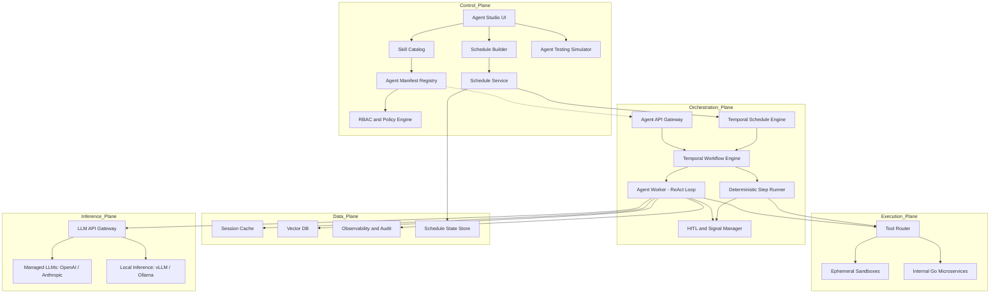
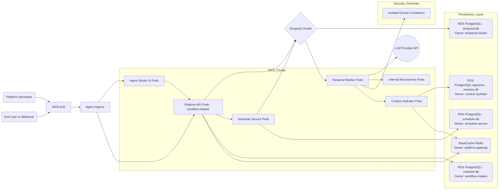
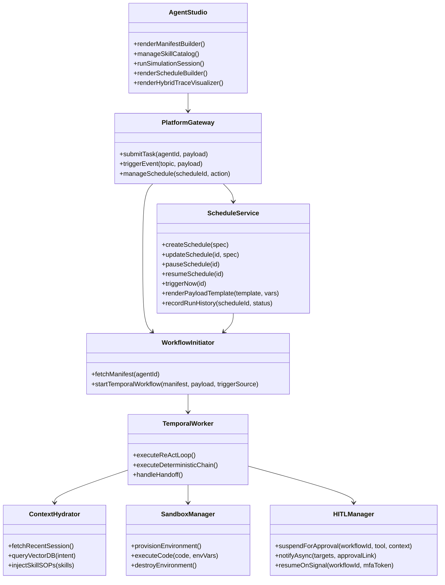
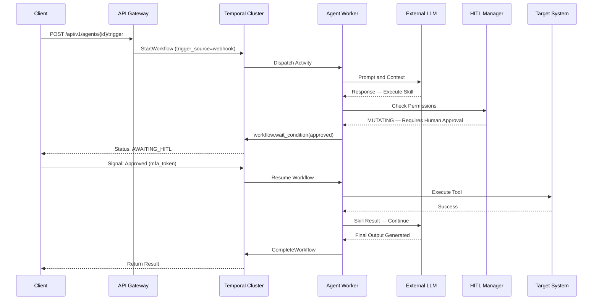
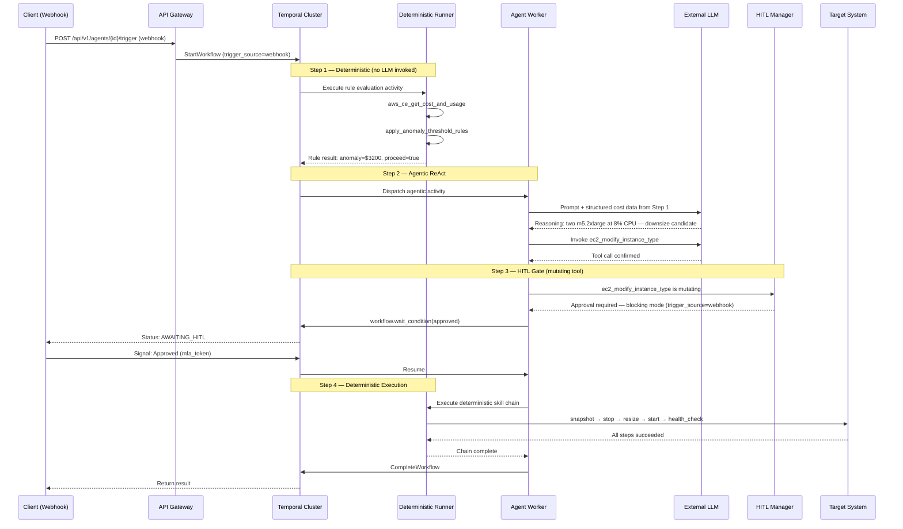
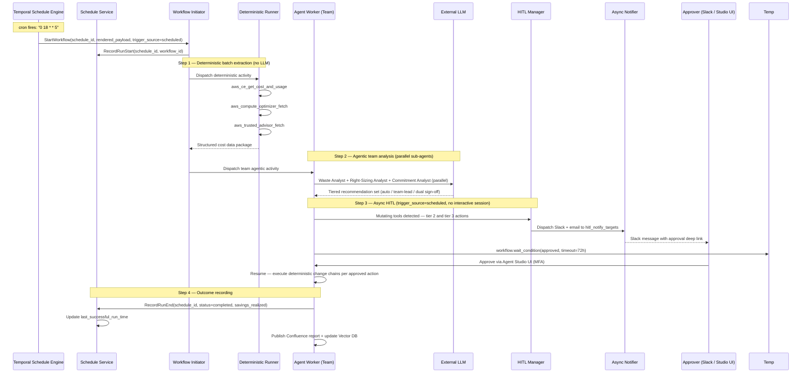

# Enterprise Agentic PaaS: Architecture & Design Spec


## Platform Vision & Capability Requirements

### Architecture Vision
To provide a secure, highly-scalable, and developer-friendly Platform-as-a-Service (PaaS) that democratizes the creation of resilient, stateful AI agents across the enterprise. By abstracting away the complex "plumbing" of LLM orchestration, state management, and security guardrails, the platform empowers product teams, SREs, and domain experts to deploy autonomous solutions (both interactive and event-driven) using a simple "No-Code" manifest approach.

### Core Capability Goals
Architecturally, the system is designed from the ground up to fulfill several strict enterprise requirements:
- **Democratize Creation**: Provide a visual **Agent Studio** and manifest builder, relying on a robust Skill Catalog so domain experts can deploy agents in hours rather than weeks.
- **Enterprise-Grade Resilience**: Guarantee zero-data-loss execution via **Durable ReAct loops**. By relying on Temporal for orchestration, if a node crashes or an API rate limit is triggered, the AI agent resumes its reasoning trace exactly where it left off.
- **Strict Execution Security**: Ensure AI actions execute using short-lived, least-privilege machine identities. Untrusted code or tools run securely inside isolated **Docker Containers** for maximum multi-cloud portability.
- **Human-in-the-Loop (HITL)**: Transparently throttle agent workflows requiring manual authorization for mutating actions, pausing execution indefinitely while awaiting secure MFA sign-off. For schedule-triggered workflows with no interactive session, HITL notifications are delivered asynchronously to configured Slack channels and email targets.
- **Universal Auditability**: Keep a 100% immutable log of all LLM reasoning trees, prompts, and tool triggers via OpenTelemetry tracing for regulatory compliance and SRE review.
- **Event-Driven Invocation**: Ensure agents can be triggered persistently via automated webhooks, supporting autonomous background remediation tasks without requiring interactive chat.
- **Hybrid Workflow Execution**: Support workflows that compose deterministic (non-agentic) steps, agentic ReAct reasoning loops, and HITL approval gates within a single durable Temporal workflow. Each step's execution mode is declared in the manifest and enforced at runtime, preventing unnecessary LLM invocations on deterministic steps while sharing a single execution context and audit trail across all modes.
- **Scheduled Triggers**: Support cron-based and fixed-interval scheduled workflow invocations as a first-class trigger mode alongside webhooks and chat, backed by Temporal's native Schedule primitives for exactly-once delivery, overlap policy enforcement, and missed-run catchup on platform restart.

---

## 1. Logical Architecture
The logical architecture decouples the definition of an agent from its execution, ensuring platform engineers can manage the underlying infrastructure while developers focus on use cases. It clearly separates "Tools" (raw APIs) from "Skills" (governed logic) and adds a dedicated scheduling surface to the Control Plane.



- **Control Plane**: Features the Agent Studio, acting as the command center for users to build manifests. Senior engineers assemble raw APIs into governed items in the Skill Catalog, which No-Code users select to build their agents in the Agent Manifest Registry. The new **Schedule Builder** tab allows any user to define cron or interval schedules against any deployed agent or team, with the **Schedule Service** persisting schedule metadata and owning the Temporal Schedule lifecycle.
- **Orchestration Plane (The Brain)**: An Agent API Gateway routes webhook and chat requests to the Temporal Workflow Engine. The **Temporal Schedule Engine** fires scheduled invocations autonomously, routed through the Schedule Service before reaching the same Workflow Engine. For each workflow, the engine dispatches to either the **Agent Worker** (ReAct reasoning loop) or the **Deterministic Step Runner** (direct skill chain execution, no LLM) depending on the manifest step type. Both runners converge on the same **HITL and Signal Manager**.
- **Execution Plane (The Hands)**: Completely isolated from the reasoning engine. Routes underlying tool calls to ephemeral sandboxes or internal Go microservices, regardless of whether the calling step was agentic or deterministic.
- **Data Plane**: Manages short-term session cache, long-term Vector DB storage, OpenTelemetry observability, and the **Schedule State Store** (PostgreSQL tables tracking schedule definitions and per-run history).
- **Inference Plane**: A centralized proxy routing all prompt inferences strictly outward to SaaS providers or inward toward self-hosted GPU edge nodes. Deterministic steps never touch this plane.

## 2. Physical Architecture (AWS Native)
Maps the logical components to an AWS cloud-native environment, utilizing managed services.



- **Ingress**: Traffic flows through an AWS ALB to an Nginx Ingress on an Amazon EKS Cluster. Supports both synchronous REST/gRPC traffic and asynchronous webhook events.
- **Compute (EKS)**:
  - Agent Studio UI Pods (Next.js).
  - Platform API Pods / Workflow Initiator (Go).
  - Temporal Worker Pods (Python) running the ReAct loop and Deterministic Step Runner — stateless; no direct DB ownership.
  - Internal Microservice Pods.
  - **Schedule Service Pods** (Go) — own the `schedule-db` exclusively; no other service may query it directly.
  - **Context Hydrator Pods** (Go/Python) — own the `memory-db` (pgvector) exclusively.
- **Isolation Layer**: Arbitrary code execution happens in a strictly peered, isolated VPC/Subnet using dedicated ephemeral Docker Containers.
- **Managed Persistence (Database-per-Service)**:
  - `temporal-db` — Amazon RDS (PostgreSQL), exclusively managed by the Temporal Cluster. Platform services never connect to this database.
  - `manifest-db` — Amazon RDS (PostgreSQL), exclusively owned by `workflow-initiator`. Stores agent manifests, skill definitions, and RBAC rules.
  - `schedule-db` — Amazon RDS (PostgreSQL), exclusively owned by `schedule-service`. Stores `workflow_schedules` and `schedule_run_history`.
  - `memory-db` — Amazon RDS (PostgreSQL) with the `pgvector` extension, exclusively owned by `context-hydrator`. Stores long-term agent memories and RAG embeddings.
  - `gateway-cache` — Amazon ElastiCache (Redis), owned by `platform-gateway`. Used for rate limiting, idempotency key deduplication, and short-term session buffering.

## 3. Component Design



- **Agent Studio (Next.js)**: Frontend for lifecycle management, creating skills, building agent manifests, simulation, and the new **Schedule Builder** tab and **Hybrid Trace Visualizer** with step-type badges.
- **Platform Gateway (Go)**: The REST/gRPC/Webhook entry point. Handles rate limiting, authentication, event payload mapping, and proxies schedule management requests to the Schedule Service.
- **Workflow Initiator (Go)**: Reads the agent manifest and translates it into a Temporal workflow request. Accepts `trigger_source` (`webhook`, `chat`, `scheduled`) to enable downstream behavioral differentiation (e.g., async HITL mode for scheduled invocations).
- **Temporal Worker (Python)**: The core execution process. Runs either the ReAct loop (for agentic steps) or a deterministic skill chain (for non-agentic steps) depending on the manifest step type. Handles HITL suspension and passes `trigger_source` to the HITL Manager to select blocking vs. async-notify mode.
- **Schedule Service (Go)**: New service. Stores schedule definitions in PostgreSQL, owns Temporal Schedule API calls (create/update/delete/pause/resume), renders payload templates with time variables at fire time, and maintains per-run history. Does not own execution timing — Temporal does.
- **HITL Manager**: Intercepts mutating tool invocations. In blocking mode (chat/webhook), suspends the workflow and waits. In async-notify mode (scheduled), suspends and immediately dispatches Slack/email notifications with approval deep links. Resumes the workflow on signal receipt with MFA validation.
- **Context Hydrator**: Injects relevant context (long-term memory and Skill SOPs) into the LLM system prompt before agentic steps. Exclusively owns `memory-db` (RDS PostgreSQL + pgvector) — no other service connects to this database. Agent Workers retrieve memory exclusively via the Context Hydrator's gRPC endpoint. Skipped entirely for deterministic steps.
- **Sandbox Manager**: Provisions secure execution environments on the fly and destroys them post-execution.

## 4. Execution Sequences

### 4.1 Interactive / Webhook HITL Flow



### 4.2 Hybrid Workflow Execution

Demonstrates a single Temporal workflow moving through deterministic, agentic, and HITL steps sequentially, sharing execution context throughout.



### 4.3 Scheduled Workflow with Async HITL

Demonstrates a schedule-triggered workflow with no interactive session. HITL approval is delivered asynchronously to Slack/email because no user is present to approve in real time.



## 5. Deployment Topology
- **High Availability**: Deployments are spread across multiple Availability Zones using EKS topology spread constraints. Schedule Service Pods run with a minimum of 2 replicas across AZs — a single pod outage does not affect Temporal Schedule delivery since Temporal owns the firing clock.
- **Scaling**: Temporal Worker Pods scale horizontally via HPA based on Temporal task queue depth. Schedule Service Pods scale on CPU/RPS. Scheduled workflow bursts (e.g., many schedules firing simultaneously at market open) are absorbed by the Worker HPA before the agentic phase begins.
- **Observability**: OTel Collector Daemons run on every EKS node, silently capturing all traces and exporting them to the central observability stack (Prometheus/Grafana). The Agent Studio pulls from this stack to display hybrid execution graphs with step-type colour coding. `trigger_source` is emitted as a span attribute on every workflow trace, enabling cost and latency breakdown by invocation mode in the Operations Dashboard.

## 6. Detailed Tech Stack Choices

- **Frontend (Agent Studio UI)**: React with Next.js for SSR and fast routing. Tailwind CSS for styling. React Flow for the Visual Manifest Builder and Execution Trace Visualizer — node colour coding differentiates deterministic (grey), agentic (blue), and HITL (orange) steps.
- **API Gateway & Routing**: Go (Gin or Echo) for high concurrency, low latency, and efficient payload mapping.
- **Orchestration**: Temporal workflow engine for durable execution. Go Temporal SDK for the Workflow Initiator; Python Temporal SDK for the Agent Workers (to leverage the Python AI ecosystem). **Temporal Schedules API** (not the deprecated `CronSchedule` workflow field) for scheduled triggers — provides built-in overlap policy, backfill, and jitter.
- **AI Agent Framework**: **Pydantic AI** (via the `py-agent-core` adapter interface). The platform uses Pydantic AI as the concrete agent framework for typed agent and tool definitions, dependency injection via `RunContext`, and structured output validation. Critically, `agent-workers` never imports Pydantic AI directly — it imports only from `py-agent-core`, which owns the framework binding. The active framework is selected at runtime via the `AGENT_FRAMEWORK` environment variable. This decouples the Temporal execution layer from any specific framework, making a future migration to OpenAI Agents SDK (or any other OpenAI-compatible framework) a single-file adapter change with no modifications to `workflows.py` or tool implementations. Deterministic steps bypass the framework entirely and invoke the Skill Dispatcher directly.
- **LLM Gateway & Inference Proxy**: A centralized router (LiteLLM) handling load balancing, token governance, and API schema standardization. Bridges to external endpoints (OpenAI, Bedrock) or locally hosted endpoints (vLLM, Ollama, LMStudio).
- **State & Persistence**: PostgreSQL (via Amazon RDS) for Temporal state, platform metadata, and schedule tables. Amazon ElastiCache (Redis) for short-term session cache, rate limiting, and idempotency key deduplication.
- **Sandboxed Execution**: Ephemeral Docker Containers for executing untrusted tool code securely.
- **Observability**: OTel collectors on EKS nodes reporting to Prometheus/Grafana/Jaeger. `trigger_source` and `step_type` emitted as span attributes for hybrid/scheduled workflow breakdown.

## 7. Project Structure (Monorepo)

```text
agentic-paas/
├── apps/
│   ├── agent-studio/         # Next.js frontend (Agent Builder, Skill Catalog,
│   │                         #   Schedule Builder, Hybrid Trace Visualizer)
│   └── platform-gateway/     # Go public API Gateway
├── services/
│   ├── workflow-initiator/   # Go — Temporal workflow dispatcher (trigger_source routing)
│   ├── agent-workers/        # Python — Temporal workers (ReAct loop + deterministic runner)
│   ├── schedule-service/     # Go — schedule CRUD, Temporal Schedule API, payload templating
│   ├── context-hydrator/     # Go/Python — Vector DB queries, skill SOP injection
│   └── internal-tools/       # Go microservices for primitive platform tools
├── packages/
│   ├── shared-protos/        # Protocol Buffers / gRPC definitions
│   ├── skill-sdk/            # Internal SDK for defining new tool schemas
│   └── py-agent-core/        # Python — AgentRunner interface, PlatformTool protocol,
│                             #   Pydantic AI adapter (active), OpenAI Agents adapter (future),
│                             #   factory.py (AGENT_FRAMEWORK env var routing)
├── infra/
│   ├── terraform/            # AWS VPC, RDS (with schedule tables), EKS, ElastiCache
│   └── k8s/                  # Kubernetes Deployments / Helm charts
└── docs/                     # Architecture and technical specs
```

## 8. Core Service Descriptions

- **Platform Gateway**: The edge entry point. Handles SSO authentication (OIDC/SAML), role-based access control, rate limiting, and translates webhook events into standard platform events. Proxies schedule management requests to the Schedule Service.
- **Workflow Initiator & API**: Serves traffic from the Agent Studio (saving manifests, retrieving logs) and submits workflow configurations to the Temporal Cluster. Exclusively owns `manifest-db` (PostgreSQL) — the authoritative store for agent manifests, skill definitions, and RBAC rules. Accepts `trigger_source` (`webhook`, `chat`, `scheduled`) and passes it forward as workflow context for downstream behavioral differentiation.
- **Agent Workers (Python)**: The heavy-lifting compute nodes horizontally scaled using HPA. Listen to Temporal task queues and execute either the ReAct reasoning loop (for agentic manifest steps) or a deterministic skill chain (for non-agentic steps). Import exclusively from `py-agent-core` — never from `pydantic_ai` or `openai-agents` directly — ensuring the Temporal execution layer is fully decoupled from the framework choice. Use `trigger_source` to select blocking vs. async HITL mode.
- **Schedule Service (Go)**: Manages the full lifecycle of scheduled workflow triggers. Exclusively owns `schedule-db` (PostgreSQL) — no other service connects to this database. Stores schedule definitions (`workflow_schedules`) and run history (`schedule_run_history`). Owns all Temporal Schedule API calls (create, update, delete, pause, resume, backfill). Renders payload templates with time variables (`{{.ScheduledTime}}`, `{{.LastSuccessfulRunTime}}`) at fire time before calling the Workflow Initiator. Exposes management endpoints consumed by Agent Studio and the external REST API.
- **LLM Gateway Router**: The unified proxy that Worker nodes channel inferences through. Standardizes API formats, manages token budgets, and routes to local or cloud providers. Never invoked by deterministic steps.
- **Tool Proxy / Sandbox Manager**: An isolation service that workers call to safely execute arbitrary code or query internal systems via strict egress-controlled ephemeral Docker containers. Called by both agentic and deterministic steps.
- **Observability Sink**: Unified OTel daemon collectors picking up structured logs and metrics mapping them to execution histories. `trigger_source` and `step_type` attributes enable per-mode cost and performance breakdown in the Operations Dashboard.

## 9. Low-Level Component Design & API Contracts

### 9.1 Database & Persistence Specifications

Each microservice exclusively owns its persistence layer. No service may connect to another service's database directly — all cross-service data access goes through the owning service's API.

| Database | Owner Service | Engine | Stores |
|---|---|---|---|
| `temporal-db` | Temporal Cluster | RDS PostgreSQL | Workflow histories, task queues, activity state — managed entirely by Temporal; no platform service connects here |
| `manifest-db` | `workflow-initiator` | RDS PostgreSQL | Agent manifests, skill definitions, RBAC policies, tenant configuration |
| `schedule-db` | `schedule-service` | RDS PostgreSQL | `workflow_schedules`, `schedule_run_history` |
| `memory-db` | `context-hydrator` | RDS PostgreSQL + pgvector | Long-term agent memories, RAG embeddings |
| `gateway-cache` | `platform-gateway` | ElastiCache Redis | Rate limiting counters, idempotency keys, short-term session buffers |

**Access rules enforced at the IAM / security-group layer:**
- Each service's RDS instance is in a dedicated security group. Only the owning service's pod IAM role has inbound permission on port 5432.
- `gateway-cache` Redis ACLs restrict keyspace access to `platform-gateway` and `context-hydrator` (session reads only) pod identities.
- The Temporal Cluster's security group blocks all platform service pods — Temporal SDK gRPC (port 7233) is the only allowed entry point.

**Cross-service data access patterns (API-only, never direct DB):**
- `workflow-initiator` needs schedule metadata → calls `GET /api/v1/schedules/{id}` on `schedule-service`.
- `agent-workers` need long-term memory → call `context-hydrator` gRPC endpoint; never touch `memory-db` directly.
- `schedule-service` needs manifest details to validate schedule targets → calls `workflow-initiator` gRPC endpoint.

### 9.2 Service Languages & Protocols
- **Agent Studio <--> Gateway**: `REST/JSON` over HTTPS.
- **Gateway <--> Internal Services**: Internal `gRPC` over HTTP/2 using Protobuf schemas.
- **Workflow Initiator <--> Temporal Workers**: Native `gRPC` via Temporal SDK.
- **Temporal Workers <--> Internal Microservices**: `gRPC` or `REST` via the Tool Router.
- **Temporal Workers <--> LLM Provider**: `REST/HTTPS` using the standard OpenAI SDK format.
- **Schedule Service <--> Temporal**: Temporal Go SDK `ScheduleClient` — no HTTP, native SDK calls.

### 9.3 Component Interface Definitions (API Docs)

**1. External REST API (Webhook Trigger)**

```http
POST /api/v1/agents/{agent_id}/trigger
Content-Type: application/json
Authorization: Bearer <OIDC_TOKEN>

{
  "event_source": "datadog-monitor",
  "payload": {
    "alert_id": "AL-99238",
    "description": "API latency exceeded 5s threshold",
    "metrics": { "latency_ms": 5200, "cluster": "prod-us-west-2" }
  }
}
```

**2. Schedule Management REST API**

```http
POST   /api/v1/schedules                    # Create schedule
GET    /api/v1/schedules                    # List (filter: target_type, status)
GET    /api/v1/schedules/{id}               # Fetch + next 5 run times
PUT    /api/v1/schedules/{id}               # Update (propagates to Temporal Schedule)
DELETE /api/v1/schedules/{id}               # Archive + delete Temporal Schedule

POST   /api/v1/schedules/{id}/pause         # Pause
POST   /api/v1/schedules/{id}/resume        # Resume
POST   /api/v1/schedules/{id}/trigger       # Immediate manual trigger
POST   /api/v1/schedules/{id}/backfill      # Run for specific past time range
GET    /api/v1/schedules/{id}/history       # Per-run history with status
GET    /api/v1/schedules/{id}/next-runs     # Preview next N scheduled fire times
```

Schedule create request body:

```json
{
  "name": "Weekly AWS Cost Optimization",
  "target_type": "agent",
  "target_id": "550e8400-e29b-41d4-a716-446655440000",
  "cron_expression": "0 18 * * 5",
  "timezone": "Asia/Kolkata",
  "blackout_windows": [
    { "dates": ["2025-12-25", "2026-01-01"] },
    { "time_ranges": [{ "start": "09:15", "end": "15:30", "days": ["MON","TUE","WED","THU","FRI"] }] }
  ],
  "jitter_seconds": 300,
  "overlap_policy": "SKIP",
  "catchup_window_sec": 3600,
  "payload_template": {
    "analysis_window": {
      "start": "{{.LastSuccessfulRunTime | iso8601}}",
      "end":   "{{.ScheduledTime | iso8601}}"
    },
    "report_label": "week-ending-{{.ScheduledTime | date \"2006-01-02\"}}"
  },
  "hitl_mode": "ASYNC_NOTIFY",
  "hitl_notify_targets": [
    { "type": "slack_channel", "id": "C08FINOPS" },
    { "type": "email", "address": "finops-lead@company.com" }
  ]
}
```

**3. Internal gRPC Interface (Workflow Initiator)**

```protobuf
syntax = "proto3";
package platform.workflow.v1;

service WorkflowInitiator {
  rpc StartAgentSession(StartAgentRequest) returns (StartAgentResponse);
  rpc GetSessionStatus(StatusRequest)     returns (StatusResponse);
}

message StartAgentRequest {
  string agent_id      = 1;
  string session_id    = 2;   // idempotency key
  string tenant_id     = 3;
  map<string, string> context = 4;
  string trigger_source = 5;  // "webhook" | "chat" | "scheduled"
  string schedule_id   = 6;   // populated when trigger_source = "scheduled"
}

message StartAgentResponse {
  string workflow_id = 1;
  string run_id      = 2;
  string status      = 3;
}
```

### 9.4 Temporal Worker Internal Design (Python)

The Worker uses `py-agent-core` as its only framework dependency. The `AGENT_FRAMEWORK` environment variable controls which concrete adapter is loaded at process start — `workflows.py` and all tool implementations are unchanged when switching frameworks.

**Layered architecture:**

```
workflows.py  (@workflow.defn)
    │  calls Temporal activities only — no framework imports
    ▼
activities_agent.py  (@activity.defn)
    │  imports from py_agent_core only
    ▼
py_agent_core.factory.create_runner(manifest, tools)
    │  reads AGENT_FRAMEWORK env var
    ├── adapters/pydantic_ai.py   ← active
    └── adapters/openai_agents.py ← future swap
```

**Stable interface contract (`py-agent-core/interfaces.py`):**

```python
class PlatformContext:
    agent_id: str
    session_id: str
    memories: list[str]
    trigger_source: Literal['chat', 'webhook', 'scheduled']

class AgentResult:
    output: str
    tool_calls_made: list[ToolCall]
    usage: TokenUsage           # forwarded to Cost Attribution
    messages: list[dict]        # full history forwarded to OTel

class PlatformTool(Protocol):
    name: str
    description: str
    input_schema: dict
    async def execute(self, ctx: PlatformContext, **kwargs) -> str: ...

class AgentRunner(ABC):
    @classmethod
    @abstractmethod
    def from_manifest(cls, manifest: AgentManifest,
                      tools: list[PlatformTool]) -> 'AgentRunner': ...

    @abstractmethod
    async def run(self, input: str, ctx: PlatformContext) -> AgentResult: ...
```

**Pydantic AI adapter (active, `adapters/pydantic_ai.py`):**

```python
from pydantic_ai import Agent as _PydanticAgent, RunContext
from ..interfaces import AgentRunner, AgentResult, PlatformContext

class PydanticAIRunner(AgentRunner):

    @classmethod
    def from_manifest(cls, manifest, tools):
        pydantic_tools = [cls._adapt_tool(t) for t in tools]
        agent = _PydanticAgent(
            model=manifest.model,          # e.g. "openai:gpt-4o" → LiteLLM gateway
            system_prompt=manifest.system_prompt,
            tools=pydantic_tools,
            deps_type=PlatformContext,
        )
        return cls(agent)

    async def run(self, input: str, ctx: PlatformContext) -> AgentResult:
        result = await self._agent.run(input, deps=ctx)
        return AgentResult(
            output=str(result.data),
            usage=TokenUsage(input=result.usage().request_tokens,
                             output=result.usage().response_tokens),
            messages=result.all_messages_json(),
        )

    @staticmethod
    def _adapt_tool(tool: PlatformTool):
        async def _fn(ctx: RunContext[PlatformContext], **kwargs) -> str:
            return await tool.execute(ctx.deps, **kwargs)
        _fn.__name__ = tool.name
        _fn.__doc__ = tool.description
        return _fn
```

**OpenAI Agents SDK adapter (future, `adapters/openai_agents.py`):**

```python
from agents import Agent as _OAIAgent, Runner, function_tool
from ..interfaces import AgentRunner, AgentResult, PlatformContext

class OpenAIAgentsRunner(AgentRunner):

    @classmethod
    def from_manifest(cls, manifest, tools):
        oai_tools = [cls._adapt_tool(t) for t in tools]
        agent = _OAIAgent(
            name=manifest.name,
            instructions=manifest.system_prompt,
            tools=oai_tools,
            model=manifest.model,
        )
        return cls(agent)

    async def run(self, input: str, ctx: PlatformContext) -> AgentResult:
        result = await Runner.run(self._agent, input)
        return AgentResult(output=result.final_output, ...)

    @staticmethod
    def _adapt_tool(tool: PlatformTool):
        @function_tool
        async def _fn(**kwargs) -> str:
            return await tool.execute(**kwargs)
        _fn.__name__ = tool.name
        return _fn
```

**Factory — the only place the framework choice lives (`factory.py`):**

```python
def create_runner(manifest: AgentManifest,
                  tools: list[PlatformTool]) -> AgentRunner:
    framework = os.getenv("AGENT_FRAMEWORK", "pydantic_ai")
    if framework == "pydantic_ai":
        from .adapters.pydantic_ai import PydanticAIRunner
        return PydanticAIRunner.from_manifest(manifest, tools)
    if framework == "openai_agents":
        from .adapters.openai_agents import OpenAIAgentsRunner
        return OpenAIAgentsRunner.from_manifest(manifest, tools)
    raise ValueError(f"Unknown AGENT_FRAMEWORK: {framework}")
```

**Temporal activity (the only consumer, `activities_agent.py`):**

```python
from py_agent_core.factory import create_runner
from py_agent_core.interfaces import PlatformContext

@activity.defn
async def reasoning_step(manifest: dict, input: str,
                         memories: list[str], trigger_source: str) -> dict:
    agent_manifest = AgentManifest(**manifest)
    tools = ToolRegistry.resolve(agent_manifest.allowed_skills)
    ctx = PlatformContext(agent_id=agent_manifest.agent_id,
                          memories=memories, trigger_source=trigger_source)
    runner = create_runner(agent_manifest, tools)
    result = await runner.run(input, ctx)
    return result.model_dump()
```

**What is unchanged when swapping from Pydantic AI to OpenAI Agents SDK:**
- `workflows.py` — zero changes
- All `PlatformTool` implementations — zero changes (pure Python, no framework imports)
- LLM Gateway — zero changes (both use OpenAI-compatible `base_url`)
- OTel instrumentation — zero changes (`AgentResult` carries the message history)
- `activities_agent.py` — zero changes (calls `create_runner`, not the framework)

**What changes during a swap:**
- `AGENT_FRAMEWORK=openai_agents` in the deployment environment
- One new adapter file (`adapters/openai_agents.py`) already stubbed above
- `pyproject.toml` in `py-agent-core`: `pydantic-ai` → `openai-agents`

**Two paths per manifest step, both using this adapter layer:**
- **Agentic (`step_type: agentic`)**: `reasoning_step` activity invokes `create_runner(...).run(...)`. Temporal retries the activity on failure. HITL suspension via `workflow.wait_condition` happens in `workflows.py`, above the framework layer — framework is never aware of HITL.
- **Deterministic (`step_type: deterministic`)**: Bypasses `py-agent-core` entirely. The Skill Dispatcher is called directly; no LLM, no framework instantiation.

### 9.5 Schedule Database Schema

```sql
CREATE TABLE workflow_schedules (
  id                   UUID PRIMARY KEY DEFAULT gen_random_uuid(),
  tenant_id            UUID NOT NULL,
  name                 TEXT NOT NULL,
  description          TEXT,
  target_type          TEXT NOT NULL CHECK (target_type IN ('agent', 'team')),
  target_id            UUID NOT NULL,
  cron_expression      TEXT,           -- mutually exclusive with interval_seconds
  interval_seconds     INT,
  timezone             TEXT NOT NULL DEFAULT 'UTC',
  blackout_windows     JSONB,          -- [{dates:[...]}, {time_ranges:[{start,end,days}]}]
  jitter_seconds       INT DEFAULT 0,
  overlap_policy       TEXT NOT NULL DEFAULT 'SKIP'
                       CHECK (overlap_policy IN ('SKIP','BUFFER_ONE','CANCEL_OTHER','ALLOW_ALL')),
  catchup_window_sec   INT DEFAULT 3600,
  payload_template     JSONB,          -- supports {{.ScheduledTime}}, {{.LastSuccessfulRunTime}}
  hitl_mode            TEXT NOT NULL DEFAULT 'ASYNC_NOTIFY'
                       CHECK (hitl_mode IN ('ASYNC_NOTIFY','BLOCK_AND_WAIT','AUTO_APPROVE')),
  hitl_notify_targets  JSONB,          -- [{type:"slack_channel",id:...},{type:"email",address:...}]
  status               TEXT NOT NULL DEFAULT 'active'
                       CHECK (status IN ('active','paused','archived')),
  temporal_schedule_id TEXT,           -- Temporal's internal schedule handle ID
  created_by           TEXT NOT NULL,
  created_at           TIMESTAMPTZ DEFAULT now(),
  updated_at           TIMESTAMPTZ DEFAULT now()
);

CREATE TABLE schedule_run_history (
  id                  UUID PRIMARY KEY DEFAULT gen_random_uuid(),
  schedule_id         UUID NOT NULL REFERENCES workflow_schedules(id),
  tenant_id           UUID NOT NULL,
  workflow_id         TEXT,
  scheduled_time      TIMESTAMPTZ NOT NULL,
  actual_start_time   TIMESTAMPTZ,
  end_time            TIMESTAMPTZ,
  status              TEXT CHECK (status IN ('running','completed','failed','skipped','hitl_pending')),
  trigger_reason      TEXT,            -- 'scheduled' | 'manual_trigger' | 'backfill'
  error_message       TEXT,
  created_at          TIMESTAMPTZ DEFAULT now()
);
```

**Payload template variables** rendered by Schedule Service before calling Workflow Initiator:

| Variable | Value |
|---|---|
| `{{.ScheduledTime}}` | Nominal fire time (not actual start — important for idempotent data windows) |
| `{{.ActualStartTime}}` | Wall clock time the workflow actually started |
| `{{.LastSuccessfulRunTime}}` | Timestamp of last run that completed with `status=completed` |
| `{{.LastRunTime}}` | Timestamp of last run regardless of status |
| `{{.ScheduleID}}` | Platform schedule UUID |

**Overlap policy guidance by workflow type:**

| Workflow Type | Recommended Policy | Reason |
|---|---|---|
| Reporting / cost analysis | `SKIP` | Two parallel runs for the same period produce duplicate data |
| Incident remediation sweep | `CANCEL_OTHER` | Latest system state supersedes prior run's findings |
| Data ingestion / ETL | `BUFFER_ONE` | Cannot skip; queue one catchup run |

## 10. Architectural Solutions for Non-Functional Requirements

### 10.1 Execution Sandboxing (NFR1)
- **Solution**: The Tool Proxy service isolates mutating capabilities by forwarding untrusted logic to ephemeral Docker container infrastructure. All agent tool execution running arbitrary scripts is natively containerized with restricted egress blocking lateral internal network movement. Deterministic steps use the same sandbox path, ensuring uniform isolation regardless of whether a step is agentic or rule-based.

### 10.2 Immutable Auditability (NFR2)
- **Solution**: OpenTelemetry (OTel) instrumentation across all Go/Python microservices. Every LLM prompt, context injection, and tool execution is logged with a trace ID. `step_type` (deterministic / agentic / hitl) and `trigger_source` (webhook / chat / scheduled) are emitted as span attributes, enabling the Agent Studio to render hybrid execution graphs with colour-coded step badges and the Operations Dashboard to break down cost and latency by invocation mode.

### 10.3 Fault Tolerance & Concurrency (NFR3, NFR4)
- **Solution**: Temporal as the core orchestrator. If an EKS worker node terminates during a hybrid workflow, Temporal resumes execution from the last successfully completed activity — whether that was a deterministic data-extraction step or an agentic LLM call. Pending HITL suspensions survive pod restarts because approval state is stored in Temporal workflow state, not in worker memory.

### 10.4 Model Agnosticism (NFR5)
- **Solution**: All model requests route through the centralized LLM Gateway (LiteLLM). Agent Workers implement one standardized API format; the gateway proxies to any provider. Deterministic steps never invoke the LLM Gateway, so provider changes have zero impact on non-agentic workflow phases.

### 10.5 Cost & Token Governance (NFR6)
- **Solution**: The LLM Gateway enforces per-session token budgets. Agent manifests configure a `max_iterations` ceiling that shuts down the Temporal ReAct loop to prevent infinite generation. Deterministic steps consume no tokens; hybrid workflows therefore have lower and more predictable LLM cost than equivalent fully-agentic workflows. `trigger_source` is recorded on every `cost_events` row, enabling separate cost attribution for scheduled vs. interactive invocations.

### 10.6 Agent Machine Identities (NFR7)
- **Solution**: OIDC Identity Federation. Before querying internal microservices, the Temporal Worker authenticates to an internal STS module and exchanges its Agent ID for a short-lived OIDC token (5-minute TTL) scoped to the agent's permitted skill list. The Schedule Service uses its own service-level OIDC identity to call the Temporal Schedule API — schedule ownership is separated from agent execution identity.

### 10.7 Schedule Reliability (NFR8)
- **Solution**: Temporal's native Schedules API provides exactly-once invocation guarantees. On platform restart, the `catchup_window_sec` field on each schedule controls how far back Temporal backfills missed runs; runs beyond the window are recorded as `skipped` in `schedule_run_history` with `trigger_reason: missed_catchup_window`. Duplicate firings are suppressed at the Temporal layer via idempotent schedule handles. The Schedule Service is stateless — it reads from PostgreSQL and delegates all timing to Temporal, so Schedule Service pod restarts never result in double-fires.

### 10.8 Hybrid Execution Mode Integrity
- **Solution**: Step execution mode (`deterministic` vs. `agentic`) is declared in the agent manifest and validated by the Workflow Initiator before the workflow starts. The Temporal Worker enforces the declared mode at activity dispatch time — a step declared `deterministic` cannot invoke the LLM Gateway regardless of what the tool implementation requests. This prevents accidental LLM calls in cost-sensitive or compliance-sensitive pipeline steps, and ensures the Execution Trace Visualizer always reflects the actual execution path rather than an inferred one.

## 11. Configuration & Secrets Management

To maintain enterprise security postures and streamline MLOps deployments, configuration and secrets are strictly segregated into three architectural layers:

### 11.1 Infrastructure & Application Config (GitOps)
- **Pattern**: Kubernetes ConfigMaps managed declaratively via GitOps (e.g., ArgoCD or Flux).
- **Usage**: Used for static, service-level configurations that bind the platform topology together. Examples include database connection strings (excluding passwords), Temporal cluster addresses, OpenTelemetry collector endpoints, and environment-specific flags (Dev, Staging, Prod). This ensures infrastructure immutability.

### 11.2 Dynamic Agent & Platform Config (Database / Cache)
- **Pattern**: Polled Relational State (PostgreSQL + Redis).
- **Usage**: Unlike static infrastructure, Agent capabilities (System Prompts, Max Token limits, Attached Skills, Fallback Models) and Schedule definitions change rapidly. To avoid requiring software redeployments for behavior changes, the Agent Studio UI mutates these configurations directly in Postgres. The Workflow Initiator and Context Hydrator read and locally cache these definitions dynamically at task initiation.

### 11.3 Enterprise Secrets & Vault Management (AWS Native)
- **Pattern**: **AWS Secrets Manager** deeply integrated with Kubernetes via the **External Secrets Operator (ESO)**.
- **Usage**: LLM API keys, OIDC STS signing secrets, and sensitive system credentials are never stored in Git repositories or injected as raw environment variables. ESO syncs secrets into Kubernetes Secrets; secret updates trigger zero-downtime rolling restarts of affected pods automatically.
- **Just-In-Time (JIT) Tool Execution**: When the reasoning agent invokes a mutating skill on a sensitive external system, the Sandbox Manager fetches the required credential from AWS Secrets Manager exclusively for the lifespan of that Docker container execution. The credential never touches the agent's memory or state.

## 12. Local Development Architecture (DevEx)

To ensure rapid iteration cycles without incurring unnecessary cloud costs or bottlenecking on strict IAM policies, the architecture is designed to map cleanly onto a developer's local machine (macOS/Linux) via a hybrid configuration.

### 12.1 Local Backing Services (Docker Compose)
Heavy infrastructure state and dependencies should **not** be installed natively. A unified `docker-compose.yml` spins up the essential ecosystem backbone locally, preserving the database-per-service boundary via separate named PostgreSQL instances:
- **`postgres-temporal`**: PostgreSQL container used exclusively by the Temporal standalone cluster.
- **`postgres-manifest`**: PostgreSQL container used exclusively by `workflow-initiator`. Run `make db-migrate-manifest` after first start.
- **`postgres-schedule`**: PostgreSQL container used exclusively by `schedule-service`. Run `make db-migrate-schedule` after first start.
- **`postgres-memory`**: PostgreSQL container with the `pgvector` extension, used exclusively by `context-hydrator`. Run `make db-migrate-memory` after first start.
- **`redis`**: For `platform-gateway` rate limiting and session buffering.
- **`temporal-server` & `temporal-ui`**: The standalone orchestration cluster (available at `localhost:7233` / `localhost:8233`). Temporal Schedules work identically in the local standalone cluster.
- **`schedule-service`**: Go binary container backed by `postgres-schedule`. Set `TEMPORAL_SCHEDULE_NAMESPACE=default` in `.env` for local dev.
- **`prometheus` & `grafana`**: Providing immediate local access to the OpenTelemetry tracing UI.

### 12.2 Service Execution & Hot-Reloading
Rather than stuffing complex Go/Python build pipelines heavily inside Docker—where debugger attachments drop and iteration loops slow to a crawl—developers run the actual microservices natively to leverage their IDEs (VS Code/Cursor):
- **Agent Studio (Frontend)**: Runs natively via standard React tooling: `npm run dev` (targeting `localhost:3000`).
- **Go Gateway, Initiator & Schedule Service**: Runs natively using `air` to parse code changes automatically and trigger near-instant hyper-local recompilations.
- **Python Agent Workers**: Runs securely via isolated virtual environments (`venv` or `poetry`) combined with `watchfiles` to automatically recycle the Temporal worker instances on code changes.

### 12.3 Offline Testing & Mocking Constraints
To iterate offline or avoid executing dangerous tools accidentally during testing:
- **Local LLM Inference**: The LLM Gateway is reconfigured via `.env` to point to a local **Ollama** daemon (e.g., Llama-3 or Mistral) instead of public provider APIs. Deterministic workflow steps are unaffected since they never invoke the LLM Gateway.
- **Webhook Security Bypass**: Set `WEBHOOK_HMAC_DISABLED=true` in `.env` to skip HMAC signature validation locally. Never set this in staging or production.
- **Schedule Testing**: Use `POST /api/v1/schedules/{id}/trigger` to fire a schedule immediately in local dev without waiting for the cron interval. The Temporal local dev cluster supports this natively.
- **Execution Sandbox Compatibility**: Because the platform universally standardizes on Docker Containers for tool execution, the sandboxing layer ports natively onto Mac hardware via standard Docker-out-of-Docker socket mounting exactly as in production.
