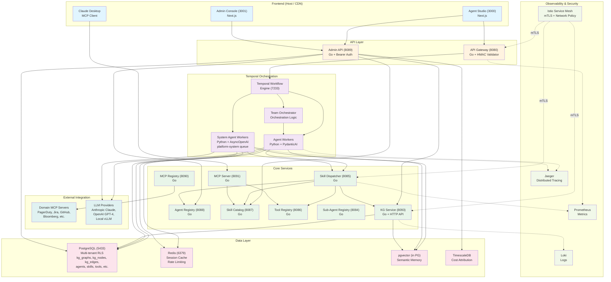
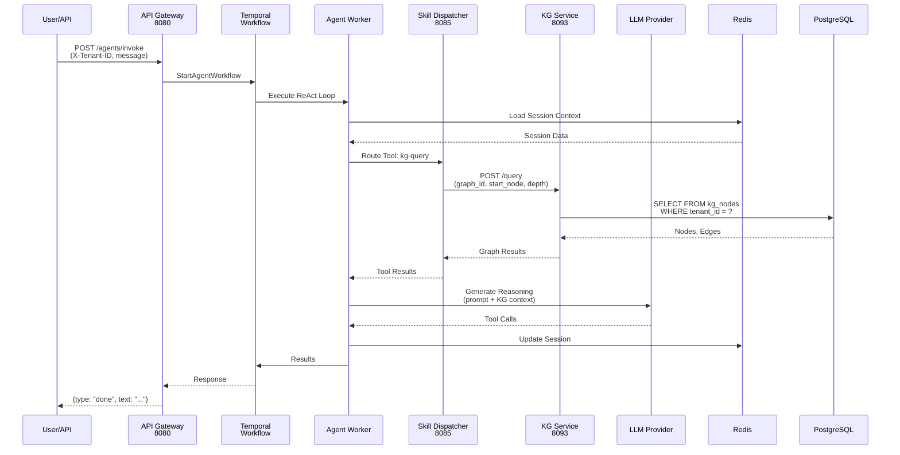
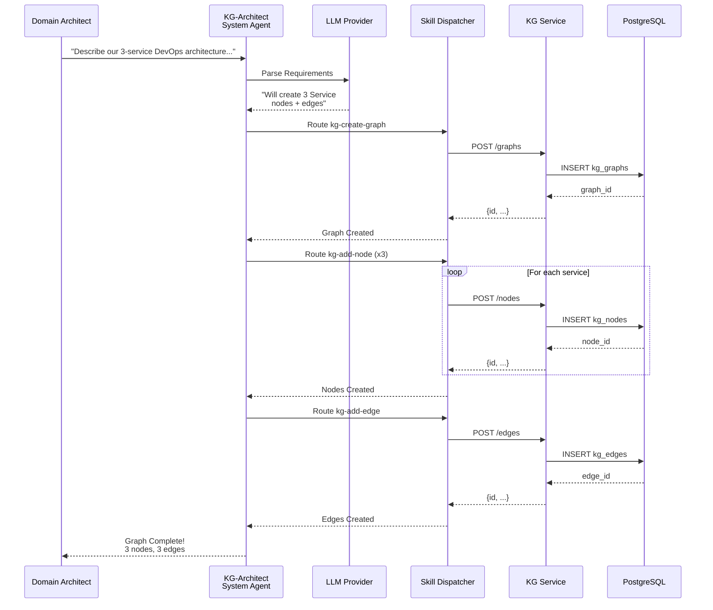
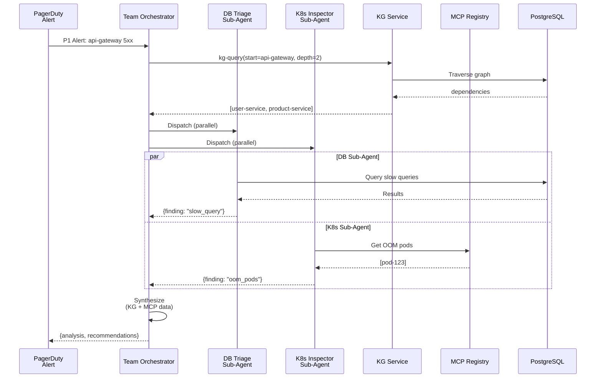
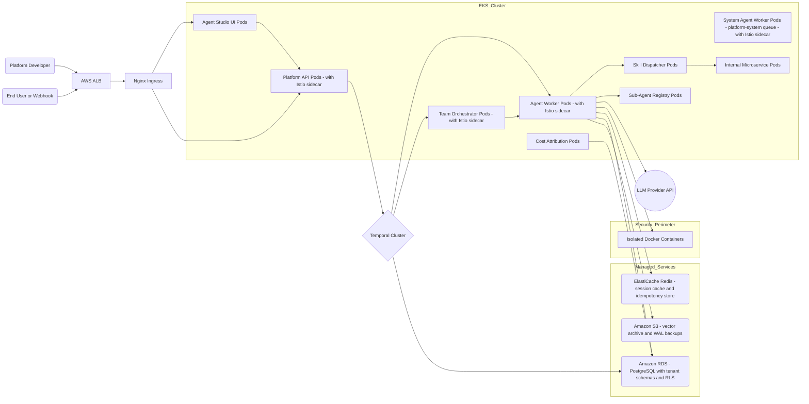
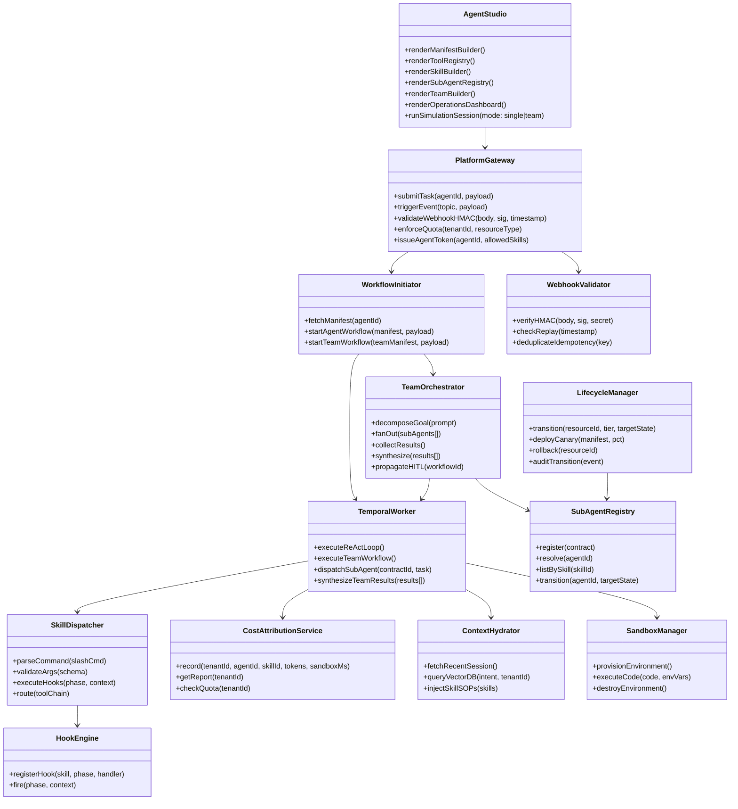
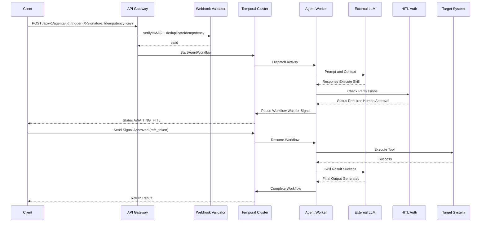
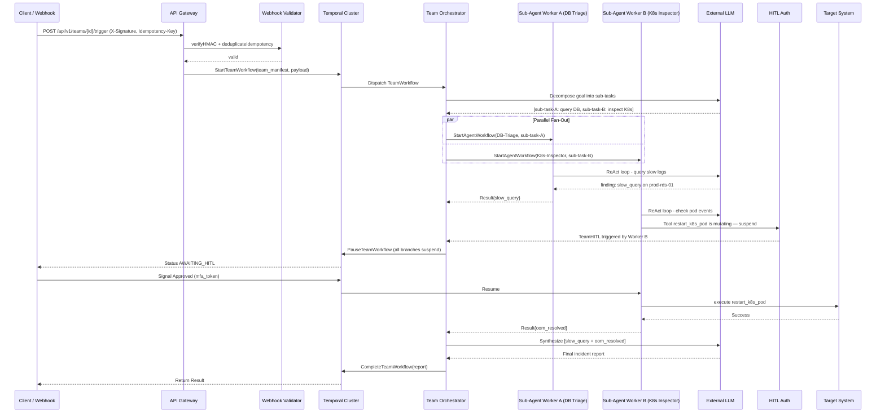
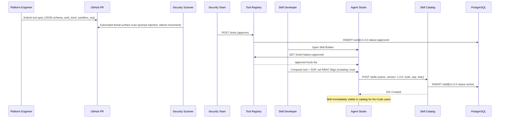

# Enterprise Agentic PaaS: Architecture & Design Spec


## Platform Vision & Capability Requirements

### Architecture Vision
To provide a secure, highly-scalable, and developer-friendly Platform-as-a-Service (PaaS) that transforms how enterprises build and operate AI-driven automation. The platform is structured around a four-tier capability hierarchy — **Tools**, **Skills**, **Sub-Agents**, and **Agent Teams** — that separates primitive execution from governed composition, and single-agent reasoning from coordinated multi-agent workflows. This architecture enables platform engineers to govern every primitive while domain experts assemble sophisticated, self-orchestrating workflows without writing code.

### Core Capability Goals
Architecturally, the system is designed from the ground up to fulfill several strict enterprise requirements:
- **Composable Agent Workforce**: A four-tier hierarchy (Tools → Skills → Sub-Agents → Agent Teams) allows incremental composition — from raw API operations through governed skill bundles to coordinated specialist pipelines that decompose and solve complex multi-domain tasks in parallel.
- **Enterprise-Grade Resilience**: Guarantee zero-data-loss execution via **Durable ReAct loops** and **Team Orchestration** backed by Temporal. Sub-agent failures within a team are retried independently; the team orchestrator resumes without restarting the entire workflow.
- **Zero-Trust Security by Design**: Every tool invocation uses a short-lived, scoped OIDC token. All inter-service communication runs over mTLS. Inbound webhooks require HMAC-SHA256 signature validation. Secrets rotate automatically with leak-detection scanning.
- **Human-in-the-Loop (HITL)**: Any agent or team member invoking a mutating tool suspends the entire team workflow pending MFA-backed approval, with full execution trace context visible to the Approver.
- **Governed Extensibility Without Lock-in**: Security-reviewed tool registration, independently versioned skills, and per-sub-agent model selection prevent both accidental capability sprawl and vendor lock-in.
- **Operational Accountability**: SLOs are tracked at workflow, skill, and tool granularity. Every platform action is costed and attributed per tenant, agent, and skill. Incident runbooks and SLO burn-rate alerts ensure predictable operation at enterprise scale.

---

## 1. Logical Architecture
The logical architecture decouples the definition of an agent from its execution across eight planes. It separates primitive capability registration (Tools) from governed composition (Skills), single-agent reasoning from coordinated multi-agent execution (Agent Teams), and agent creation from platform administration. A dedicated Knowledge Graph Plane stores structural domain context, while a Security Plane enforces zero-trust policy across all planes as a cross-cutting concern.


```mermaid
graph TD
    subgraph Control_Plane
        UI[Agent Studio UI] --> ToolRegistry[Tool Registry]
        UI --> SkillCatalog[Skill Catalog]
        SkillCatalog --> SubAgentRegistry[Sub-Agent Registry]
        SubAgentRegistry --> TeamManifestRegistry[Team Manifest Registry]
        TeamManifestRegistry --> AgentRegistry[Agent Manifest Registry]
        AgentRegistry --> Policy[RBAC and Policy Engine]
        UI --> Simulator[Agent Testing Simulator]
        UI --> LifecycleMgr[Lifecycle and Deployment Manager]
        UI --> ManifestAssistant[Manifest Assistant Chat UI]
        UI --> KGViz[KG Visualization & Browse]
        KGViz --> KGService[KG Service - Query/Search]
    end

    subgraph Admin_Plane
        AdminUI[Admin Console UI] --> AdminAPI[Admin API Gateway]
        AdminAPI --> TenantMgr[Tenant Manager]
        AdminAPI --> LLMConfig[LLM Config Manager]
        AdminAPI --> SystemAgentMgr[System Agent Manager]
        AdminAPI --> CostTracker[Cost Tracking & Billing]
        AdminAPI --> AuditLog[Audit Log Query]
        AdminAPI --> KGMgr[Knowledge Graph Manager]
    end

    subgraph Orchestration_Plane
        Gateway[Agent API Gateway] --> WebhookValidator[Webhook HMAC Validator]
        WebhookValidator --> Workflow[Temporal Workflow Engine]
        Workflow --> AgentWorker[Single-Agent Worker]
        Workflow --> TeamOrchestrator[Team Orchestrator]
        Workflow --> SystemAgentWorker[System Agent Worker - platform-system queue]
        TeamOrchestrator --> SubAgentDispatcher[Sub-Agent Dispatcher]
        SubAgentDispatcher -.->|parallel fan-out| AgentWorker
        AgentWorker --> HITL[HITL and Signal Manager]
    end

    subgraph Execution_Plane
        SkillDispatcher[Skill Dispatcher and Hook Engine]
        Router[Tool Router]
        Sandbox[Ephemeral Sandboxes]
        InternalAPI[Internal Go Microservices]
    end

    subgraph Knowledge_Graph_Plane
        KGService[KG Service]
        KGTools[KG System Tools: kg-create-graph, kg-add-node, kg-add-edge, kg-query, kg-search]
        KGArchitect[KG-Architect System Agent]
        KGService --> KGTools
        KGService --> KGArchitect
    end

    subgraph Data_Plane
        ShortMem[Session Cache - Redis]
        LongMem[Vector DB - tenant-partitioned]
        StructuralContext[Knowledge Graph - PostgreSQL + pgvector]
        LifecycleStore[Lifecycle State Store]
        CostStore[Cost Attribution Store]
        TenantStore[Tenant Settings Store]
        OTel[Observability and Audit - OTel]
    end

    subgraph Security_Plane
        mTLS[Service Mesh - mTLS via Istio]
        STS[Internal STS - short-lived OIDC tokens]
        SecretRotation[Secret Rotation Service]
    end

    subgraph Inference_Plane
        LLMRouter[LLM API Gateway]
        PublicLLM[Managed LLMs: OpenAI / Anthropic]
        LocalLLM[Local Inference: vLLM / Ollama]
    end

    AgentRegistry -.-> Gateway
    ManifestAssistant -.-> Gateway
    AdminAPI -.-> TenantStore
    AdminAPI -.-> CostStore
    AdminAPI -.-> OTel
    AdminAPI -.-> StructuralContext
    SystemAgentMgr -.-> AgentRegistry
    AgentWorker --> SkillDispatcher
    SystemAgentWorker --> SkillDispatcher
    SkillDispatcher --> Router
    Router --> Sandbox
    Router --> InternalAPI
    Router --> KGTools
    AgentWorker --> ShortMem
    SystemAgentWorker --> ShortMem
    AgentWorker --> LongMem
    SystemAgentWorker --> LongMem
    AgentWorker --> StructuralContext
    SystemAgentWorker --> StructuralContext
    AgentWorker --> OTel
    SystemAgentWorker --> OTel
    TeamOrchestrator --> CostStore
    LifecycleMgr --> LifecycleStore
    AgentWorker --> LLMRouter
    SystemAgentWorker --> LLMRouter
    LLMRouter --> PublicLLM
    LLMRouter --> LocalLLM
    KGArchitect --> StructuralContext
    Security_Plane -.->|cross-cutting| Orchestration_Plane
    Security_Plane -.->|cross-cutting| Execution_Plane
    Security_Plane -.->|cross-cutting| Knowledge_Graph_Plane
    Security_Plane -.->|cross-cutting| Admin_Plane
```

---

## 1.0a Full-Stack Platform Conceptual Architecture

```
┌──────────────────────────────────────────────────────────────────────────────────────────┐
│                              PRESENTATION LAYER                                          │
│                                                                                          │
│  Agent Studio                  Admin Console                    Claude Desktop         │
│  (3000)                        (3001)                           (via MCP client)        │
│  • Agent creation UI           • Tenant management              • KG queries           │
│  • Skill compose UI            • LLM config                     • Tool invocation      │
│  • Agent testing               • System agents                  • External access     │
│  • Execution logs              • Cost tracking                  via MCP Servers       │
└──────────────────────────────────────────────────────────────────────────────────────────┘
                                        │
                                        ▼
┌──────────────────────────────────────────────────────────────────────────────────────────┐
│                            API GATEWAY LAYER                                             │
│                                                                                          │
│  API Gateway (8080)                              Admin API (8089)                       │
│  • HMAC webhook validation                       • Bearer token auth                    │
│  • Tenant isolation (X-Tenant-ID)                • Cross-tenant visibility              │
│  • Request routing                               • Platform governance                  │
│  • Rate limiting                                 • Cost aggregation                     │
└──────────────────────────────────────────────────────────────────────────────────────────┘
                                        │
                    ┌───────────────────┴───────────────────┐
                    ▼                                       ▼
┌────────────────────────────────────────────┐  ┌──────────────────────────────────────────┐
│         ORCHESTRATION & EXECUTION           │  │     PLATFORM GOVERNANCE                 │
│                                            │  │                                          │
│  Workflow Initiator (8081)                 │  │  Tenant Manager                          │
│  • Temporal workflow dispatch              │  │  LLM Config Manager                      │
│  • Team orchestration                      │  │  System Agent Manager                    │
│  • HITL signal management                  │  │  Cost Tracker                            │
│  • Sub-agent fan-out                       │  │  Audit Log                               │
│                                            │  │                                          │
│  Agent Workers (Temporal queue)            │  │  Admin API Router                        │
│  • Single-agent execution                  │  │                                          │
│  • Tool invocation cycle                   │  │                                          │
│  • LLM inference calls                     │  │                                          │
│  • HITL suspension/resume                  │  │                                          │
│                                            │  │                                          │
│  System Agent Workers                      │  │  Config Persistence                      │
│  • platform-system queue                   │  │  (platform_config table)                 │
│  • Manifest Assistant                      │  │                                          │
│  • KG-Architect agent                      │  │                                          │
└────────────────────────────────────────────┘  └──────────────────────────────────────────┘
                    │                                        │
                    └───────────────┬───────────────────────┘
                                    ▼
┌──────────────────────────────────────────────────────────────────────────────────────────┐
│                            SERVICE LAYER (Microservices)                                 │
│                                                                                          │
│  ┌──────────────────┐  ┌──────────────────┐  ┌──────────────────┐  ┌─────────────────┐ │
│  │ Skill Dispatcher │  │ Tool Registry    │  │ MCP Registry     │  │ KG Service      │ │
│  │ (8082)           │  │ (8083)           │  │ (8090)           │  │ (8093)          │ │
│  │                  │  │                  │  │                  │  │                 │ │
│  │ • Skill routing  │  │ • Tool catalog   │  │ • MCP endpoints  │  │ • KG CRUD API   │ │
│  │ • Hook execution │  │ • Versioning     │  │ • Bearer tokens  │  │ • Traversal     │ │
│  │ • Pre/post hooks │  │ • Approval flows │  │ • Client mgmt    │  │ • Semantic      │ │
│  │ • Tool chains    │  │                  │  │ • Endpoint test  │  │   search        │ │
│  └──────────────────┘  └──────────────────┘  └──────────────────┘  │ • Query API     │ │
│                                                                      │ • RLS isolation │ │
│  ┌──────────────────┐  ┌──────────────────┐  ┌─────────────────┐   └─────────────────┘ │
│  │ Agent Registry   │  │ Skill Catalog    │  │ LLM Gateway     │                       │
│  │ (8084)           │  │ (8085)           │  │ (internal)      │   4-Tier Hierarchy   │
│  │                  │  │                  │  │                 │   ───────────────    │
│  │ • Agent manifests│  │ • Skill catalog  │  │ • Provider proxy│   Tools              │
│  │ • Versioning     │  │ • Skill versioning  │ • Model routing │   • bash             │
│  │ • Lifecycle mgmt │  │ • Lifecycle      │  │ • Rate limits   │   • web-search       │
│  │                  │  │                  │  │ • Cost tracking │   • kg-*             │
│  └──────────────────┘  └──────────────────┘  └─────────────────┘   • custom tools      │
│                                                                                          │
│  Skill = Bundle(Tools)          Sub-Agent = Agent(Skills)       Agent Team = Multi     │
│                                                                  Sub-Agent Workflow    │
└──────────────────────────────────────────────────────────────────────────────────────────┘
                                        │
                    ┌───────────────────┴───────────────────┐
                    ▼                                       ▼
┌────────────────────────────────────────────┐  ┌──────────────────────────────────────────┐
│       EXECUTION ADAPTERS                    │  │     EXTERNAL INTEGRATIONS                │
│                                            │  │                                          │
│  Skill Dispatcher Routes to:               │  │  Domain MCP Servers                      │
│                                            │  │  ─────────────────                       │
│  • Ephemeral Sandboxes                     │  │  • PagerDuty (incident context)         │
│    - bash execution (Docker)               │  │  • Jira/GitHub (project context)        │
│    - Python runtime                        │  │  • Bloomberg (market data)               │
│    - Node.js runtime                       │  │  • Custom enterprise APIs                │
│                                            │  │                                          │
│  • Internal Go Microservices               │  │  Platform MCP Server (port 8091)         │
│    - Tool execution via RPC                │  │  ──────────────────────────             │
│    - Type-safe invocation                  │  │  Exposes platform capabilities:         │
│    - Structured responses                  │  │  • kg_search_entities                   │
│                                            │  │  • kg_get_relationships                 │
│  Tool Router                               │  │  • kg_query_graph                       │
│  • Verb dispatch (invoke, list, approve)  │  │  • invoke_tool_via_dispatcher           │
│  • Error handling                          │  │  • list_skills_in_catalog               │
│  • Response formatting                     │  │                                          │
│                                            │  │  External Claude Desktop                 │
│                                            │  │  • Connects via MCP client               │
│                                            │  │  • Full KG query access                  │
│                                            │  │  • Tool invocation capability            │
└────────────────────────────────────────────┘  └──────────────────────────────────────────┘
                    │                                        │
                    └───────────────┬───────────────────────┘
                                    ▼
┌──────────────────────────────────────────────────────────────────────────────────────────┐
│                              DATA LAYER                                                  │
│                                                                                          │
│  ┌────────────────────────┐  ┌──────────────────────┐  ┌─────────────────────────────┐  │
│  │   PostgreSQL           │  │   Redis              │  │   Vector DB (pgvector)      │  │
│  │   (Multi-Tenant RLS)   │  │   (Session Cache)    │  │   (Semantic Memory)         │  │
│  │                        │  │                      │  │                             │  │
│  │ agents                 │  │ • Agent sessions     │  │ • Tenant-partitioned        │  │
│  │ skills                 │  │ • Execution context  │  │ • Node embeddings           │  │
│  │ tools                  │  │ • HITL state         │  │ • Entity vectors            │  │
│  │ agent_teams            │  │ • Rate limit counters│  │ • Relationship embeddings   │  │
│  │ tenant_settings        │  │ • LLM routing state  │  │ • Semantic search index     │  │
│  │ lifecycle_events       │  │                      │  │                             │  │
│  │ cost_events            │  │ TTL: 24 hours        │  │ Queried by kg-search        │  │
│  │ agent_executions       │  │                      │  │ agent system tool           │  │
│  │                        │  │                      │  │                             │  │
│  │ kg_graphs              │  │                      │  │                             │  │
│  │ kg_nodes               │  │                      │  │                             │  │
│  │ kg_edges               │  │                      │  │                             │  │
│  │                        │  │                      │  │                             │  │
│  │ RLS Isolation:         │  │                      │  │                             │  │
│  │ Tenant via             │  │                      │  │                             │  │
│  │ app.tenant_id          │  │                      │  │                             │  │
│  │ setting & policies     │  │                      │  │                             │  │
│  └────────────────────────┘  └──────────────────────┘  └─────────────────────────────┘  │
│                                                                                          │
│  ┌────────────────────────────────────────────────────────────────────────────────┐   │
│  │   TimescaleDB (Cost Attribution)              OTel (Observability)             │   │
│  │                                                                                │   │
│  │   cost_events                                 • Trace export (Jaeger)         │   │
│  │   • tenant_id                                 • Metric export (Prometheus)    │   │
│  │   • agent_id / skill_id / tool_id            • Log aggregation (Loki)        │   │
│  │   • model_id                                  • Distributed tracing           │   │
│  │   • input_tokens / output_tokens              • SLO monitoring               │   │
│  │   • cost (USD)                                • Alert rules                  │   │
│  │   • timestamp                                                                 │   │
│  │                                                                                │   │
│  │   Used for: Cost tracking, SLO burn-rate, Per-tenant invoicing              │   │
│  └────────────────────────────────────────────────────────────────────────────────┘   │
│                                                                                          │
└──────────────────────────────────────────────────────────────────────────────────────────┘
                                        │
                                        ▼
┌──────────────────────────────────────────────────────────────────────────────────────────┐
│                          INFERENCE LAYER                                                │
│                                                                                          │
│  ┌──────────────────────┐  ┌──────────────────────┐  ┌─────────────────────────────┐  │
│  │  LLM API Gateway     │  │  Managed LLMs        │  │  Local Inference            │  │
│  │  (LiteLLM proxy)     │  │  (claude-sonnet)     │  │  (vLLM / Ollama)            │  │
│  │                      │  │  (gpt-4o)            │  │                             │  │
│  │  • Model routing     │  │  (gpt-4-turbo)       │  │  Self-hosted models:        │  │
│  │  • Token accounting  │  │  (gpt-4o-mini)       │  │  • Mistral 7B               │  │
│  │  • Rate limiting     │  │                      │  │  • Llama 2 13B              │  │
│  │  • Cost tracking     │  │  Per-tenant          │  │  • Custom fine-tunes        │  │
│  │  • Request replay    │  │  model allowlists    │  │  (with autoscaling)         │  │
│  │                      │  │  configured via      │  │                             │  │
│  │  Config:             │  │  Admin Console       │  │  Cost control:              │  │
│  │  • Anthropic API key │  │                      │  │  • Run on dedicated GPU     │  │
│  │  • OpenAI API key    │  │  Fallback routing:   │  │  • Cost per inference       │  │
│  │  • vLLM endpoint     │  │  if primary fails    │  │  • KV cache mgmt            │  │
│  │  • Max tokens/min    │  │                      │  │                             │  │
│  └──────────────────────┘  └──────────────────────┘  └─────────────────────────────┘  │
│                                                                                          │
└──────────────────────────────────────────────────────────────────────────────────────────┘

════════════════════════════════════════════════════════════════════════════════════════════
                            DATA FLOW (Example: Agent Invocation)
════════════════════════════════════════════════════════════════════════════════════════════

 User (Claude Desktop or Agent Studio)
           │
           ▼
 POST /api/v1/agents/<agent_id>/invoke
 X-Tenant-ID: tenant-123
 { message: "...", tools: [...] }
           │
           ▼
 API Gateway (8080) ──HMAC validate──> Webhook HMAC Validator
           │
           ├─ Rate limit check (Redis)
           │
           ├─ Tenant isolation check (X-Tenant-ID)
           │
           ▼
 Temporal Workflow Engine
           │
           ├─ Load agent manifest from Agent Registry
           │
           ├─ Load recommended skills from Skill Catalog
           │
           ├─ Load skill → tool mappings from Tool Registry
           │
           ├─ Query KG Service for structural context
           │    └─ kg-search (semantic search)
           │    └─ kg-query (relationship traversal)
           │
           ▼
 Agent Worker (Temporal activity)
           │
           ├─ Fetch context from Redis (session)
           │
           ├─ Call LLM Gateway → LLM (Claude/GPT)
           │
           ├─ Parse tool calls
           │
           ├─ For each tool:
           │    │
           │    ├─ Skill Dispatcher (8082)
           │    │    │
           │    │    ├─ Resolve skill → tools
           │    │    │
           │    │    ├─ Pre-hooks
           │    │    │
           │    │    ├─ Tool Router
           │    │    │    │
           │    │    │    ├─ Sandbox (bash, python, node)
           │    │    │    │
           │    │    │    └─ Internal RPC (kg-service, etc.)
           │    │    │
           │    │    └─ Post-hooks
           │    │
           │    └─ Collect results
           │
           ├─ For mutating tools:
           │    │
           │    ├─ Check HITL approval
           │    │
           │    ├─ If needed: suspend + signal Human
           │    │
           │    └─ Resume after MFA approval
           │
           ├─ Update Redis session with new context
           │
           ├─ Track cost_events in TimescaleDB
           │
           ├─ Emit traces/metrics to OTel
           │
           ▼
 Response streamed to user
 { type: "thinking" | "tool_call" | "text" | "done" }

════════════════════════════════════════════════════════════════════════════════════════════
                 FRAMEWORK-AGNOSTIC AGENT EXECUTION ARCHITECTURE
════════════════════════════════════════════════════════════════════════════════════════════

All agent frameworks (Anthropic SDK, OpenAI Agents, Google ADK, PydanticAI) follow the same
execution pattern to maximize code reuse and minimize duplication across Temporal and direct modes.

## Core Pattern: Framework Core + Execution Mode Wrappers

Each framework has three layers:

 1. **Core Module** (Framework-Agnostic)
    ├─ ReAct loop (LLM calls, tool invocation, response processing)
    ├─ Tool definition building
    ├─ Thinking block extraction
    ├─ Token tracking
    └─ Accepts tool executor abstraction (varies by execution mode)

 2. **Temporal Wrapper** (Temporal-Specific)
    ├─ Wraps core module
    ├─ Handles HITL approval context (approved_hitl_tools)
    ├─ Returns AgentDecision format for workflow state machine
    ├─ Uses ToolExecutionClient (platform tool bridge with governance)
    └─ Called as Temporal activity (runs inside workflow)

 3. **Direct Wrapper** (Direct Execution-Specific)
    ├─ Wraps core module
    ├─ Handles session state and event streaming (SSE)
    ├─ Emits events to session.events queue (thinking, tool_call, tool_result, final_answer)
    ├─ Uses DirectToolsExecutor (bypasses Skill Dispatcher for speed)
    └─ Called via HTTP endpoint (stateless per-iteration execution)

## Example: Anthropic SDK

```
anthropic_agent_core.py (shared)
  ├─ AnthropicAgentCore
  │  ├─ build_tool_definitions()
  │  ├─ run_react_loop(messages, iteration_callback)
  │  └─ Anthropic SDK client initialization
  └─ No execution-mode concerns (pure ReAct logic)

anthropic_agent.py (Temporal wrapper)
  ├─ AnthropicTemporalAgent(AnthropicAgentCore)
  │  ├─ execute_step(session, context) → AgentDecision
  │  └─ Handles HITL resumption
  ├─ TemporalToolExecutor (wraps ToolExecutionClient)
  └─ Called by: @activity.defn anthropic_agents_run()

direct_anthropic_agent.py (Direct wrapper)
  ├─ DirectAnthropicAgent(AnthropicAgentCore)
  │  ├─ execute_step(session, context) → {final_answer, continue_loop, tool_calls}
  │  └─ Emits events to session
  ├─ DirectToolExecutor (wraps DirectToolsExecutor)
  └─ Called by: POST /api/v1/agents/{id}/execute-direct
```

## Benefits

| Aspect | Benefit |
|--------|---------|
| **DRY** | ReAct loop, tool definitions, response parsing written once |
| **Testability** | Test core in isolation (no Temporal, no HTTP mocking needed) |
| **Maintainability** | Bug fixes in core apply to both execution modes automatically |
| **Extensibility** | Add new framework = copy wrapper pattern, reuse core design |
| **Consistency** | Both modes use identical tool logic and loop behavior |
| **Parity** | Temporal and direct agents behave identically for same framework |

## Execution Mode Differences

| Aspect | Temporal | Direct |
|--------|----------|--------|
| **Tool Executor** | ToolExecutionClient (platform bridge) | DirectToolsExecutor (direct) |
| **Governance** | Full HITL, cost metering, audit hooks | None (fast path) |
| **State Management** | Workflow durable state (Temporal) | In-memory session (Redis optional) |
| **Return Format** | AgentDecision dict | Step result with continue_loop flag |
| **Iteration Model** | Single activity runs full loop | HTTP endpoint called per iteration |
| **Event Streaming** | Via Temporal event emitters | Via SSE/WebSocket to client |

This pattern applies to all frameworks: PydanticAI, OpenAI Agents, Google ADK, and future additions.

## Framework-Specific Implementation Status

### Anthropic SDK ✅ (Complete)
- **Core**: `anthropic_agent_core.py` (AnthropicAgentCore) — 345 lines
- **Temporal**: `anthropic_agent.py` (AnthropicTemporalAgent) — 248 lines
- **Direct**: `direct_anthropic_agent.py` (DirectAnthropicAgent) — 103 lines
- **Total**: 696 lines (vs. 1300+ without pattern)

### PydanticAI ⏳ (Temporal Only - Refactor When Adding Direct)
- **Status**: Only Temporal version exists (`pydantic_ai_agent.py`, 689 lines)
- **Current Architecture**: Single file with `AgentToolRegistry` + `build_agent_with_tools`
- **When Direct Execution Needed**: Apply core + wrapper pattern:
  - Extract `AgentToolRegistry` and `build_agent_with_tools` into `pydantic_ai_agent_core.py`
  - Keep Temporal specifics in `pydantic_ai_agent.py`
  - Create `direct_pydantic_ai_agent.py` with event streaming
  - Reason: PydanticAI uses SDK-managed loop (not manual), so architecture differs slightly from Anthropic

### OpenAI Agents, Google ADK (Not Yet Implemented)
- Placeholder for future multi-framework support
- When implemented, follow the same core + wrapper pattern

════════════════════════════════════════════════════════════════════════════════════════════
                        4-TIER CAPABILITY HIERARCHY
════════════════════════════════════════════════════════════════════════════════════════════

 TIER 1: TOOLS (Primitives, Platform-Governed)
 ──────────────────────────────────────────
 Atomic operations: bash, python, web-search, kg-create-graph, invoke_custom_api
 • Register with Tool Registry
 • Security review required
 • Versioned independently
 • Invoked via Skill Dispatcher
 • HITL gating per tool

 TIER 2: SKILLS (Bundles of Tools, Reusable Packages)
 ───────────────────────────────────────────────────
 Workflows: bash + python + web-search = "diagnostic-skill"
            kg-query + web-fetch = "research-skill"
 • Composed in Skill Catalog
 • Versioned skill manifest (name, tools, defaults, hooks)
 • Pre/post-hook chains
 • Instantiated per agent
 • Reusable across agents

 TIER 3: SUB-AGENTS (Single-Threaded ReAct Loops, Capability Contracts)
 ──────────────────────────────────────────────────────────────────
 Specialized agents: {name: "research-agent", skills: ["research-skill"],
                      model: "claude-sonnet", system_prompt: "..."}
 • Bound to LLM model (can differ per sub-agent in team)
 • Bound to specific skill set
 • Runs single ReAct loop (think + act + observe)
 • Part of larger team workflows
 • Independent failure domain (can be retried)

 TIER 4: AGENT TEAMS (Parallel Sub-Agent Orchestration, Temporal Workflows)
 ──────────────────────────────────────────────────────────────────────
 Multi-agent workflows: Team = {sub_agents: [research-agent, code-reviewer],
                                orchestration: parallel}
 • Durable execution via Temporal
 • Sub-agents run in parallel (fan-out)
 • Results aggregated by Team Orchestrator
 • HITL signals suspend entire team
 • Failures in one sub-agent don't stop team (independent retry)

════════════════════════════════════════════════════════════════════════════════════════════
```

- **Control Plane (Agent Studio - Domain Architects)**: The command center where domain architects work within their tenant workspace. Architects import and customize cookbooks, build knowledge graphs via KG-Architect natural-language chat, create agents from pre-built templates, configure tenant-specific MCP integrations, deploy agents, and monitor executions—all no-code. Behind the scenes: Platform engineers register Tools via the Tool Registry (security review required). Skill Developers compose Tools into Skills in the Skill Catalog. Sub-Agent Developers define capability contracts in the Sub-Agent Registry. The Lifecycle Manager governs state transitions and deployment strategies across all tiers. The **Manifest Assistant Chat UI** is embedded in the Agent Creation dialog for interactive manifest design; **KG-Architect Chat** provides natural-language knowledge graph building.

- **Knowledge Graph Plane**: A dedicated layer for storing and querying structural domain context. The KG Service provides HTTP APIs for CRUD operations on graphs, nodes, and edges with PostgreSQL + pgvector backend. Five system tools (`kg-*`) enable agents to query domain topology. The KG-Architect system agent helps domain architects build knowledge graphs conversationally. Multi-tenant isolation enforced via PostgreSQL RLS policies.

---

## 1.0b Two-User Model: Platform Operators vs Domain Architects

A1 Agent Engine deliberately separates platform administration from domain-solution creation, enabling a clean division of labor:

### Platform Operators (Admin Console - port 3001)

**Who**: Platform engineers, DevOps teams managing the A1 platform itself

**Responsibilities**:
1. **Publish Cookbooks** — Upload domain-specific cookbook bundles to `infra/platform/cookbooks/<vertical>/`
   - DevOps/SRE cookbook (agent templates, skill definitions, KG schema, MCP recommendations)
   - Fintech cookbook, Healthcare cookbook, etc.
   - Version and release cookbooks

2. **Manage System Agents & Skills**
   - Lifecycle transitions for Manifest Assistant, KG-Architect
   - Publish system-wide skills to skill catalog
   - Register system tools with security review

3. **Configure LLM Providers**
   - Anthropic API endpoint + keys
   - OpenAI endpoint + keys
   - Local vLLM/Ollama endpoints
   - Per-tenant model access allowlists

4. **Register Global MCP Servers**
   - PagerDuty instance endpoint + credentials
   - Datadog endpoint + API keys
   - GitHub endpoint + PAT
   - Custom enterprise API endpoints
   - (Domain architects create tenant-scoped MCP connections)

5. **Tenant & Quota Management**
   - Create/suspend/delete tenants
   - Set monthly token budgets
   - Configure per-tenant model access restrictions
   - View cross-tenant cost aggregations and SLO metrics

6. **Governance & Audit**
   - Immutable audit logs of all platform actions
   - Cost attribution per tenant/agent/skill
   - Cross-tenant execution traces
   - Compliance reports

**Access**: Admin Console (separate from Agent Studio) via bearer token authentication

---

### Domain Architects (Agent Studio - port 3000, within Tenant Workspace)

**Who**: DevOps leads, SRE managers, Fintech engineers, Healthcare IT teams using the platform to build domain-specific agentic solutions

**Responsibilities** (All within their tenant):
1. **Import & Customize Cookbooks** (Agent Studio → Cookbooks)
   - Browse published cookbooks (DevOps/SRE, Fintech, Healthcare, etc.)
   - One-click import into their tenant
   - Platform auto-creates tenant-scoped agent templates, skills, KG schema

2. **Build Knowledge Graphs** (Agent Studio → KG-Architect Chat)
   - Natural language: "Describe your infrastructure, services, relationships"
   - KG-Architect system agent iteratively builds graph via kg-* tools
   - Semantic search on domain entities (pgvector)
   - Iterate and refine in conversational chat

2b. **Visualize & Explore KGs** (Agent Studio → Knowledge Graphs)
   - Interactive graph canvas showing nodes and edges
   - Search/filter entities and relationships
   - Click nodes to inspect properties
   - Traverse relationships in the graph
   - View statistics and export as JSON/PNG

3. **Configure Tenant MCP Integrations** (Agent Studio → Settings → External Integrations)
   - Register their PagerDuty instance (token issued per tenant)
   - Integrate their Datadog metrics (API key scoped to tenant)
   - Connect their GitHub/Jira instances
   - All connections tenant-isolated; no cross-tenant data leakage

4. **Create & Deploy Agents** (Agent Studio → Create Agent)
   - Select cookbook template (e.g., "SRE Incident Triager")
   - Pre-populated with: system prompt, skills, KG context, MCP integrations
   - Customize and fine-tune
   - Deploy to canary/production with auto-rollback

5. **Test & Monitor** (Agent Studio → Simulator & Executions)
   - Agent Simulator for testing before production
   - Live execution traces showing KG queries and MCP calls
   - Cost monitoring per agent
   - Iterate on performance

6. **Configure Automation** (Agent Studio → Agent Settings)
   - Webhook triggers (PagerDuty alert → invoke agent)
   - Scheduled execution (periodic health checks)
   - Budget alerts and soft/hard quota limits

**Access**: Agent Studio within their tenant context; never access Admin Console

---

### Why This Separation Matters

| Concern | Platform Operator | Domain Architect |
|---------|-------------------|------------------|
| **Scope** | Cross-tenant system resources | Single-tenant domain solution |
| **Access** | Admin Console (bearer token) | Agent Studio (enterprise SSO) |
| **Data Visibility** | All tenants (no RLS) | Own tenant only (RLS enforced) |
| **Responsibilities** | Platform uptime, cookbook publishing, LLM configuration | Domain KG, agent customization, tenant MCP setup |
| **Skill Level** | Platform/DevOps engineers | Domain experts (no coding required) |
| **Iteration Speed** | Quarterly cookbook releases | Minutes (KG-Architect, template customization) |

---

## 1.1 Physical Architecture (Deployment Topology)

The Physical Architecture maps logical planes to concrete Kubernetes services, ports, and data stores. It illustrates how all components communicate at runtime.


```mermaid
graph TB
    subgraph Frontend["Frontend (Host / CDN)"]
        AS["Agent Studio (3000)<br/>Next.js"]
        AC["Admin Console (3001)<br/>Next.js"]
        CD["Claude Desktop<br/>MCP Client"]
    end

    subgraph API_Layer["API Layer"]
        AG["API Gateway (8080)<br/>Go + HMAC Validator"]
        AA["Admin API (8089)<br/>Go + Bearer Auth"]
    end

    subgraph Temporal_Engine["Temporal Orchestration"]
        TW["Temporal Workflow<br/>Engine (7233)"]
        AW["Agent Workers<br/>Python + PydanticAI"]
        SAW["System Agent Workers<br/>Python + AsyncOpenAI<br/>platform-system queue"]
        TO["Team Orchestrator<br/>Orchestration Logic"]
    end

    subgraph Services["Core Services"]
        SD["Skill Dispatcher (8085)<br/>Go"]
        AR["Agent Registry (8088)<br/>Go"]
        SC["Skill Catalog (8087)<br/>Go"]
        TR["Tool Registry (8086)<br/>Go"]
        SR["Sub-Agent Registry (8084)<br/>Go"]
        KGS["KG Service (8093)<br/>Go + HTTP API"]
        MCPReg["MCP Registry (8090)<br/>Go"]
        MCPS["MCP Server (8091)<br/>Go"]
    end

    subgraph Data_Stores["Data Layer"]
        PG["PostgreSQL (5433)<br/>Multi-tenant RLS<br/>kg_graphs, kg_nodes, kg_edges,<br/>agents, skills, tools, etc."]
        Redis["Redis (6379)<br/>Session Cache<br/>Rate Limiting"]
        VectorDB["pgvector (in PG)<br/>Semantic Memory"]
        TSDB["TimescaleDB<br/>Cost Attribution"]
    end

    subgraph External_Integration["External Integration"]
        ExtMCP["Domain MCP Servers<br/>PagerDuty, Jira, GitHub,<br/>Bloomberg, etc."]
        LLM["LLM Providers<br/>Anthropic Claude,<br/>OpenAI GPT-4,<br/>Local vLLM"]
    end

    subgraph Observability["Observability & Security"]
        Jaeger["Jaeger<br/>Distributed Tracing"]
        Prometheus["Prometheus<br/>Metrics"]
        Loki["Loki<br/>Logs"]
        Istio["Istio Service Mesh<br/>mTLS + Network Policy"]
    end

    %% Frontend connections
    AS --> AG
    AS --> AA
    AC --> AA
    CD --> MCPS

    %% API Gateway flow
    AG --> TW
    AA --> AR
    AA --> KGS
    AA --> SC

    %% Temporal workers
    TW --> AW
    TW --> SAW
    TW --> TO
    TO --> AW

    %% Worker execution
    AW --> SD
    SAW --> SD
    AW --> Redis
    SAW --> Redis
    AW --> VectorDB
    SAW --> VectorDB
    AW --> PG
    SAW --> PG
    AW --> LLM
    SAW --> LLM

    %% Service lookups
    SD --> AR
    SD --> SC
    SD --> TR
    SD --> KGS

    %% KG Service
    KGS --> PG
    KGS --> VectorDB

    %% MCP integration
    MCPReg --> ExtMCP
    MCPS --> SC
    MCPS --> TR

    %% Admin operations
    AA --> PG
    AA --> TSDB

    %% Observability connections
    AW -.-> Jaeger
    SAW -.-> Jaeger
    AG -.-> Prometheus
    SD -.-> Prometheus
    KGS -.-> Loki

    %% Security layer (cross-cutting)
    Istio -.->|mTLS| AG
    Istio -.->|mTLS| SD
    Istio -.->|mTLS| KGS

    classDef frontend fill:#e1f5ff
    classDef api fill:#fff3e0
    classDef temporal fill:#f3e5f5
    classDef services fill:#e8f5e9
    classDef data fill:#fce4ec
    classDef external fill:#e0f2f1
    classDef obs fill:#f1f8e9

    class AS,AC,CD frontend
    class AG,AA api
    class TW,AW,SAW,TO temporal
    class SD,AR,SC,TR,SR,KGS,MCPReg,MCPS services
    class PG,Redis,VectorDB,TSDB data
    class ExtMCP,LLM external
    class Jaeger,Prometheus,Loki,Istio obs
```

**Key Deployment Characteristics:**

- **Frontend-Only Hosts**: Agent Studio and Admin Console run on developer/user machines or separate CDN, not in Kubernetes
- **API Gateway (8080)**: Single entry point with HMAC webhook validation; routes to Temporal and registries
- **Temporal Cluster**: Manages all agent execution via durable workflows; workers are horizontally scalable
- **System Agent Isolation**: System agents run on isolated `platform-system-agent-queue` with dedicated worker pool
- **KG Service (8093)**: Dedicated microservice for knowledge graph operations; routes through Skill Dispatcher for agent access
- **Multi-Tenancy**: PostgreSQL RLS enforces tenant isolation at query time; Redis uses key prefixes; Temporal uses per-tenant task queues
- **Data Locality**: All services colocate with PostgreSQL for reduced latency; Redis used for session hot cache

---

## 1.2 Component Architecture: Data Flows

This section illustrates key data flows and component interactions for common platform operations.

### 1.2.1 Agent Execution Flow with KG Context


```mermaid
sequenceDiagram
    participant User as User/API
    participant AG as API Gateway<br/>8080
    participant TW as Temporal<br/>Workflow
    participant AW as Agent Worker
    participant SD as Skill Dispatcher<br/>8085
    participant KGS as KG Service<br/>8093
    participant LLM as LLM Provider
    participant Redis as Redis
    participant PG as PostgreSQL

    User->>AG: POST /agents/invoke<br/>(X-Tenant-ID, message)
    AG->>TW: StartAgentWorkflow
    TW->>AW: Execute ReAct Loop
    
    AW->>Redis: Load Session Context
    Redis-->>AW: Session Data
    
    AW->>SD: Route Tool: kg-query
    SD->>KGS: POST /query<br/>(graph_id, start_node, depth)
    KGS->>PG: SELECT FROM kg_nodes<br/>WHERE tenant_id = ?
    PG-->>KGS: Nodes, Edges
    KGS-->>SD: Graph Results
    SD-->>AW: Tool Results
    
    AW->>LLM: Generate Reasoning<br/>(prompt + KG context)
    LLM-->>AW: Tool Calls
    
    AW->>Redis: Update Session
    AW->>TW: Results
    TW-->>AG: Response
    AG-->>User: {type: "done", text: "..."}
```

### 1.2.2 Knowledge Graph Construction (KG-Architect)


```mermaid
sequenceDiagram
    participant Arch as Domain Architect
    participant KGA as KG-Architect<br/>System Agent
    participant LLM as LLM Provider
    participant SD as Skill Dispatcher
    participant KGS as KG Service
    participant PG as PostgreSQL

    Arch->>KGA: "Describe our 3-service DevOps architecture..."
    KGA->>LLM: Parse Requirements
    LLM-->>KGA: "Will create 3 Service<br/>nodes + edges"
    
    KGA->>SD: Route kg-create-graph
    SD->>KGS: POST /graphs
    KGS->>PG: INSERT kg_graphs
    PG-->>KGS: graph_id
    KGS-->>SD: {id, ...}
    SD-->>KGA: Graph Created
    
    KGA->>SD: Route kg-add-node (x3)
    loop For each service
        SD->>KGS: POST /nodes
        KGS->>PG: INSERT kg_nodes
        PG-->>KGS: node_id
        KGS-->>SD: {id, ...}
    end
    SD-->>KGA: Nodes Created
    
    KGA->>SD: Route kg-add-edge
    SD->>KGS: POST /edges
    KGS->>PG: INSERT kg_edges
    PG-->>KGS: edge_id
    KGS-->>SD: {id, ...}
    SD-->>KGA: Edges Created
    
    KGA-->>Arch: Graph Complete!<br/>3 nodes, 3 edges
```

### 1.2.3 Team Workflow with KG + MCP Integration


```mermaid
sequenceDiagram
    participant Alert as PagerDuty<br/>Alert
    participant TO as Team Orchestrator
    participant DBSub as DB Triage<br/>Sub-Agent
    participant K8sSub as K8s Inspector<br/>Sub-Agent
    participant KGS as KG Service
    participant MCP as MCP Registry
    participant PG as PostgreSQL

    Alert->>TO: P1 Alert: api-gateway 5xx

    TO->>KGS: kg-query(start=api-gateway, depth=2)
    KGS->>PG: Traverse graph
    PG-->>KGS: dependencies
    KGS-->>TO: [user-service, product-service]

    TO->>DBSub: Dispatch (parallel)
    TO->>K8sSub: Dispatch (parallel)

    par DB Sub-Agent
        DBSub->>PG: Query slow queries
        PG-->>DBSub: Results
        DBSub-->>TO: {finding: "slow_query"}
    and K8s Sub-Agent
        K8sSub->>MCP: Get OOM pods
        MCP-->>K8sSub: [pod-123]
        K8sSub-->>TO: {finding: "oom_pods"}
    end

    TO->>TO: Synthesize<br/>(KG + MCP data)
    TO-->>Alert: {analysis, recommendations}
```

### 1.2.4 Multi-Tenant KG Isolation via RLS

```
┌──────────────────────────────────────────────────────────┐
│ PostgreSQL Row-Level Security (RLS) on kg_nodes          │
│                                                          │
│ SET LOCAL app.tenant_id = 'tenant-a'                     │
│ SELECT * FROM kg_nodes                                   │
│ ✓ Returns: 50 rows (tenant-a only)                       │
│                                                          │
│ SET LOCAL app.tenant_id = 'tenant-b'                     │
│ SELECT * FROM kg_nodes                                   │
│ ✓ Returns: 100 rows (tenant-b only)                      │
│                                                          │
│ SET LOCAL app.tenant_id = 'tenant-a'                     │
│ SELECT * FROM kg_nodes WHERE tenant_id = 'tenant-b'      │
│ ✗ RLS blocks: returns 0 rows                             │
│                                                          │
│  Tenant-A KG              Tenant-B KG                    │
│  ┌──────────────┐         ┌──────────────┐               │
│  │ DevOps       │         │ Fintech      │               │
│  │ • 20 Services│         │ • 50 Assets  │               │
│  │ • 40 edges   │         │ • 200 edges  │               │
│  │ • ISOLATED   │         │ • ISOLATED   │               │
│  └──────────────┘         └──────────────┘               │
│   Complete Partition via RLS Policy                      │
└──────────────────────────────────────────────────────────┘
```

---

## 1.3 Admin Plane Architecture

- **Admin Plane (Platform Operators - Admin Console)**: A dedicated governance layer for platform administrators, **NOT for domain architects**. Domain architects work exclusively in Agent Studio (Control Plane) within their tenant. The **Admin Console UI** (Next.js frontend on port 3001) is accessible only to platform operators with admin credentials. The **Admin API Gateway** (Go service on port 8089) enforces bearer-token authentication and aggregates cross-tenant data without tenant filtering. Platform operator responsibilities: (1) **Cookbook Management** — publish and version domain cookbooks (DevOps/SRE, Fintech, Healthcare); (2) **System Resources** — manage platform system agents (Manifest Assistant, KG-Architect), system skills, system tools; (3) **Global Configuration** — LLM provider setup (proxy URLs, API keys), global MCP endpoint registration; (4) **Tenant Management** — CRUD, quotas, status, model access allowlists; (5) **Governance** — cost attribution and billing (per-tenant/agent/skill), audit log queries, cross-tenant execution visibility, KG statistics. The Admin Plane integrates with Tenant Store, Cost Store, OTel Data Plane, and KG Service for governance data.
- **Orchestration Plane (The Brain)**: The Agent API Gateway validates inbound requests (HMAC on webhooks) and routes to the Temporal Workflow Engine. For single agents, the engine dispatches to an Agent Worker. For teams, it dispatches to the Team Orchestrator, which fans out to the Sub-Agent Dispatcher, launching parallel Agent Workers per sub-agent. HITL signals propagate team-wide, suspending all parallel branches. A **System Agent Worker** pool runs on the isolated `platform-system-agent-queue` for platform system agents (e.g., Manifest Assistant), keeping platform automation separate from user workflows.
- **Execution Plane (The Hands)**: The Skill Dispatcher receives slash-command-style invocations, validates arguments, fires pre/post hooks, and routes tool chains through the Tool Router. The Tool Router dispatches to Ephemeral Sandboxes (arbitrary code) or Internal Go Microservices (typed platform APIs).
- **Data Plane**: Redis for short-term session context; pgvector (tenant-partitioned) for long-term semantic memory; a Lifecycle State Store for immutable audit trails of all four-tier transitions; a Cost Attribution Store (TimescaleDB) for per-tenant/agent/skill cost metering; OTel collectors for unified observability. The Tenant Settings Store (`tenant_settings` table) is managed by the Admin Plane for storing tenant metadata, quotas, and status.
- **Security Plane (Cross-Cutting)**: Istio enforces mTLS between all services. The Internal STS issues short-lived (5-min TTL), scoped OIDC tokens for every agent and sub-agent invocation. The Secret Rotation Service manages automated credential rotation and leak detection.
- **Inference Plane**: A centralized LLM API Gateway (e.g., LiteLLM) proxies all model requests. Model selection is configurable per sub-agent — members of the same team can target different providers without changing the team manifest structure.

## 1.4 Platform System Agents (Manifest Assistant & KG-Architect Architecture)

Platform system agents are specialized agents owned and operated by the platform to enhance user experience and operator efficiency. They are distinct from user agents in several ways:

**Tenant Strategy (No Schema Changes)**
- System agents operate under a reserved `tenant_id: "platform-system"` — no database schema changes required.
- User tenant queries (e.g., `GET /api/v1/agents` with header `X-Tenant-ID: my-tenant`) never return platform system agents. They are visible only via explicit platform-system requests.
- This is a **convention-based isolation** pattern: the frontend and API Gateway enforce multi-tenancy via headers; the database does not distinguish platform agents from user agents.

**Isolated Execution Queue**
- Platform system agents run on an isolated Temporal task queue: `platform-system-agent-queue`.
- A dedicated **System Agent Worker** instance (scaled independently from user Agent Workers) consumes tasks from this queue.
- This isolation ensures platform automation (e.g., Manifest Assistant drafting prompts) does not contend for resources with user workflows.

**Manifest Assistant Agent (V1 Reference Implementation)**
The **Manifest Assistant** is the first platform system agent. It helps no-code users design agent manifests conversationally:

1. **Catalog Context Injection**: 
   - Frontend fetches active skills and approved tools via `skillsApi.list("active")` and `toolsApi.list("approved")`.
   - These are serialized into a compact `<catalog>` XML block: `<catalog>\nskills:\n  - name: "...", version: "...", description: "..."\ntools:\n  - name: "...", version: "..."\n</catalog>`
   - User's first message is enriched: `<catalog>...\n\nUser request: [user input]`
   - **No API changes needed** — catalog awareness is purely a frontend concern.

2. **Threefold Guidance**:
   - **System Prompt Drafting**: Generates a persona-driven system prompt (starting with "You are...") based on user description.
   - **Skill Recommendation**: Recommends exact skills from the catalog by name and version. Never hallucinations.
   - **Skill Gap Detection**: When catalog lacks a capability, proposes a new skill manifest (`## Skills/Tools to Create`) — users can export and hand to Skill Developers.

3. **Streaming Response via SSE**:
   - `POST /api/v1/agents/manifest-assistant/chat` accepts `{ message: string, tenant_id: "platform-system" }`.
   - Returns Server-Sent Events stream with events: `{ type: "thinking" | "tool_call" | "text" | "done" | "error", ... }`.
   - Frontend renders thinking blocks (collapsible), tool calls (code execution logs), and final structured response in real-time.

4. **One-Click Apply**:
   - Frontend parses response for `## System Prompt Draft` and `## Recommended Skills` headers using regex.
   - Displays preview of system prompt and skill recommendations.
   - User clicks "Apply to Form" → values are auto-populated into the Agent Creation form via React Hook Form's `setValue()` and `replace()`.

**Message Format Compatibility**
- Manifest Assistant is powered by a capable LLM (e.g., Claude Sonnet).
- Messages follow Anthropic API format: assistant messages with tool_call blocks; user messages with tool_result blocks (not "role": "tool").
- LLM Gateway routes system agent requests to the configured proxy endpoint (e.g., custom Anthropic inference endpoint with Bearer token auth).

**Idempotency & Resilience**
- System agent workflows follow the same durable execution model as user agents.
- On failure (LLM provider timeout, activity retry exhaustion), the workflow emits a `type: "error"` event; frontend gracefully handles errors and displays fallback UI.
- Multiple sequential messages from the same user form a **session** (tracked by session ID); memory is preserved across turns.

**KG Visualization & Browse Interface (Agent Studio)**
The **KG Visualizer** is an interactive interface within Agent Studio enabling architects to explore and understand their knowledge graphs:

1. **Graph Rendering**:
   - Interactive canvas rendering nodes and edges (D3.js/Cytoscape)
   - Node colors by entity type (Service = blue, Deployment = green, etc.)
   - Edge labels showing relationship types (depends_on, uses_database, etc.)
   - Pan, zoom, drag-to-reposition node interactions

2. **Search & Filter**:
   - Search bar for entity names or properties
   - Filter by entity type (show only Services)
   - Filter by relationship type (show only depends_on edges)
   - Highlight search results on canvas

3. **Node Inspection**:
   - Click node → side panel shows properties (name, type, custom properties)
   - List connected nodes and edges
   - "Show connected" button highlights related subgraph

4. **Relationship Traversal**:
   - "Traverse" button on edges → follow relationship and expand connected nodes
   - Depth control: show relationships up to N hops away
   - Visual path highlighting

5. **Statistics & Export**:
   - Graph stats: total nodes, total edges, entity type breakdown
   - Relationship type distribution
   - Densest nodes (most connected)
   - Export as JSON (for backup/version control)
   - Export as PNG (for documentation/Slack)

6. **Multi-Tenant Isolation**:
   - Only shows nodes/edges for architect's tenant
   - RLS enforced at query layer (KG Service)
   - No cross-tenant data leakage even if UI accessed by mistake

---

**KG-Architect System Agent**
The **KG-Architect** is the second platform system agent, specialized for natural-language knowledge graph construction. It helps domain architects build and refine domain ontologies conversationally:

1. **Conversational KG Building**:
   - Architect describes domain structure: "We have 12 microservices, 3 deployment environments, shared databases, and incident runbooks."
   - KG-Architect parses requirements, identifies entity types (Service, Environment, Database, Runbook) and relationship types (deployed_in, depends_on, uses_database, has_runbook).
   - Agent iteratively calls `kg-*` tools: `kg-create-graph`, `kg-add-node` (for entities), `kg-add-edge` (for relationships).

2. **Tool Integration Pattern**:
   - Routes through Skill Dispatcher like all system tools
   - Tools available: `kg-create-graph` (create new graph), `kg-add-node` (add entity), `kg-add-edge` (add relationship), `kg-query` (verify structure), `kg-search` (semantic search)
   - Runs on `platform-system-agent-queue` with isolated worker pool

3. **Refinement Loop**:
   - Architect reviews generated graph in Agent Studio
   - Can ask clarifying questions: "Add that api-gateway depends_on both user-service and product-service"
   - KG-Architect adds edges and confirms with graph traversal queries

4. **Output**:
   - Persisted Knowledge Graph ready for agent use via KG system tools
   - Agents can now call `kg-query` to understand topology without external calls
   - Complements MCP servers (structural context vs. live operational data)

**Message Format & Execution**:
- KG-Architect uses same SSE streaming as Manifest Assistant
- Powered by capable LLM (Claude Sonnet)
- Follows Anthropic API message format with tool_call blocks
- Durable via Temporal; failures emit error events to frontend

---

## 1.7 Knowledge Graph Workspace (Agent Studio - Complete UI Architecture)

The **Knowledge Graphs** workspace is a dedicated section in Agent Studio where domain architects design, build, visualize, and manage knowledge graphs. It mirrors the structure of other Agent Studio sections (Agents, Skills, Tool Registry) but with specialized UI for KG operations.

### Workspace Navigation

```
Agent Studio Top Nav:
[Dashboard] [Agents] [Skills] [Tool Registry] [◆ Knowledge Graphs] [Settings]

Within Knowledge Graphs section (Tabs):
[KG List] | [KG Builder] | [KG Visualizer]
```

### Tab 1: KG List (Browse & Manage)

**Purpose**: Discover and manage all tenant KGs

**Components**:
- **KG List Display**:
  - Table or card view of all tenant graphs
  - Columns: Name, Version, Status, Node Count, Edge Count, Last Updated, Actions
  - Sortable and filterable

- **Metadata per KG**:
  - Name and version (e.g., "DevOps-Infra v1.2.0")
  - Description/documentation
  - Creation date, last updated timestamp
  - Current status: Draft | Active | Archived
  - Node and edge counts
  - Schema (entity types, relationship types)

- **Action Buttons**:
  - [View] → Opens KG Builder (continue refining)
  - [Visualize] → Opens KG Visualizer
  - [Export] → Download as JSON or PNG
  - [Duplicate] → Clone KG (for creating templates)
  - [Archive] → Move to archived (soft delete)
  - [Delete] → Permanent removal (with confirmation)

- **Create New KG**:
  - [+ Create New KG] button
  - Dialog options:
    - Start fresh (blank schema)
    - Import from cookbook template
    - Import from JSON file
    - Import from existing KG (clone)

**Database Model**:
```sql
kg_graphs table:
- id (UUID)
- tenant_id (TEXT, RLS)
- name (TEXT)
- version (TEXT)
- description (TEXT)
- schema (JSONB) -- entity types, relationship types
- status (TEXT) -- draft/active/archived
- created_at, updated_at (TIMESTAMPTZ)
```

### Tab 2: KG Builder (Design via KG-Architect)

**Purpose**: Natural-language KG design with real-time visualization

**Three-Panel Layout**:

```
┌───────────────────────────────────────────────────┐
│  [Save] [Discard] [Undo] [Redo] [Export] [Exp]  │
├───────────────────────────────────────────────────┤
│  Left Panel          │  Center Panel  │  Right   │
│ KG-Architect Chat   │  Graph Preview │  Panels  │
│                     │                │          │
│ • Message input    │ • Real-time    │ • Stats  │
│ • Chat history      │   D3 canvas   │ • Export │
│ • Streaming resp.  │ • Nodes & edges│ • Help   │
│                     │ • Mini-map     │          │
│                     │ • Zoom/Pan    │          │
│                     │                │          │
│                     │  Bottom Panel  │          │
│                     │ Iteration Hist │          │
│                     │ • Tool calls   │          │
│                     │ • Undo/Redo   │          │
└───────────────────────────────────────────────────┘
```

**Panel 1 - KG-Architect Chat**:
- Conversational interface with KG-Architect system agent
- Streaming responses via SSE (show typing indicator)
- Message input field at bottom
- Chat history above
- Architect describes domain; agent builds graph
- Follow-up refinements and clarifications

**Interaction Flow**:
```
Architect: "We have 3 services: api-gateway, user-service, product-service.
           api-gateway depends on the other two.
           user-service and product-service both use postgres."

KG-Architect (streaming response):
"I'll build this graph step by step...

Step 1: Creating graph 'Services'... ✓
Step 2: Adding service nodes...
  • api-gateway ✓
  • user-service ✓
  • product-service ✓
Step 3: Adding database node...
  • postgres ✓
Step 4: Creating relationships...
  • api-gateway depends_on user-service ✓
  • api-gateway depends_on product-service ✓
  • user-service uses_database postgres ✓
  • product-service uses_database postgres ✓

Done! Graph has 4 nodes and 4 edges. Ready to refine further? 
Tell me if you'd like to add more details (e.g., environments, teams, runbooks)."

Architect: "Also add that these run in prod, staging, and dev environments."

KG-Architect:
"Adding environments...
  • prod ✓
  • staging ✓
  • dev ✓
Adding deployments...
  • api-gateway deployed_in prod ✓
  • api-gateway deployed_in staging ✓
  ... [and so on]

Graph now has 10 nodes and 12 edges."
```

**Panel 2 - Graph Preview**:
- Real-time D3.js/Cytoscape canvas
- Updates as each tool call completes
- Shows nodes (colored by type) and edges (labeled with relationship type)
- Mini-map in corner for navigation in large graphs
- Zoom/pan controls
- Statistics: "4 nodes, 4 edges"

**Panel 3 - Iteration History**:
- Chronological log of all kg-* tool calls
- Each entry: tool name, parameters, result status
- Rows: "kg-create-graph: DevOps → graph_id: abc123"
- Rows: "kg-add-node: Service/api-gateway → node_id: n1"
- Rows: "kg-add-edge: n1→n2/depends_on → edge_id: e1"
- [Undo] button (revert last step)
- [Redo] button (restore undone step)
- [Copy as JSON] button (audit trail export)

**Top Action Bar**:
- [Save] → Persist graph to database
- [Discard] → Abandon changes, revert to last saved
- [Undo] → Undo last KG-Architect operation
- [Redo] → Redo undone operation
- [Export] → Download current state as JSON

### Tab 3: KG Visualizer (Browse & Explore)

**Purpose**: Explore graph structure, understand domain topology

**Five-Panel Layout**:

```
┌──────────────────────────────────────────────────┐
│ [Search: ________] [Filter: Entity▼] [Rel.Type▼]│
├──────────────────────────────────────────────────┤
│                                                  │
│  Graph Canvas (D3.js/Cytoscape)  │ Node Inspect │
│  • Interactive nodes & edges      │ • Properties│
│  • Pan/zoom/drag                 │ • Connections
│  • Hover tooltips                │ • Actions   │
│  • Highlight search results      │             │
│                                  │             │
│                                  │ Statistics  │
│                                  │ • Counts    │
│                                  │ • Breakdown │
│                                  │ • Density   │
│                                  │             │
│                                  │ Export Opts │
│                                  │ • JSON      │
│                                  │ • PNG       │
│                                  │ • Report    │
└──────────────────────────────────────────────────┘
```

**Search & Filter Bar**:
- Search input: entity name, properties, relationships
- Filter dropdown 1: Entity Type (Service, Database, Environment, etc.)
- Filter dropdown 2: Relationship Type (depends_on, uses_database, deployed_in, etc.)
- Results highlight on canvas (color background, outline, etc.)

**Graph Canvas**:
- D3.js or Cytoscape.js renderer
- Node rendering:
  - Shape: Circle (or varied by type)
  - Color: By entity type (Service=blue, Database=green, Environment=gray, etc.)
  - Label: Entity name
  - Size: By node degree (connectivity)
- Edge rendering:
  - Stroke: Line or arrow-head indicating direction
  - Color: By relationship type
  - Label: Relationship name (depends_on, uses_database, etc.)
  - Hover: Show edge metadata
- Interactions:
  - Click node → select (highlight)
  - Drag node → reposition (forces-based layout)
  - Scroll → zoom in/out
  - Double-click background → reset view
  - Right-click node → context menu (inspect, traverse, etc.)

**Node Inspector (Right Panel 1)**:
- Triggered on node click
- Display:
  - Node ID, Type, Name
  - All JSONB properties (key-value pairs)
  - Timestamps (created_at, updated_at)
- Connected Nodes Section:
  - List of all connected nodes
  - Edge type for each connection (incoming/outgoing)
  - Count of connections
- Action Buttons:
  - [Traverse] → Expand neighbors on canvas
  - [Show Subgraph] → Show all nodes within N hops (slider for depth)
  - [Copy Node ID] → For documentation

**Statistics Panel (Right Panel 2)**:
- Overall Metrics:
  - Total Nodes
  - Total Edges
  - Graph Density (edges / possible edges)
- Breakdown by Type:
  - Nodes: Service (3), Database (1), Environment (3), etc.
  - Edges: depends_on (2), uses_database (2), deployed_in (6), etc.
- Connectivity Metrics:
  - Most connected node (densest)
  - Least connected nodes
  - Orphan nodes (if any)
  - Average degree

**Export Options**:
- [Export as JSON] → Full graph JSON (nodes + edges + metadata)
- [Export as PNG] → Screenshot of current canvas
- [Generate Report] → PDF with stats, schema, entity list, relationship matrix
- [Copy as Markdown] → For documentation wikis

### Multi-KG Support

Architects manage multiple KGs for different domains:

**Example Scenario**:
```
KG List shows:
1. DevOps-Infra (v1.2.0) — Active
   └─ 15 nodes, 23 edges
   └─ Last updated: 2 hours ago
   └─ [View] [Visualize] [Export] [Delete]

2. Fintech-Trading (v1.0.0) — Active
   └─ 28 nodes, 54 edges
   └─ Last updated: 1 day ago
   └─ [View] [Visualize] [Export] [Delete]

3. Healthcare-Patients (v0.5.0) — Draft
   └─ 5 nodes, 2 edges
   └─ Last updated: 3 days ago
   └─ [Continue Building] [Visualize] [Delete]
```

Each KG is independently:
- Stored in `kg_graphs` and related tables
- Scoped to tenant (RLS isolation)
- Linked to a specific cookbook (optional)
- Independently versioned and exported

### Data Persistence & Queries

**KG Builder**:
- Calls KG Service (port 8093) for all kg-* operations
- KG Service enforces RLS: `SET LOCAL app.tenant_id = <tenant_id>`
- All writes go to PostgreSQL: kg_graphs, kg_nodes, kg_edges tables
- Real-time UI updates via streaming responses (SSE)

**KG Visualizer**:
- Calls KG Service queries: kg-query, kg-search
- RLS enforced at database layer
- Canvas re-renders based on query results
- Search filters sent to KG Service for filtering

**Multi-Tenant Isolation**:
- Architect can ONLY see their tenant's KGs
- X-Tenant-ID header passed from Agent Studio
- KG Service validates tenant context before any query
- PostgreSQL RLS policies prevent cross-tenant access

---

## 1.5 Admin Plane (Platform Governance Architecture)

The **Admin Plane** is a dedicated governance layer that separates platform operations from user-facing agent creation and execution. It provides platform administrators with tenancy management, LLM provider configuration, cost attribution, audit logging, cross-tenant observability, and Knowledge Graph management.

### Admin API Service (`services/admin-api`, port 8089)

A thin Go aggregator service acting as the single source of truth for platform governance data. Key design principles:

1. **Strong Authentication**: Every endpoint (except `/health`) requires `Authorization: Bearer <ADMIN_API_KEY>` validation. Admin API keys are long-lived secrets, rotated quarterly.

2. **Cross-Tenant Visibility**: Unlike user APIs which enforce tenant isolation via `X-Tenant-ID` headers, the Admin API queries Temporal and PostgreSQL **without tenant filters**, providing platform-wide aggregation. Example: `GET /api/v1/admin/executions` returns execution traces across all tenants; user `GET /api/v1/agents` would only return agents in the caller's tenant.

3. **DB-Backed Configuration**: LLM provider config (URLs, API keys) is persisted to the `platform_config` table, enabling durability across service restarts. Changes via `PUT /api/v1/admin/llm/config` update both the LLM Gateway in-memory state and the database immediately.

4. **Data Aggregation**:
   - **Tenant CRUD**: Direct queries to `tenant_settings` table. Updates enforce constraints (e.g., token_budget must be > 0). Quota enforcement is delegated to the API Gateway (soft/hard limits).
   - **Cost Aggregation**: Queries `cost_events` table grouped by tenant, agent, skill, model. Computes estimated costs using configurable rate tables.
   - **Audit Log**: Direct queries to `lifecycle_events` table with resource type and state change filtering.
   - **LLM Config Proxying**: Acts as a proxy to LLM Gateway's internal `/admin/config` endpoint; persists updates to DB.

5. **Rate Limiting & DDoS Protection**: 1000 req/min per admin key; 10000 req/min aggregate. Excess requests return `429 TooManyRequests`. IP-based circuit breaker blocks IPs exceeding 10k req/min for 5 minutes.

### Admin Console (`apps/admin-console`, port 3001)

A Next.js web application providing graphical administration interfaces. Key architectural decisions:

1. **Auth via SessionStorage**: Admin API key is stored in `sessionStorage` (cleared on browser close) after verification via `POST /api/v1/admin/auth/verify`. All subsequent requests include the key in the `Authorization` header.

2. **React Query for State**: Uses TanStack Query with 5-minute `staleTime` for data freshness and retry logic (1 retry on failure). Dashboard auto-refreshes every 30 seconds.

3. **Independent Deployment**: Runs on a separate hostname/port from Agent Studio. No cross-console communication allowed. CORS restricted: Admin Console only talks to Admin API.

4. **Page Structure**:
   - **`/login`** — Accepts admin key; validates via `POST /api/v1/admin/auth/verify`
   - **`/dashboard`** — Summary cards, health checks, recent executions
   - **`/tenants`** — Full CRUD: list, create (modal), detail view with quota editing and status toggles
   - **`/llm-config`** — Mode selection, provider config (URL, keys), per-tenant model allowlists
   - **`/system-agents`** — List/edit platform system agents (Manifest Assistant, etc.); lifecycle transitions (draft → staged → active)
   - **`/system-skills`** — Manage platform system skills catalog; versioning, lifecycle states, skill composition
   - **`/system-tools`** — Global tool registry; approval workflows, versioning, security review gates
   - **`/mcp-servers`** — Register and manage global MCP server endpoints; issue/revoke bearer tokens for external MCP client access (e.g., Claude Desktop)
   - **`/knowledge-graphs`** — Inspect, search, and manage tenant knowledge graphs; view entity types, relationships, graph statistics, export graph data
   - **`/executions`** — Cross-tenant execution visualizer with DAG rendering and live streaming
   - **`/cost`** — Per-tenant cost breakdown by agent, skill, model with CSV export
   - **`/audit`** — Immutable audit log with filtering and export

### Admin-Specific Data Model

Three new PostgreSQL tables persist admin governance state:

```sql
CREATE TABLE tenant_settings (
    tenant_id TEXT PRIMARY KEY,
    display_name TEXT NOT NULL,
    status TEXT NOT NULL DEFAULT 'active',  -- active | suspended | archived
    max_concurrent_workflows INT DEFAULT 50,
    token_budget_monthly BIGINT DEFAULT 10000000,
    created_at TIMESTAMPTZ DEFAULT NOW(),
    updated_at TIMESTAMPTZ DEFAULT NOW()
);

CREATE TABLE tenant_model_access (
    tenant_id TEXT NOT NULL,
    model_id TEXT NOT NULL,
    enabled BOOLEAN DEFAULT TRUE,
    daily_token_limit BIGINT DEFAULT NULL,  -- NULL = unlimited
    PRIMARY KEY (tenant_id, model_id)
);

CREATE TABLE platform_config (
    key TEXT PRIMARY KEY,
    value TEXT NOT NULL,
    updated_at TIMESTAMPTZ DEFAULT NOW()
);
-- Rows: ('llm_proxy_url', '...'), ('anthropic_api_key_encrypted', '...'), ('mode', 'anthropic')
```

### Admin API Routes

| **Method** | **Route** | **Purpose** |
|---|---|---|
| POST | `/api/v1/admin/auth/verify` | Validate admin key; return role |
| GET | `/api/v1/admin/tenants` | List all tenants with metadata |
| POST | `/api/v1/admin/tenants` | Create new tenant with defaults |
| GET | `/api/v1/admin/tenants/:id` | Fetch tenant detail (counts, quotas) |
| PUT | `/api/v1/admin/tenants/:id/quota` | Update max workflows and budget |
| PUT | `/api/v1/admin/tenants/:id/status` | Activate/suspend/archive |
| GET | `/api/v1/admin/llm/config` | Fetch current LLM config |
| PUT | `/api/v1/admin/llm/config` | Update config + DB persistence |
| GET | `/api/v1/admin/llm/access` | List models and per-tenant access |
| PUT | `/api/v1/admin/llm/access/:tenant_id` | Set model allowlist + limits |
| GET | `/api/v1/admin/system-agents` | List platform system agents |
| GET | `/api/v1/admin/system-agents/:id` | Fetch single system agent manifest |
| PUT | `/api/v1/admin/system-agents/:id` | Update manifest |
| POST | `/api/v1/admin/system-agents/:id/transition` | Lifecycle transition |
| GET | `/api/v1/admin/system-skills` | List platform system skills catalog |
| POST | `/api/v1/admin/system-skills` | Create new system skill |
| GET | `/api/v1/admin/system-skills/:id` | Fetch single skill manifest |
| PUT | `/api/v1/admin/system-skills/:id` | Update skill manifest |
| POST | `/api/v1/admin/system-skills/:id/transition` | Lifecycle state transition |
| GET | `/api/v1/admin/system-tools` | List global tool registry |
| POST | `/api/v1/admin/system-tools` | Register new tool (requires security review) |
| GET | `/api/v1/admin/system-tools/:id` | Fetch tool specification |
| PUT | `/api/v1/admin/system-tools/:id` | Update tool spec |
| POST | `/api/v1/admin/system-tools/:id/approve` | Approve tool for catalog |
| GET | `/api/v1/admin/mcp/servers` | List global MCP server registrations |
| POST | `/api/v1/admin/mcp/servers` | Register external MCP server |
| DELETE | `/api/v1/admin/mcp/servers/:id` | Unregister MCP server |
| GET | `/api/v1/admin/mcp/tokens` | List issued MCP access tokens |
| POST | `/api/v1/admin/mcp/tokens` | Issue new token for external client |
| DELETE | `/api/v1/admin/mcp/tokens/:id` | Revoke token |
| GET | `/api/v1/admin/executions` | Query execution traces (all tenants) |
| GET | `/api/v1/admin/executions/:id` | Fetch single execution + DAG |
| GET | `/api/v1/admin/cost` | Aggregate cost data |
| GET | `/api/v1/admin/cost/:tenant_id` | Per-tenant cost breakdown |
| GET | `/api/v1/admin/audit` | Query audit log |

### Integration Points

- **LLM Gateway**: Admin API proxies config queries to LLM Gateway's internal `/admin/config` endpoint.
- **Temporal**: Admin API queries Temporal SDK for workflow history and execution traces.
- **PostgreSQL**: Reads/writes to `tenant_settings`, `tenant_model_access`, `platform_config`, `cost_events`, `lifecycle_events` tables.
- **Agent Studio API Gateway**: API Gateway enforces tenant-scoped quotas from `tenant_settings` (max_concurrent_workflows, token_budget_monthly).

---

## 1.3 MCP Integration Architecture

The **MCP Integration** layer enables bidirectional tool discovery and invocation via the Model Context Protocol (HTTP + SSE transport). Agents gain access to external tools without platform redeployment, and external MCP clients gain access to platform skills via a token-gated MCP server endpoint.

### MCP Client: `services/mcp-registry` (port 8090)

A Go service managing external MCP server connections per tenant. Responsibilities:

1. **Server Registration & Discovery**:
   - Agents specify `mcp_servers: ["server-id-1", "server-id-2"]` in their manifest
   - At workflow start, the `discover_mcp_tools` activity queries the MCP Registry to fetch available tools
   - Tools are cached in `mcp_tool_cache` to avoid redundant network calls on every workflow invocation
   - Cache is validated on each agent start and refreshed if stale (TTL configurable, default 1 hour)

2. **Tool Naming Convention**:
   - External MCP tools are renamed to `mcp__{server_name}__{tool_name}` to ensure globally unique identifiers
   - This naming prevents collisions with platform skills and allows bidirectional routing (tool name → server mapping)

3. **Tool Invocation**:
   - When a workflow invokes a tool matching `mcp__*`, the `invoke_mcp_tool` activity routes the call to the MCP Registry
   - The registry translates the namespaced tool name back to the original server and tool name
   - HTTP POST to the external MCP server with JSON-RPC 2.0 payload
   - Result is returned to the workflow for further reasoning

4. **Data Model**:
   ```sql
   CREATE TABLE mcp_servers (
       id TEXT PRIMARY KEY,
       tenant_id TEXT NOT NULL,
       name TEXT NOT NULL,          -- e.g., "github-mcp", "filesystem"
       url TEXT NOT NULL,           -- e.g., http://github-mcp:3000
       enabled BOOLEAN DEFAULT true,
       created_at TIMESTAMPTZ DEFAULT NOW(),
       updated_at TIMESTAMPTZ DEFAULT NOW()
   );
   
   CREATE TABLE mcp_tool_cache (
       id TEXT PRIMARY KEY,
       mcp_server_id TEXT NOT NULL REFERENCES mcp_servers(id),
       tenant_id TEXT NOT NULL,
       tool_name TEXT NOT NULL,
       description TEXT,
       input_schema JSONB,          -- OpenAI-compatible parameters schema
       cached_at TIMESTAMPTZ DEFAULT NOW(),
       UNIQUE(mcp_server_id, tool_name)
   );
   ```

5. **REST API**:
   - `POST /api/v1/mcp/servers` — Register MCP server (requires `X-Tenant-ID`)
   - `GET /api/v1/mcp/servers` — List servers for tenant
   - `GET /api/v1/mcp/servers/:id/tools` — Discover tools (caches results)
   - `POST /api/v1/mcp/servers/:id/tools/refresh` — Force refresh cache
   - `POST /api/v1/mcp/servers/:id/call` — Invoke tool (routes to external server)

### MCP Server: `services/mcp-server` (port 8091)

A Go service exposing platform skills as an MCP server endpoint for external MCP clients. Responsibilities:

1. **Token-Gated Authentication**:
   - External clients authenticate with `Authorization: Bearer <token>`
   - Tokens are SHA-256 hashed and stored in `mcp_tokens` table with tenant association
   - Each token is scoped to a single tenant; only that tenant's skills are visible

2. **MCP Protocol Implementation**:
   - Implements JSON-RPC 2.0 over HTTP POST at `/mcp`
   - Supports `initialize` method: returns server capabilities
   - Supports `tools/list` method: queries skill-catalog for available skills, maps each to MCP tool format
   - Supports `tools/call` method: routes invocations to skill-dispatcher with tenant context
   - Implements SSE stream at `/mcp/sse` for spec compliance (no proactive events sent yet)

3. **Tool Discovery**:
   - On `tools/list`, fetches all skills from `skill-catalog` for the token's tenant
   - Converts each skill to MCP tool format:
     ```json
     {
       "name": "skill_name",
       "description": "Skill description from manifest",
       "inputSchema": {
         "type": "object",
         "properties": { ... skill input schema ... },
         "required": [ ... ]
       }
     }
     ```

4. **Tool Invocation**:
   - On `tools/call` with `{"name": "skill_name", "arguments": {...}}`:
   - Extracts tenant from token
   - POSTs to skill-dispatcher at `:8085/api/v1/skills/{name}/invoke`
   - Forwards request with `X-Tenant-ID: {tenant}` header
   - Returns result or error to the external MCP client

5. **Data Model**:
   ```sql
   CREATE TABLE mcp_tokens (
       id TEXT PRIMARY KEY,
       token_hash TEXT NOT NULL UNIQUE,  -- SHA-256 hash of raw bearer token
       tenant_id TEXT NOT NULL,
       description TEXT,
       created_at TIMESTAMPTZ DEFAULT NOW(),
       expires_at TIMESTAMPTZ            -- NULL = never expires
   );
   ```

6. **Admin Console Integration**:
   - New page: `/admin/mcp-servers` for token lifecycle management
   - Issues new tokens (generates 32-byte random, displays once, stores hash)
   - Revokes tokens (soft-delete via expires_at)
   - Shows MCP server URL for external client configuration

### Agent Workflow Changes

`services/agent-workers/workflows.py` — Enhanced ReAct loop:

1. **MCP Tool Discovery** (after manifest load):
   ```python
   if manifest.mcp_servers:
       mcp_tool_defs = await workflow.execute_activity(
           "discover_mcp_tools",
           args=[manifest.mcp_servers, tenant_id],
           start_to_close_timeout=timedelta(seconds=30),
       )
       # Strip __mcp_meta before LLM, store in lookup map for dispatch
       mcp_meta_map = {}
       for t in mcp_tool_defs:
           meta = t.pop("__mcp_meta", None)
           if meta:
               mcp_meta_map[t["function"]["name"]] = meta
       tool_defs.extend(mcp_tool_defs)
   ```

2. **Tool Dispatch** (in ReAct loop tool handling):
   ```python
   elif tool_name.startswith("mcp__"):
       meta = mcp_meta_map.get(tool_name, {})
       result = await workflow.execute_activity(
           "invoke_mcp_tool",
           args=[meta["server_id"], meta["tool_name"], args_dict, tenant_id],
           start_to_close_timeout=timedelta(seconds=60),
       )
   ```

### AgentManifest Extension

`packages/go-shared/pkg/models/models.go`:

```go
type AgentManifest struct {
    // ... existing fields ...
    MCPServers []string `json:"mcp_servers,omitempty"`  // IDs of external MCP servers
}
```

### Integration Points

- **MCP Client ↔ External MCP Servers**: HTTP POST JSON-RPC 2.0, no auth (server responsibility)
- **MCP Client ↔ Agent Workers**: Temporal activities `discover_mcp_tools` and `invoke_mcp_tool`
- **MCP Server ↔ Skill Dispatcher**: HTTP POST to `/api/v1/skills/{name}/invoke` with `X-Tenant-ID`
- **MCP Server ↔ Skill Catalog**: HTTP GET to `/api/v1/skills?tenant_id={id}` for tool discovery
- **Admin Console ↔ MCP Token Management**: Direct DB reads/writes to `mcp_tokens` (no separate API needed)

---

## 1.4 Phase 5: Complete Observability Implementation Details

Phase 5 introduces comprehensive observability, cost tracking, and execution monitoring across the platform. This section documents the concrete implementation patterns, database schemas, API contracts, and frontend architecture for Phase 5 features.

### System Design Overview

```
┌─────────────────────────────────────────────────────────────┐
│                    Admin Console (Frontend)                  │
│  ┌──────────────┬──────────────┬──────────────────────────┐  │
│  │  /cost       │ /executions  │ /executions/[id]         │  │
│  │  (USD costs) │  (list)      │ (timeline + polling)     │  │
│  └──────┬───────┴──────┬───────┴──────────────┬───────────┘  │
│         │              │                      │              │
└─────────┼──────────────┼──────────────────────┼──────────────┘
          │ HTTP REST    │ HTTP REST            │ 1s polling
          │              │                      │
┌─────────▼──────────────▼──────────────────────▼──────────────┐
│              Admin API Gateway (Backend)                      │
│  ┌──────────────────────────────────────────────────────────┐ │
│  │  Authentication Middleware (Bearer Token)                │ │
│  └──────────────────────────────────────────────────────────┘ │
│  ┌──────────────────────────────────────────────────────────┐ │
│  │  Cost Handlers:                                          │ │
│  │  - getCostSummary() → DB + Pricing Model → cost_usd     │ │
│  │  - getCostByTenant() → DB + Pricing → cost_usd breakdown│ │
│  └──────────────────────────────────────────────────────────┘ │
│  ┌──────────────────────────────────────────────────────────┐ │
│  │  Execution Handlers:                                     │ │
│  │  - listExecutions() → workflow_executions table          │ │
│  │  - getExecution() → DB + Temporal fallback               │ │
│  │  - getExecutionEvents() → Temporal QueryWorkflow()       │ │
│  └──────────────────────────────────────────────────────────┘ │
└─────────┬──────────────┬──────────────────────┬──────────────┘
          │ SQL Query    │ DescribeWorkflow()   │ QueryWorkflow()
          │              │                      │
┌─────────▼──────┐  ┌────▼──────────────────────▼──────────────┐
│  PostgreSQL DB │  │     Temporal Server                      │
│  ┌────────────┐│  │  ┌──────────────────────────────────┐   │
│  │ cost_events││  │  │  AgentWorkflow Executions        │   │
│  │ (tokens)   ││  │  │  - Status tracking               │   │
│  │ platform_  ││  │  │  - Event stream                  │   │
│  │   config   ││  │  │  - QueryWorkflow("get_events")   │   │
│  │ (pricing)  ││  │  └──────────────────────────────────┘   │
│  │ workflow_  ││  │                                          │
│  │  executions││  │                                          │
│  └────────────┘│  │                                          │
└────────────────┘  └──────────────────────────────────────────┘
```

### Execution Tracking Architecture

#### workflow_executions Table

Tracks all workflow execution instances for efficient querying without requiring Temporal SDK calls:

**Schema:**
```sql
CREATE TABLE workflow_executions (
    workflow_id      TEXT PRIMARY KEY,         -- agent-wf-{agent_id}-{session_id}
    tenant_id        TEXT NOT NULL,            -- For multi-tenancy isolation
    agent_id         TEXT,                     -- Agent that ran
    status           TEXT DEFAULT 'RUNNING',   -- RUNNING | COMPLETED | FAILED
    start_time       TIMESTAMPTZ NOT NULL,     -- When workflow started
    end_time         TIMESTAMPTZ,              -- When workflow completed
    created_at       TIMESTAMPTZ DEFAULT NOW(),
    updated_at       TIMESTAMPTZ DEFAULT NOW()
);

CREATE INDEX idx_workflow_executions_tenant_time 
    ON workflow_executions(tenant_id, start_time DESC);
CREATE INDEX idx_workflow_executions_status 
    ON workflow_executions(status, start_time DESC);
CREATE INDEX idx_workflow_executions_agent 
    ON workflow_executions(agent_id, start_time DESC);
```

**Population Strategy:**
- Workflows populate this table when they start/end (activity writes)
- Used as primary source for list/detail queries (O(log n) with index, ~2-5ms)
- Temporal used as fallback if workflow not in table yet (~40ms)
- Enables efficient pagination and filtering for Admin API

#### Temporal Query Patterns

**Pattern 1: Describe Workflow Execution (Status & Timing)**
```go
desc, err := h.TemporalClient.DescribeWorkflowExecution(ctx, workflowID, "")
// Returns: Status, StartTime, CloseTime, Metadata
// Latency: ~40ms
```

**Pattern 2: Query Workflow Events (Live Stream)**
```go
val, err := h.TemporalClient.QueryWorkflow(ctx, workflowID, "", "get_events")
// Requires: Workflow implements "get_events" query handler
// Returns: []AgentEvent from workflow state
// Latency: ~40-100ms
```

**Pattern 3: Fallback Strategy (DB First)**
```
1. Try database (workflow_executions) → fast path (~2-5ms)
2. If not found → Try Temporal → slower path (~40ms)
3. If both fail → Return 404
```

### Pricing Model Architecture

#### Storage Structure

**Location:** `platform_config` table (existing)  
**Key:** `"pricing_model"`  
**Format:** JSON object mapping model IDs to per-1M-token costs in USD

```json
{
  "claude-3-5-sonnet-20241022": 3.0,
  "claude-opus-4-20250514": 15.0,
  "claude-opus-4": 15.0,
  "gpt-4-turbo": 10.0
}
```

#### Retrieval & Calculation

**Function: getPricingModel()**
```go
func (h *AdminHandler) getPricingModel(ctx context.Context) map[string]float64 {
    // 1. Query platform_config table for key="pricing_model"
    // 2. Unmarshal JSON
    // 3. Return map or default fallback ($5/1M tokens if missing)
}
```

**Function: calculateCost()**
```go
func (h *AdminHandler) calculateCost(ctx context.Context, 
    tokensIn, tokensOut int64, modelID string) float64 {
    
    pricing := h.getPricingModel(ctx)
    pricePerM := pricing[modelID]
    if pricePerM == 0 {
        pricePerM = 5.0  // default fallback
    }
    
    totalTokens := float64(tokensIn + tokensOut)
    return (totalTokens / 1000000.0) * pricePerM
}
```

### Frontend Architecture

#### Admin Console Execution Detail Page: Live Polling

**State Management:**
```typescript
const [pollingInterval, setPollingInterval] = useState<number | false>(1000);

const { data: execution } = useQuery({
  queryKey: ["execution", sessionId],
  queryFn: () => adminApi.getExecution(sessionId),
  refetchInterval: pollingInterval,
});

useEffect(() => {
  if (execution?.status !== "RUNNING") {
    setPollingInterval(false);  // Stop polling on completion
  }
}, [execution?.status]);
```

**Timeline Rendering:**
```
Event nodes in horizontal flow:
💭 ─── 🔧 ─── ✅ ─── 💬 ─── 🏁
thinking tool_call result text done

Detail cards below timeline (collapsible):
- Full JSON for tool args/results
- Full text for thinking/messages
- Error highlighting in red
```

**Performance Characteristics:**
- Initial load: ~500-1000ms (API + render)
- Polling update: ~300-500ms (refetch + rerender)
- No flickering (React Query handles stale data automatically)
- Memory stable (auto-cleanup on unmount)

#### Admin Console Cost Page: USD Display

**Summary Stats Calculation:**
```typescript
const summaryStats = useMemo(() => {
  const totalCost = costs.reduce((sum, c) => sum + (c.cost_usd || 0), 0);
  return { totalCostUSD: totalCost, ... };
}, [costs]);
```

**Table Display:**
```
Each row: Tenant | Tokens In | Tokens Out | Sandbox | Cost (USD)
Cost formatted with 2 decimals: $${(cost.cost_usd || 0).toFixed(2)}
```

**Responsive Grid:**
```css
/* Mobile: 1 column */
grid-cols-1

/* Tablet: 2 columns */
md:grid-cols-2

/* Desktop: 5 columns (Total Tokens, Sandbox, Most Active, Total Cost, Tenants) */
lg:grid-cols-5
```

### Admin API Contracts

#### GET /api/v1/admin/cost

**Query Parameters:**
- `period`: "7d", "30d", "90d" (default: "30d")

**Response:**
```json
{
  "costs": [
    {
      "tenant_id": "acme-corp",
      "tokens_in": 1000000,
      "tokens_out": 500000,
      "sandbox_ms": 5000,
      "cost_usd": 4.50
    }
  ],
  "period": "30d",
  "count": 1
}
```

#### GET /api/v1/admin/executions

**Query Parameters:**
- `limit`: 1-100 (default: 20)
- `tenant_id`: Filter by tenant
- `status`: RUNNING | COMPLETED | FAILED | CANCELLED

**Response:**
```json
{
  "executions": [
    {
      "session_id": "agent-wf-agent-123-session-456",
      "tenant_id": "acme-corp",
      "agent_id": "agent-123",
      "status": "COMPLETED",
      "start_time": "2026-04-27T10:30:00Z",
      "end_time": "2026-04-27T10:32:15Z",
      "duration_ms": 135000,
      "event_count": 12
    }
  ],
  "count": 1
}
```

#### GET /api/v1/admin/executions/{id}

**Response:**
```json
{
  "session_id": "agent-wf-agent-123-session-456",
  "status": "COMPLETED",
  "start_time": "2026-04-27T10:30:00Z",
  "end_time": "2026-04-27T10:32:15Z",
  "duration_ms": 135000,
  "events": [
    {
      "type": "thinking",
      "content": "I need to analyze the user's request..."
    },
    {
      "type": "tool_call",
      "name": "search",
      "args": "{\"query\": \"...\"}"
    },
    {
      "type": "tool_result",
      "result": "{\"results\": [...]}"
    }
  ]
}
```

### Data Flow Diagrams

#### Cost Calculation Flow
```
Frontend: User clicks /cost
         │
         ├─→ API: GET /api/v1/admin/cost?period=30d
                   │
                   ├─→ DB: SELECT SUM(tokens_in), SUM(tokens_out)
                   │       FROM cost_events WHERE time > NOW() - INTERVAL
                   │
                   ├─→ Pricing: Load from platform_config
                   │
                   ├─→ Calculate: (tokens / 1M) * price
                   │
                   └─→ Response: { costs[], cost_usd: [...] }
         │
         └─→ Frontend: Display summary cards + tables
```

#### Execution Detail Flow
```
Frontend: User navigates to /executions/[id]
         │
         ├─→ useQuery({ refetchInterval: 1000 })
         │   │
         │   ├─→ API: GET /api/v1/admin/executions/{id}
         │   │         │
         │   │         ├─→ DB: SELECT * FROM workflow_executions
         │   │         │       WHERE workflow_id = $1
         │   │         │
         │   │         ├─→ Temporal: DescribeWorkflowExecution()
         │   │         │             + QueryWorkflow("get_events")
         │   │         │
         │   │         └─→ Response: { status, events: [...] }
         │   │
         │   └─→ (if status !== RUNNING) stop polling
         │
         └─→ Frontend: Render timeline + event details
```

### Error Handling Strategy

#### Temporal Unavailable
```
1. Query workflow_executions table (primary)
2. Fall back to Temporal if needed
3. Return 404 if both unavailable
```

#### Missing Pricing Model
```
1. Try load from platform_config
2. Use default ($5/1M tokens)
3. Never fail cost calculation
```

#### Invalid Filters
```
1. Ignore invalid status values
2. Use empty tenant_id as "all tenants"
3. Cap limit to 100, min 1
```

### Performance Optimization

#### Query Performance
- **Indexes:** All list queries use indexed lookups on (tenant_id, start_time DESC)
- **Filtering:** Applied at DB level, not in application
- **Pagination:** Limit enforced in query (max 100 rows)

#### Frontend Performance
- **React Query:** Automatic caching and deduplication
- **Polling:** Stops automatically on workflow completion
- **Memoization:** Summary stats use useMemo to prevent recalculation

#### API Performance
- **Response time:** All endpoints <100ms typical
- **Concurrent requests:** No locking, safe for parallel requests
- **Memory:** Streaming used for large result sets

### Security Considerations (Phase 5)

#### Authentication
- Bearer token required on all admin endpoints
- Validated in middleware before handler

#### Authorization
- Single admin role for Phase 5
- Phase 6+: Role-based access control (RBAC) for cost viewers vs. admins

#### Data Isolation
- Multi-tenancy via tenant_id in all queries
- RLS enforced on PostgreSQL level
- Pricing model visibility restricted to admins only

#### Sensitive Data
- Pricing model not exposed to non-admins
- Execution events may be redacted for non-owning tenants (future)

### Monitoring & Observability (Phase 5)

#### Metrics to Track
- Cost per tenant (daily/monthly aggregates)
- Execution success rate (COMPLETED / total)
- Average execution duration
- Polling frequency impact on API load

#### Logs to Collect
- Admin API endpoint access and latency
- Temporal connection errors
- Database query performance (slow queries >100ms)
- Pricing model changes and reloads

#### Alerts to Set
- Execution failure spike (>10% failure rate)
- Cost threshold exceeded per tenant
- Admin API latency degradation (p99 > 500ms)
- Temporal connection loss

---

## 2. Physical Architecture (AWS Native)
Maps the logical components to an AWS cloud-native environment, utilizing managed services.


```mermaid
graph LR
    Developer(Platform Developer) --> ALB[AWS ALB]
    User(End User or Webhook) --> ALB
    ALB --> EKS_Ingress[Nginx Ingress]

    subgraph EKS_Cluster
        AdminUI_Pod[Agent Studio UI Pods]
        API_Pod[Platform API Pods - with Istio sidecar]
        Worker_Pod[Agent Worker Pods - with Istio sidecar]
        SystemWorker_Pod[System Agent Worker Pods - platform-system queue - with Istio sidecar]
        TeamOrch_Pod[Team Orchestrator Pods - with Istio sidecar]
        SubAgentReg_Pod[Sub-Agent Registry Pods]
        SkillDisp_Pod[Skill Dispatcher Pods]
        CostAttr_Pod[Cost Attribution Pods]
        Tool_Pod[Internal Microservice Pods]
    end

    subgraph Security_Perimeter
        Sandbox[Isolated Docker Containers]
    end

    subgraph Managed_Services
        RDS(Amazon RDS - PostgreSQL with tenant schemas and RLS)
        ElastiCache(ElastiCache Redis - session cache and idempotency store)
        S3(Amazon S3 - vector archive and WAL backups)
    end

    EKS_Ingress --> AdminUI_Pod
    EKS_Ingress --> API_Pod
    AdminUI_Pod --> API_Pod
    API_Pod --> Temporal_Service{Temporal Cluster}
    Temporal_Service --> Worker_Pod
    Temporal_Service --> TeamOrch_Pod
    TeamOrch_Pod --> Worker_Pod
    Worker_Pod --> SkillDisp_Pod
    SkillDisp_Pod --> Tool_Pod
    Worker_Pod --> SubAgentReg_Pod
    Worker_Pod --> LLM((LLM Provider API))
    Worker_Pod --> Sandbox
    CostAttr_Pod --> RDS
    Temporal_Service --> RDS
    Worker_Pod --> ElastiCache
    Worker_Pod --> RDS
    Worker_Pod --> S3
```

- **Ingress**: Traffic flows through AWS ALB to Nginx Ingress on EKS. Webhook events from external systems (Datadog, PagerDuty) enter through the same ALB; the API Gateway validates HMAC signatures before dispatching to Temporal.
- **Compute (EKS)** — all pods run Istio sidecars enforcing mTLS:
  - Agent Studio UI Pods (Next.js)
  - Platform API Pods (Go) — HMAC validation, RBAC, OIDC token issuance
  - Agent Worker Pods (Python/Temporal) — single-agent ReAct loops
  - Team Orchestrator Pods (Python/Temporal) — team decomposition, fan-out, synthesis
  - Sub-Agent Registry Pods (Go) — contract storage and lookup
  - Skill Dispatcher Pods (Go) — slash-command parsing, hook execution, tool routing
  - Cost Attribution Pods (Go) — OTel span consumption, quota enforcement
  - Internal Microservice Pods (Go) — primitive platform tools
- **Isolation Layer**: Arbitrary code execution runs in ephemeral Docker Containers in an isolated VPC subnet with blocked lateral network movement.
- **Managed Persistence**:
  - Amazon RDS (PostgreSQL) with per-tenant schemas, RLS, and TimescaleDB extension for cost time-series data
  - Amazon ElastiCache (Redis) for session context, rate limiting, and webhook idempotency key cache (24h TTL)
  - Amazon S3 for cold-storage archival of Vector DB embeddings and continuous WAL backups (RPO ≤ 15 min)

## 2.1 Agent Execution Architecture (PydanticAI Integration)

This section details the complete end-to-end flow from agent creation in Agent Studio through Temporal workflow execution to final result delivery. It highlights how the new **PydanticAI reasoning abstraction layer** integrates with Temporal durability to simplify tool dispatch while preserving enterprise reliability.

### Agent Lifecycle: Creation to Execution

```
┌──────────────────────────────────────────────────────────────────┐
│                     AGENT LIFECYCLE                               │
├──────────────────────────────────────────────────────────────────┤
│                                                                   │
│  Agent Studio        API Gateway          Agent Registry          │
│      ↓                   ↓                     ↓                   │
│   Create               Forward              Store in DB           │
│   (UI Form)            Request              (PostgreSQL)          │
│                           ↓                                       │
│                     Workflow Initiator      Temporal              │
│                           ↓                    ↓                  │
│                      Start Session        Dispatch Workflow       │
│                                               ↓                   │
│                                          Agent Workers            │
│                                          (Python Services)        │
│                                          with PydanticAI          │
│                                                                   │
└──────────────────────────────────────────────────────────────────┘
```

### Phase 1: Agent Creation (Studio → Registry)

When a user creates an agent in Agent Studio and fills the form:
- **API Call**: `POST http://localhost:8088/api/v1/agents` with manifest (system_prompt, model, max_iterations, skills, mcp_servers)
- **Agent Registry**: Stores in PostgreSQL `agents` table with status `draft`
- **Lifecycle Event**: Audit log entry created for `draft` state

### Phase 2: Agent Deployment (State Transitions)

- **Draft → Staged**: Validation check (all skills exist, model compatible)
- **Staged → Active**: Agent becomes available for execution
- **Status transitions** are immutably logged in `lifecycle_events` table

### Phase 3: Agent Trigger (Execution Initiation)

```http
POST /api/v1/agents/{agent_id}/trigger
Headers:
  X-Tenant-ID: default-tenant
  X-Idempotency-Key: 550e8400-e29b-41d4-a716-446655440000
Body:
{
  "event_source": "chat",
  "payload": { "prompt": "What is the square root of 144?" }
}
```

1. **API Gateway** validates HMAC signature (if webhook) and idempotency key
2. **Workflow Initiator** fetches agent manifest from Agent Registry
3. **Temporal Workflow** starts with full manifest + user prompt
4. Returns `workflow_id` for status polling

### Phase 4: Agent Worker Execution

The **Agent Worker** (Python Temporal worker) executes `AgentWorkflow` with these steps:

#### Step 1: Context Preparation
- Extract agent_id, tenant_id, prompt, manifest from request
- Build `AgentContext` (Pydantic model for type safety):
  - `agent_id`, `tenant_id`, `prompt`
  - `model`, `system_prompt`, `max_iterations`
  - `skills`, `mcp_servers`

#### Step 2: Memory Recall (Non-Blocking)
- Start `recall_memories` activity (async, don't wait immediately)
- Query pgvector for semantically similar past findings
- Inject into system_prompt if found

#### Step 3: MCP Tool Discovery
- Resolve all applicable MCP servers (global + tenant + explicit)
- Discover tools from external MCP servers
- Convert to OpenAI-format tool definitions (with metadata)

#### Step 4: ReAct Loop (Simplified with PydanticAI)

**Before (Manual Routing — 87 lines)**:
```python
for i in range(max_iterations):
    decision = await workflow.execute_activity("reasoning_step", ...)
    
    if decision["tool_calls"]:
        for tc in decision["tool_calls"]:
            # Manual if/elif chain for tool routing
            if tc["function"]["name"] == "execute_code":
                result = await workflow.execute_activity("execute_code", ...)
            elif tc["function"]["name"].startswith("mcp__"):
                result = await workflow.execute_activity("invoke_mcp_tool", ...)
            else:
                result = await workflow.execute_activity("invoke_skill", ...)
```

**After (PydanticAI Abstraction — ~30 lines)**:
```python
for i in range(max_iterations):
    decision = await workflow.execute_activity(
        "pydantic_ai_reasoning_step",
        args=[agent_context, messages, mcp_tool_defs],
        start_to_close_timeout=timedelta(seconds=60),
    )
    
    final_answer = decision.get("final_answer")
    if final_answer or not decision.get("continue_loop"):
        break
    
    # PydanticAI already handled tool invocation and message updates
    if decision.get("messages_delta"):
        messages.extend(decision["messages_delta"])
```

**Key Improvements**:
- **67% reduction** in manual orchestration code (95 → 40 lines)
- Tool dispatch delegated to PydanticAI (no manual if/else chains)
- Message history management abstracted
- Type safety via Pydantic models on critical paths

#### Step 5: Tool Execution (Inside PydanticAI Activity)

The `pydantic_ai_reasoning_step` activity handles:

1. **Validate AgentContext** using Pydantic validation
2. **Convert MCP Tools** from OpenAI format to internal format
3. **Build PydanticAI Agent** with registered tools:
   - `execute_code` → Sandbox Manager
   - `invoke_skill` → Skill Dispatcher
   - `invoke_mcp_tool` → MCP Registry
4. **Run agent reasoning** via `agent.run(user_prompt, ...)`
5. **Tool invocation**: PydanticAI internally dispatches to tool decorators
6. **Message management**: Maintains conversation history
7. **Return AgentDecision**: Structured output (final_answer, tool_calls, messages_delta, continue_loop)

#### Step 6: Memory Storage (Fire-and-Forget)

- Start `store_memory` activity without waiting
- Embed final_answer and store in pgvector with tenant isolation
- Enables semantic search on future agent invocations

### Data Models (Type-Safe Boundaries)

**AgentContext** (Request Validation):
```python
agent_id: str
tenant_id: str
prompt: str
model: str
system_prompt: str
skills: List[SkillDefinition]
mcp_servers: List[str]
max_iterations: int
```

**AgentDecision** (Response Structure):
```python
final_answer: Optional[str]        # LLM's final response
tool_calls: List[ToolCall]         # Structured tool invocations
messages_delta: List[dict]         # Updated message history
continue_loop: bool                # Should loop continue?
```

**MCPToolDefinition** (MCP Tool Metadata):
```python
server_id: str
server_name: str
tool_name: str
description: str
input_schema: dict
qualified_name: str  # Computed: mcp__{server_name}__{tool_name}
```

### Execution Architecture Diagram

```
┌──────────────────────────────────────────────────────────────────┐
│ Temporal Workflow: AgentWorkflow                                  │
├──────────────────────────────────────────────────────────────────┤
│                                                                   │
│  1. Recall Memories (Async, Non-blocking)                       │
│     └─ Activity: recall_memories                                │
│        └─ Query: pgvector (semantic search)                     │
│                                                                   │
│  2. Resolve MCP Servers                                          │
│     └─ Activity: resolve_mcp_servers                            │
│        └─ Merge: global + tenant + explicit                     │
│                                                                   │
│  3. Discover MCP Tools                                           │
│     └─ Activity: discover_mcp_tools                             │
│        └─ Query: MCP Registry                                   │
│        └─ Returns: OpenAI-format tool defs                      │
│                                                                   │
│  4. ReAct Loop (up to max_iterations)                           │
│     └─ Activity: pydantic_ai_reasoning_step  ← NEW              │
│        ├─ Validate AgentContext (Pydantic)                     │
│        ├─ Convert MCP tools to MCPToolDefinition               │
│        ├─ Build PydanticAI Agent                                │
│        ├─ Run agent.run()                                       │
│        │  ├─ LLM call via LLM Gateway                          │
│        │  ├─ Tool dispatch (PydanticAI internal)               │
│        │  └─ Message management                                │
│        └─ Return AgentDecision (Pydantic)                      │
│                                                                   │
│  5. Store Memory (Fire-and-Forget)                              │
│     └─ Activity: store_memory                                   │
│        └─ Insert: pgvector embedding + text                    │
│                                                                   │
│  6. Return Final Answer                                          │
│                                                                   │
└──────────────────────────────────────────────────────────────────┘
```

### Multi-Tenancy Isolation

Every layer enforces tenant isolation:

1. **Frontend**: Header `X-Tenant-ID` filters agents shown to user
2. **API Gateway**: Relays `X-Tenant-ID` to all downstream services
3. **Agent Registry**: Query `WHERE tenant_id = ?` with indexes on `(tenant_id, status)`
4. **Workflow Initiator**: Task queue `{tenant_id}-agent-queue` prevents cross-tenant scheduling
5. **Agent Workers**: Memory queries include `tenant_id` filter
6. **PostgreSQL RLS**: Session variable `SET app.tenant_id = '...'` enforced at DB layer

### Backward Compatibility

The PydanticAI integration maintains 100% backward compatibility:

- **Old reasoning_step activity** still available (never removed)
- **Workflow signatures** unchanged (request dict → str)
- **Message format** unchanged (Anthropic API format preserved)
- **Database schema** unchanged
- **External service contracts** unchanged

**Gradual Migration Path**:
1. Deploy both activities (old + new) side-by-side
2. Update workflows to prefer `pydantic_ai_reasoning_step` for non-system agents
3. Monitor performance and error rates in staging
4. Remove old activity after stable production run (4+ weeks)

---

## 3. Component Design


```mermaid
classDiagram
    class AgentStudio {
        +renderManifestBuilder()
        +renderToolRegistry()
        +renderSkillBuilder()
        +renderSubAgentRegistry()
        +renderTeamBuilder()
        +renderOperationsDashboard()
        +runSimulationSession(mode: single|team)
    }
    class PlatformGateway {
        +submitTask(agentId, payload)
        +triggerEvent(topic, payload)
        +validateWebhookHMAC(body, sig, timestamp)
        +enforceQuota(tenantId, resourceType)
        +issueAgentToken(agentId, allowedSkills)
    }
    class WorkflowInitiator {
        +fetchManifest(agentId)
        +startAgentWorkflow(manifest, payload)
        +startTeamWorkflow(teamManifest, payload)
    }
    class TemporalWorker {
        +executeReActLoop()
        +executeTeamWorkflow()
        +dispatchSubAgent(contractId, task)
        +synthesizeTeamResults(results[])
    }
    class SubAgentRegistry {
        +register(contract)
        +resolve(agentId)
        +listBySkill(skillId)
        +transition(agentId, targetState)
    }
    class TeamOrchestrator {
        +decomposeGoal(prompt)
        +fanOut(subAgents[])
        +collectResults()
        +synthesize(results[])
        +propagateHITL(workflowId)
    }
    class SkillDispatcher {
        +parseCommand(slashCmd)
        +validateArgs(schema)
        +executeHooks(phase, context)
        +route(toolChain)
    }
    class HookEngine {
        +registerHook(skill, phase, handler)
        +fire(phase, context)
    }
    class WebhookValidator {
        +verifyHMAC(body, sig, secret)
        +checkReplay(timestamp)
        +deduplicateIdempotency(key)
    }
    class LifecycleManager {
        +transition(resourceId, tier, targetState)
        +deployCanary(manifest, pct)
        +rollback(resourceId)
        +auditTransition(event)
    }
    class CostAttributionService {
        +record(tenantId, agentId, skillId, tokens, sandboxMs)
        +getReport(tenantId)
        +checkQuota(tenantId)
    }
    class ContextHydrator {
        +fetchRecentSession()
        +queryVectorDB(intent, tenantId)
        +injectSkillSOPs(skills)
    }
    class SandboxManager {
        +provisionEnvironment()
        +executeCode(code, envVars)
        +destroyEnvironment()
    }

    AgentStudio --> PlatformGateway
    PlatformGateway --> WebhookValidator
    PlatformGateway --> WorkflowInitiator
    WorkflowInitiator --> TemporalWorker
    WorkflowInitiator --> TeamOrchestrator
    TeamOrchestrator --> SubAgentRegistry
    TeamOrchestrator --> TemporalWorker
    TemporalWorker --> SkillDispatcher
    SkillDispatcher --> HookEngine
    TemporalWorker --> ContextHydrator
    TemporalWorker --> SandboxManager
    TemporalWorker --> CostAttributionService
    LifecycleManager --> SubAgentRegistry
```

- **Agent Studio (Next.js)**: Frontend for all four builder surfaces — Tool Registry, Skill Builder, Sub-Agent Registry, Team Manifest Editor — plus simulation in single-agent or team mode and the Operations Dashboard.
- **Platform Gateway (Go)**: Edge entry point. Validates HMAC signatures on webhook events, enforces per-tenant quotas, issues scoped OIDC tokens for agent executions, and routes to Workflow Initiator.
- **Webhook Validator (Go)**: Standalone middleware inside the Gateway. Computes and compares HMAC-SHA256 signatures, validates timestamps (anti-replay), and deduplicates idempotency keys via Redis.
- **Workflow Initiator (Go)**: Translates platform-level manifest IDs into Temporal workflow requests. Routes single-agent requests to `AgentWorkflow` and team requests to `TeamWorkflow`.
- **Team Orchestrator (Python/Temporal)**: Implements `TeamWorkflow`. Decomposes goals via LLM, fans out to sub-agent workers in parallel via `SubAgentDispatcher`, collects typed results, synthesizes the final response, and propagates HITL suspension team-wide.
- **Sub-Agent Registry (Go)**: Stateless CRUD service backed by PostgreSQL. Stores versioned sub-agent contracts. Resolves capability contracts at workflow start time.
- **Temporal Worker (Python)**: Implements single-agent `AgentWorkflow`. Runs the durable ReAct loop: context hydration → LLM reasoning → skill dispatch → observation → loop.
- **Skill Dispatcher (Go)**: Parses slash-command invocations, validates arguments against skill schemas, fires the Hook Engine for pre/post hooks, and routes tool chains to the Tool Router.
- **Hook Engine (Go)**: Executes declarative YAML-configured hooks at pre/post-skill boundaries for audit logging, cost metering, and HITL interception.
- **Lifecycle Manager (Go)**: Enforces state machines across all four tiers (Draft → Staged → Active ↔ Paused → Archived). Manages canary deployment traffic splitting via Argo Rollouts. Emits immutable lifecycle events to the Lifecycle State Store.
- **Cost Attribution Service (Go)**: Consumes OTel spans from a Kafka topic. Aggregates token counts, sandbox execution time, and Vector DB ops by (tenant, agent, skill). Enforces quota limits in real time.
- **Context Hydrator**: Loads tenant-partitioned vector memories and injects Skill SOPs into the agent's system prompt before each LLM call.
- **Sandbox Manager**: Provisions ephemeral Docker containers for arbitrary code execution and destroys them immediately post-execution.

## 4. Execution Sequences

### 4.1 Single-Agent HITL Flow


```mermaid
sequenceDiagram
    participant Client as Client
    participant Gateway as API Gateway
    participant Validator as Webhook Validator
    participant Temp as Temporal Cluster
    participant Worker as Agent Worker
    participant LLM as External LLM
    participant Auth as HITL Auth
    participant Tool as Target System

    Client->>Gateway: POST /api/v1/agents/{id}/trigger (X-Signature, Idempotency-Key)
    Gateway->>Validator: verifyHMAC + deduplicateIdempotency
    Validator-->>Gateway: valid
    Gateway->>Temp: StartAgentWorkflow
    Temp->>Worker: Dispatch Activity
    Worker->>LLM: Prompt and Context
    LLM-->>Worker: Response Execute Skill
    Worker->>Auth: Check Permissions
    Auth-->>Worker: Status Requires Human Approval
    Worker->>Temp: Pause Workflow Wait for Signal
    Temp-->>Client: Status AWAITING_HITL

    Client->>Temp: Send Signal Approved (mfa_token)
    Temp->>Worker: Resume Workflow
    Worker->>Tool: Execute Tool
    Tool-->>Worker: Success
    Worker->>LLM: Skill Result Success
    LLM-->>Worker: Final Output Generated
    Worker->>Temp: Complete Workflow
    Temp-->>Client: Return Result
```

### 4.2 Agent Team Execution Flow


```mermaid
sequenceDiagram
    participant Client as Client / Webhook
    participant Gateway as API Gateway
    participant Validator as Webhook Validator
    participant Temp as Temporal Cluster
    participant Orch as Team Orchestrator
    participant DispA as Sub-Agent Worker A (DB Triage)
    participant DispB as Sub-Agent Worker B (K8s Inspector)
    participant LLM as External LLM
    participant HITL as HITL Auth
    participant Tool as Target System

    Client->>Gateway: POST /api/v1/teams/{id}/trigger (X-Signature, Idempotency-Key)
    Gateway->>Validator: verifyHMAC + deduplicateIdempotency
    Validator-->>Gateway: valid
    Gateway->>Temp: StartTeamWorkflow(team_manifest, payload)
    Temp->>Orch: Dispatch TeamWorkflow

    Orch->>LLM: Decompose goal into sub-tasks
    LLM-->>Orch: [sub-task-A: query DB, sub-task-B: inspect K8s]

    par Parallel Fan-Out
        Orch->>DispA: StartAgentWorkflow(DB-Triage, sub-task-A)
    and
        Orch->>DispB: StartAgentWorkflow(K8s-Inspector, sub-task-B)
    end

    DispA->>LLM: ReAct loop - query slow logs
    LLM-->>DispA: finding: slow_query on prod-rds-01
    DispA-->>Orch: Result{slow_query}

    DispB->>LLM: ReAct loop - check pod events
    DispB->>HITL: Tool restart_k8s_pod is mutating — suspend
    HITL-->>Orch: TeamHITL triggered by Worker B

    Orch->>Temp: PauseTeamWorkflow (all branches suspend)
    Temp-->>Client: Status AWAITING_HITL

    Client->>Temp: Signal Approved (mfa_token)
    Temp->>DispB: Resume
    DispB->>Tool: execute restart_k8s_pod
    Tool-->>DispB: Success
    DispB-->>Orch: Result{oom_resolved}

    Orch->>LLM: Synthesize [slow_query + oom_resolved]
    LLM-->>Orch: Final incident report
    Orch->>Temp: CompleteTeamWorkflow(report)
    Temp-->>Client: Return Result
```

### 4.3 Tool Registration and Skill Publication


```mermaid
sequenceDiagram
    participant Eng as Platform Engineer
    participant PR as GitHub PR
    participant Bot as Security Scanner
    participant Admin as Security Team
    participant Registry as Tool Registry
    participant Dev as Skill Developer
    participant Studio as Agent Studio
    participant Catalog as Skill Catalog
    participant DB as PostgreSQL

    Eng->>PR: Submit tool spec (JSON schema, auth_level, sandbox_req)
    Bot->>PR: Automated threat surface scan (prompt injection, lateral movement)
    Admin->>Registry: POST /tools (approve)
    Registry->>DB: INSERT tool@v1.0.0 status=approved

    Dev->>Studio: Open Skill Builder
    Studio->>Registry: GET /tools?status=approved
    Registry-->>Studio: approved tools list
    Dev->>Studio: Compose tool + SOP, set RBAC flags (mutating: true)
    Studio->>Catalog: POST /skills {name, version: 1.0.0, tools, sop, rbac}
    Catalog->>DB: INSERT skill@v1.0.0 status=active
    Catalog-->>Studio: 201 Created
    Note over Studio: Skill immediately visible in catalog for No-Code users
```

## 5. Deployment Topology
- **High Availability**: All pods spread across multiple Availability Zones via EKS topology spread constraints. All stateful services (RDS, ElastiCache) run Multi-AZ. Route53 health checks flip traffic to a standby region if the primary ALB is unhealthy for 5+ consecutive minutes.
- **Scaling**: Agent Worker and Team Orchestrator Pods each have independent HPAs driven by their respective Temporal task-queue depths. Sub-Agent Registry and Skill Dispatcher Pods scale on CPU/RPS. Cost Attribution Pods scale on Kafka consumer lag.
- **Service Mesh**: Istio sidecar injection enabled on all namespaces. `PeerAuthentication` set to `STRICT` — all pod-to-pod communication requires mTLS. `cert-manager` rotates mTLS certificates every 30 days automatically.
- **Deployment Strategy**: Argo Rollouts manages canary (10% → 25% → 100%) and blue-green rollouts for Agent Manifests, Skills, and Sub-Agent contracts. Automated analysis rules check workflow success rate and p99 latency; rollback fires automatically if success rate drops more than 10% over 10 minutes.
- **Observability**: OTel Collector Daemons run on every EKS node. Traces export to Prometheus/Grafana/Jaeger. The Cost Attribution Service consumes OTel spans from a Kafka topic to produce per-tenant, per-skill cost records. Agent Studio queries these stacks for the Operations Dashboard and Execution Trace Visualizer.

## 6. Detailed Tech Stack Choices

- **Frontend (Agent Studio UI)**: Next.js (App Router) for SSR and fast routing. Tailwind CSS for styling. React Flow for the Visual Manifest Builder, Team Canvas, and Execution Trace Visualizer DAG with swimlane support.
- **API Gateway & Routing**: Go (net/http or Gin) for high concurrency and low latency. HMAC-SHA256 webhook validation middleware implemented using Go's `crypto/hmac` stdlib (constant-time comparison).
- **Orchestration**: Temporal workflow engine for durable execution. Go Temporal SDK for the Workflow Initiator; Python Temporal SDK for Agent Workers and Team Orchestrator (to leverage the Python AI ecosystem).
- **AI Agent Framework**: Provider-agnostic reasoning loop. Model selection is configurable per sub-agent (`model` field in sub-agent contract). The platform routes through the LLM Gateway rather than binding to any single SDK. Temporal workflow extensions ensure durability of ReAct loops regardless of provider.
- **LLM Gateway & Inference Proxy**: LiteLLM handling load balancing, token governance, and API schema normalization. Bridges to external endpoints (OpenAI, Anthropic, Bedrock) or locally hosted endpoints (vLLM, Ollama, LMStudio).
- **Service Mesh**: Istio with `cert-manager` for automatic mTLS certificate issuance and 30-day rotation. `PeerAuthentication: STRICT` enforced cluster-wide.
- **Deployment Strategy**: Argo Rollouts for canary and blue-green rollouts with automated metric-based analysis and rollback.
- **State & Persistence**: PostgreSQL (Amazon RDS) with per-tenant schemas, Row-Level Security, pgvector extension, and TimescaleDB extension for cost time-series data. Amazon ElastiCache (Redis) for session cache and idempotency key deduplication.
- **Secret Management**: AWS Secrets Manager with per-secret rotation lambdas. External Secrets Operator (ESO) syncs secrets into Kubernetes with zero-downtime rolling restarts.
- **Sandboxed Execution**: Ephemeral Docker Containers with blocked lateral network movement. Destroyed immediately post-execution.
- **Observability**: OTel collectors on every EKS node reporting to Prometheus/Grafana/Jaeger. Cost Attribution Service consumes OTel spans from Kafka to produce per-tenant/agent/skill cost records in TimescaleDB.

## 7. Project Structure (Monorepo)

```text
agentic-paas/
├── apps/
│   └── agent-studio/              # Next.js frontend (Agent Builder, Skill Builder,
│                                  #   Sub-Agent Registry, Team Builder, Ops Dashboard)
├── services/
│   ├── api-gateway/               # Go — REST/gRPC entry point, HMAC validation, RBAC
│   ├── workflow-initiator/        # Go — Temporal workflow dispatcher (agent + team)
│   ├── agent-workers/             # Python — single-agent Temporal workers (ReAct loop)
│   ├── team-orchestrator/         # Python — team Temporal workers (decompose, fan-out, synthesize)
│   ├── sub-agent-registry/        # Go — sub-agent contract storage and versioning
│   ├── skill-dispatcher/          # Go — slash-command parsing, hook execution, tool routing
│   ├── cost-attribution/          # Go — OTel span consumer, quota enforcement, cost reporting
│   ├── context-hydrator/          # Go/Python — vector DB queries, skill SOP injection
│   ├── sandbox-manager/           # Go — ephemeral Docker container lifecycle
│   └── llm-gateway/               # Go — LiteLLM proxy, per-sub-agent model routing
├── packages/
│   ├── go-shared/                 # Shared Go models (AgentManifest, TeamManifest, SubAgentContract)
│   ├── shared-protos/             # Protocol Buffers / gRPC definitions
│   ├── hook-engine/               # Go — shared pre/post skill hook registration and execution
│   ├── webhook-security/          # Go — shared HMAC validation middleware
│   ├── team-sdk/                  # Python — Team Manifest schema, sub-agent client helpers
│   └── skill-sdk/                 # Internal SDK for defining tool schemas
├── infra/
│   ├── terraform/                 # AWS VPC, RDS (with RLS), EKS, ElastiCache, S3, Secrets Manager
│   │   └── secrets-rotation/      # AWS Secrets Manager rotation lambda configs
│   ├── k8s/
│   │   ├── deployments/           # Kubernetes Deployment / Service manifests
│   │   ├── istio/                 # PeerAuthentication, AuthorizationPolicy, VirtualService
│   │   └── argo-rollouts/         # Canary / blue-green Rollout definitions
│   └── local/                     # docker-compose for local development
└── docs/                          # Architecture and technical specs
```

## 8. Core Service Descriptions

- **API Gateway (Go)**: Edge entry point. Validates HMAC-SHA256 signatures on webhook events, enforces per-tenant quotas, issues scoped short-lived OIDC tokens for agent executions, handles SSO authentication (OIDC/SAML), and routes to the Workflow Initiator.
- **Workflow Initiator (Go)**: Translates platform-level manifest IDs into Temporal workflow requests. Routes single-agent triggers to `AgentWorkflow` and team triggers to `TeamWorkflow`. Handles idempotency: duplicate `session_id` values within 24 hours return the cached workflow response.
- **Agent Workers (Python)**: Single-agent Temporal workers. Listen to per-tenant agent task queues, execute the durable ReAct loop (recall → reason → act → observe → learn), and handle HITL signal suspension.
- **Team Orchestrator (Python)**: Team Temporal workers. Implement `TeamWorkflow`: decompose the goal via LLM, fan out to sub-agents via the Sub-Agent Dispatcher, collect typed results, and synthesize a unified response. Propagates HITL suspension team-wide when any sub-agent triggers a mutating action.
- **Sub-Agent Registry (Go)**: Stateless CRUD service backed by PostgreSQL. Stores versioned sub-agent contracts (persona, `allowed_skills`, `model`, `max_iterations`, typed I/O schema). Serves capability contract lookups to the Team Orchestrator and parent Agent Workers at workflow start.
- **Skill Dispatcher (Go)**: Receives skill invocations (slash-command or structured tool call), validates arguments against skill input schemas, fires pre/post hooks via the Hook Engine, and routes tool chains to the Tool Router. Acts as the governed command interface between reasoning and execution.
- **Cost Attribution Service (Go)**: Consumes OTel spans from a Kafka topic. Aggregates LLM token counts, sandbox execution time, and Vector DB ops by (tenant_id, agent_id, skill_id) into TimescaleDB. Enforces quota limits in real time; returns `429 QuotaExceeded` on hard limit breach.
- **Context Hydrator (Go/Python)**: Queries tenant-partitioned pgvector for semantically relevant long-term memories and injects Skill SOPs into the agent's system prompt before each LLM reasoning step.
- **LLM Gateway (Go / LiteLLM)**: Unified inference proxy. Normalizes API formats across providers. Routes per-sub-agent model selections. Enforces token budget limits. Supports fallback to local Ollama/vLLM endpoints for data-sovereign deployments.
- **Sandbox Manager (Go)**: Provisions ephemeral Docker containers with blocked egress for arbitrary tool code execution. Destroys containers immediately post-execution. Returns structured stdout/stderr payloads to the calling worker.
- **MCP Registry (Go)**: External MCP server hub for per-tenant tool discovery and invocation. Caches tool definitions from external MCP servers to avoid redundant discovery calls. Routes workflow tool invocations to external servers via HTTP POST JSON-RPC 2.0.
- **MCP Server (Go)**: Exposes platform skills as an MCP server endpoint for external MCP-compatible clients (e.g., Claude Desktop). Authenticates external clients with SHA-256 hashed bearer tokens scoped to tenant. Implements JSON-RPC 2.0 over HTTP + SSE.
- **Observability Sink**: OTel Collector Daemons on each EKS node. Export structured traces, logs, and metrics to Prometheus/Grafana/Jaeger. Team execution traces include sub-agent swimlane metadata for DAG rendering in Agent Studio.

## 9. Low-Level Component Design & API Contracts

### 9.1 Database & Persistence Specifications
- **Relational DB (Amazon RDS - PostgreSQL)**: Primary source of truth.
  - Temporal backend state (workflow histories, task queues).
  - Platform configuration (agent manifests, skill definitions, sub-agent contracts, team manifests, RBAC rules).
  - Per-tenant schemas with Row-Level Security: `SET LOCAL app.tenant_id = '...'` on every transaction; RLS policies enforce `tenant_id = current_setting('app.tenant_id')`.
  - TimescaleDB extension for cost attribution time-series (`cost_events` hypertable, partitioned by time).
- **Vector Database (pgvector via RDS)**: Tenant-partitioned embeddings for long-term agent and team memory. Team members can access shared memory partitions or isolated per-agent partitions, configured in the Team Manifest.
- **Cache (Amazon ElastiCache - Redis)**: All keys namespaced by `{tenant_id}:` to prevent cross-tenant cache pollution.
  - Global rate limiting.
  - Short-term conversational memory buffering.
  - Webhook idempotency key deduplication (24h TTL per key).
  - Ephemeral session state lock management.

**Key New Schema Objects:**

```sql
-- Sub-Agent contracts (versioned)
CREATE TABLE sub_agent_contracts (
  id            UUID PRIMARY KEY DEFAULT gen_random_uuid(),
  tenant_id     UUID NOT NULL,
  name          TEXT NOT NULL,
  version       TEXT NOT NULL,  -- semver string
  persona       TEXT,
  allowed_skills JSONB,         -- [{name, version}]
  model         TEXT,
  max_iterations INT DEFAULT 10,
  input_schema  JSONB,
  output_schema JSONB,
  status        TEXT CHECK (status IN ('draft','staged','active','paused','archived')),
  created_at    TIMESTAMPTZ DEFAULT now()
);

-- Immutable lifecycle audit log (all four tiers)
CREATE TABLE lifecycle_events (
  id            UUID PRIMARY KEY DEFAULT gen_random_uuid(),
  resource_type TEXT NOT NULL,  -- 'tool'|'skill'|'sub_agent'|'agent'|'team'
  resource_id   UUID NOT NULL,
  tenant_id     UUID NOT NULL,
  from_state    TEXT,
  to_state      TEXT NOT NULL,
  actor         TEXT NOT NULL,
  reason        TEXT,
  created_at    TIMESTAMPTZ DEFAULT now()
);

-- Cost attribution (TimescaleDB hypertable)
CREATE TABLE cost_events (
  time          TIMESTAMPTZ NOT NULL,
  tenant_id     UUID,
  agent_id      UUID,
  skill_id      UUID,
  tokens_in     INT,
  tokens_out    INT,
  sandbox_ms    INT,
  vector_ops    INT
);
SELECT create_hypertable('cost_events', 'time');
```

### 9.2 Service Languages & Protocols

**Port Allocation:**

| Service | Port | Protocol | Purpose |
|---|---|---|---|
| API Gateway | 8080 | REST/JSON | User-facing platform entry point |
| Workflow Initiator | 8081 | gRPC | Temporal workflow submission |
| Sandbox Manager | 8082 | REST/JSON | Ephemeral code execution |
| LLM Gateway | 8083 | REST/JSON | Unified LLM provider proxy |
| Sub-Agent Registry | 8084 | REST/JSON | Versioned sub-agent contracts |
| Skill Dispatcher | 8085 | REST/JSON | Skill command routing + hooks |
| Tool Registry | 8086 | REST/JSON | Tool spec registration |
| Skill Catalog | 8087 | REST/JSON | Skill manifest + version registry |
| Agent Registry | 8088 | REST/JSON | Agent manifest storage |
| Admin API | 8089 | REST/JSON | Cross-tenant platform governance |
| MCP Registry | 8090 | HTTP POST JSON-RPC 2.0 | External MCP server hub (client side) |
| MCP Server | 8091 | HTTP POST JSON-RPC 2.0 + SSE | Platform MCP endpoint (server side) |
| Temporal Server | 7233 | gRPC | Workflow orchestration |
| Admin Console | 3001 | Next.js/REST | Platform administration UI |
| Agent Studio | 3000 | Next.js/REST | Tenant agent creation UI |

**Communication Boundaries:**
- **Agent Studio <--> Gateway**: `REST/JSON` over HTTPS. Optimized for standard browser interactions.
- **Gateway <--> Internal Services**: Internal `REST/JSON` or `gRPC` over HTTP/2 using Protobuf schemas.
- **Workflow Initiator <--> Temporal Workers**: Native `gRPC` via Temporal SDK bridging through the Temporal Cluster.
- **Temporal Workers <--> Internal Microservices**: `gRPC` or `REST` depending on legacy integrations, executed via the Tool Router.
- **Temporal Workers <--> MCP Registry**: `REST/JSON` over HTTP for MCP tool discovery and invocation.
- **Temporal Workers <--> LLM Provider**: `REST/HTTPS` mapping directly to provider APIs exclusively using the standard OpenAI SDK format.
- **External MCP Clients <--> MCP Server**: `HTTP POST JSON-RPC 2.0` + `SSE` (Model Context Protocol).

### 9.3 Component Interface Definitions (API Docs)

**1. External REST API (Webhook Trigger — Agent)**
Inbound request from an external observability system triggering a single agent. HMAC and idempotency are required.

```http
POST /api/v1/agents/{agent_id}/trigger
Content-Type: application/json
Authorization: Bearer <OIDC_TOKEN>
X-Signature: sha256=<HMAC_SHA256(request_body, tenant_secret)>
X-Timestamp: 1714000000
Idempotency-Key: <uuid-or-deterministic-hash>

{
  "event_source": "datadog-monitor",
  "payload": {
    "alert_id": "AL-99238",
    "description": "API latency exceeded 5s threshold",
    "metrics": { "latency_ms": 5200, "cluster": "prod-us-west-2" }
  }
}
```

Rejection responses:
- `401 Unauthorized` — missing or invalid `X-Signature`
- `400 ReplayDetected` — `X-Timestamp` older than 300 seconds
- `200 OK` (no new workflow) — duplicate `Idempotency-Key` within 24 hours; body contains cached `workflow_id`

**2. External REST API (Team Trigger)**
Triggering an Agent Team follows the same security contract:

```http
POST /api/v1/teams/{team_id}/trigger
X-Signature: sha256=<HMAC_SHA256(body, tenant_secret)>
X-Timestamp: 1714000000
Idempotency-Key: <uuid>

{ "payload": { "incident_id": "INC-442", "severity": "P1" } }
```

**3. Sub-Agent Registry REST API**

```http
POST   /api/v1/sub-agents                    # Register sub-agent contract
GET    /api/v1/sub-agents/{id}               # Resolve contract by ID
GET    /api/v1/sub-agents?status=active      # List (filter by skill, status, tenant)
PUT    /api/v1/sub-agents/{id}               # Publish new version
POST   /api/v1/sub-agents/{id}/transition    # State machine transition (staged→active, etc.)
```

**4. Team Manifest REST API**

```http
POST   /api/v1/teams                         # Create team manifest
GET    /api/v1/teams/{id}                    # Fetch manifest
GET    /api/v1/teams/{id}/status             # Execution status
POST   /api/v1/teams/{id}/deploy             # Deploy (body: {strategy: canary|blue-green|all-at-once})
```

**5. Internal gRPC Interface (Workflow Initiator)**
Updated Protobuf adding team workflow support alongside the original agent session RPC:

```protobuf
syntax = "proto3";
package platform.workflow.v1;

service WorkflowInitiator {
  rpc StartAgentSession(StartAgentRequest) returns (StartAgentResponse);
  rpc StartTeamSession(StartTeamRequest) returns (StartTeamResponse);
  rpc GetSessionStatus(StatusRequest) returns (StatusResponse);
}

message StartAgentRequest {
  string agent_id  = 1;
  string session_id = 2;              // idempotency key
  string tenant_id = 3;
  map<string, string> context = 4;
}

message StartTeamRequest {
  string team_id   = 1;
  string session_id = 2;              // idempotency key
  string tenant_id = 3;
  map<string, string> context = 4;
}

message StartAgentResponse {
  string workflow_id = 1;
  string run_id      = 2;
  string status      = 3;
}

message StartTeamResponse {
  string workflow_id   = 1;
  string run_id        = 2;
  string status        = 3;
  repeated string sub_workflow_ids = 4;
}
```

### 9.4 Temporal Worker Internal Design (Python)
The Worker is implemented iteratively, wrapping the OpenAI Agents SDK into durable Temporal blocks:
- **Activities (`@activity.defn`)**: Any non-deterministic external calls (e.g., LLM inference, calling the Sandbox Manager, querying PGVector) are wrapped as discrete activities. This ensures the cluster automatically handles timeout retries.
- **Workflow (`@workflow.defn`)**: The core ReAct loop is implemented as a strict, stateful workflow function. It orchestrates the activities and pauses execution natively using Temporal's `workflow.wait_condition` to suspend itself while awaiting off-system Human-In-The-Loop (HITL) approval signals via the Gateway.

## 10. Architectural Solutions for Non-Functional Requirements

### 10.1 Execution Sandboxing (NFR1)
- **Solution**: The Tool Proxy service isolates mutating capabilities by forwarding untrusted logic to ephemeral Docker container infrastructure. All agent tool execution running arbitrary scripts is natively containerized with restricted egress blocking lateral internal network movement.

### 10.2 Immutable Auditability (NFR2)
- **Solution**: OpenTelemetry (OTel) instrumentation across all Go/Python microservices. Every LLM prompt, context injection, and agent tool execution is logged with a trace ID and exported to an immutable data store (e.g., centralized Prometheus/Grafana stack). The Agent Studio UI queries this trace backend to reconstruct visual DAG graphs for post-incident review.

### 10.3 Fault Tolerance & Concurrency (NFR3, NFR4)
- **Solution**: By using **Temporal** as the core orchestrator, the agent ReAct loop executes asynchronously. If an underlying EKS worker node terminates abruptly, Temporal detects the lost heartbeat and restarts the isolated Python execution loop directly from the last successful persisted activity, ensuring massive concurrency and 100% resilience against transient crashes.

### 10.4 Model Agnosticism (NFR5)
- **Solution**: By routing all model requests through an internal centralized **LLM Gateway** (e.g., LiteLLM), the `Agent Workers` only ever implement one standardized API format (like the OpenAI schema). The gateway automatically intercepts the stream and proxies it to Anthropic, Gemini, Azure, or crucially—safely routes sensitive inference requests into isolated local computational nodes running open-source models via **vLLM**, **Ollama**, or **LMStudio**. This inherently completely eradicates vendor lock-in.

### 10.5 Cost & Token Governance (NFR6)
- **Solution**: The **LLM Gateway** functions as a global token choke-point. It intercepts all inbound/outbound tokens and rigorously enforces exact budgets natively. Additionally, hard configurations inside the Agent Manifest govern a "Maximum Tool Execution Count" directly shutting down the Temporal Loop itself to prevent infinite ReAct generation bleed.

### 10.6 Agent Machine Identities (NFR7)
- **Solution**: Standardizing on **OIDC Identity Federation**. Agents do not have statically assigned internal passwords. Before querying internal microservices, the Temporal Worker authenticates itself to an internal STS module, swapping its Agent ID for a short-lived OIDC token (5-minute TTL) containing the agent ID, permitted skill list, and resource constraints. The Tool Router validates token scope before every tool execution; out-of-scope invocations are rejected and logged.

### 10.7 Zero-Trust Networking (NFR8)
- **Solution**: **Istio service mesh** deployed cluster-wide with `PeerAuthentication` set to `STRICT` mode — all pod-to-pod communication requires mTLS; plaintext is rejected. `AuthorizationPolicy` resources enforce call graph constraints (e.g., only `skill-dispatcher` may call `tool-router`; only `team-orchestrator` may call `sub-agent-registry`). `cert-manager` provisions mTLS certificates from an internal CA and rotates them every 30 days via automated `CertificateRequest` renewal. Agent Worker pods have a `NetworkPolicy` allowing egress exclusively to the LLM Gateway and Temporal cluster; all other egress is denied by default.

### 10.8 Webhook Security (NFR9)
- **Solution**: Go middleware in the API Gateway implements constant-time HMAC-SHA256 comparison (`hmac.Equal`) between the computed `HMAC(requestBody, tenantSecret)` and the `X-Signature` header value. Requests with an `X-Timestamp` header older than 300 seconds are rejected with `400 ReplayDetected`. Idempotency keys are stored in Redis with a 24-hour TTL; duplicate keys return the cached `workflow_id` without triggering a new Temporal workflow, ensuring exactly-once agent invocation per external event.

### 10.9 Secret Lifecycle Management (NFR10)
- **Solution**: AWS Secrets Manager rotation lambdas configured per secret type — LLM API keys rotate every 90 days, OIDC signing keys every 30 days, database credentials every 90 days. The External Secrets Operator (ESO) syncs rotated secrets into Kubernetes Secrets and triggers zero-downtime rolling restarts of affected pods. A Kubernetes `CronJob` (hourly) scans OTel span attributes and Temporal execution logs for regex patterns matching known secret formats (API key prefixes, JWT structures). On detection, the service automatically revokes the exposed secret via the AWS API and fires a PagerDuty alert within 5 minutes.

### 10.10 Multi-Tenancy Isolation (NFR11)
- **Solution**: PostgreSQL enforces tenant isolation via separate schemas (`tenant_{id}`) and Row-Level Security policies (`tenant_id = current_setting('app.tenant_id')`). The application layer sets `SET LOCAL app.tenant_id = '...'` on every DB transaction — cross-tenant data access is structurally impossible at the database level. Redis namespaces all keys with `{tenant_id}:` prefixes. Temporal uses per-tenant task queues (`{tenant_id}-agent-queue`, `{tenant_id}-team-queue`) — worker pools are shared for efficiency, but queue isolation prevents cross-tenant workflow scheduling or resource starvation.

### 10.11 SLA & Availability (NFR12)
- **Solution**: Prometheus recording rules compute 5-minute rolling p99 workflow invocation latency and per-tenant success rates. Alertmanager fires PagerDuty when success rate drops below 99.5% sustained for 10 minutes. All stateful services (RDS, ElastiCache) run Multi-AZ; EKS topology spread constraints prevent single-AZ concentration. Route53 health checks automatically flip traffic to a standby region if the primary ALB is unhealthy for 5+ minutes (RTO ≤ 1h). Continuous PostgreSQL WAL archiving to S3 enables point-in-time recovery to within 15 minutes of any failure (RPO ≤ 15 min).

### 10.12 Session & Memory Lifecycle (NFR13)
- **Solution**: A Temporal `SessionCleanup` cron workflow runs hourly. It queries Redis for sessions where `last_activity > idle_timeout`, publishes a `SessionExpired` event that triggers context vector eviction from the session cache. A nightly `MemoryArchival` Temporal workflow queries pgvector for embeddings older than the tenant's configured retention period, exports them to S3 in Parquet format, and deletes from the live table. Session memory budgets are enforced inside Agent Workers before each activity: at 80% utilization the worker purges the oldest context entries from the conversation window; at 100% it raises `OutOfMemoryError` and terminates the Temporal workflow with a structured error payload containing the session ID and last successful step.

## 11. Configuration & Secrets Management

To maintain enterprise security postures and streamline MLOps deployments, configuration and secrets are strictly segregated into three architectural layers:

### 11.1 Infrastructure & Application Config (GitOps)
- **Pattern**: Kubernetes ConfigMaps managed declaratively via GitOps (e.g., ArgoCD or Flux).
- **Usage**: Used for static, service-level configurations that bind the platform topology together. Examples include database connection strings (excluding passwords), Temporal cluster addresses, OpenTelemetry collector endpoints, and environment-specific flags (Dev, Staging, Prod). This ensures infrastructure immutability.

### 11.2 Dynamic Agent & Platform Config (Database / Cache)
- **Pattern**: Polled Relational State (PostgreSQL + Redis).
- **Usage**: Unlike static infrastructure, Agent capabilities (System Prompts, Max Token limits, Attached Skills, Fallback Models) change rapidly. To avoid requiring software redeployments for behavior changes, the Agent Studio UI mutates these configurations directly in Postgres. The API Gateway and Context Hydrator read and locally cache these definitions dynamically at task initiation to instantiate the correct ReAct loop parameters on the fly.

### 11.3 Enterprise Secrets & Vault Management (AWS Native)
- **Pattern**: **AWS Secrets Manager** deeply integrated with Kubernetes via the **External Secrets Operator (ESO)**.
- **Usage**: LLM API keys, OIDC STS signing secrets, and sensitive system credentials are never stored in Git repositories or injected as raw environment variables. ESO syncs secrets into Kubernetes Secrets on a polling interval; secret updates trigger zero-downtime rolling restarts of affected pods automatically.
- **Rotation SLA**: LLM API keys rotate every 90 days; OIDC signing keys rotate every 30 days; database credentials rotate every 90 days. All rotations are automated via per-secret AWS Secrets Manager rotation lambdas.
- **Leak Detection**: A Kubernetes `CronJob` scans OTel spans and Temporal execution logs hourly for regex patterns matching known secret formats. Detected leaks trigger automatic secret revocation via the AWS API and a PagerDuty alert within 5 minutes.
- **Just-In-Time (JIT) Tool Execution**: When the reasoning agent invokes a mutating skill on a sensitive external system, the Sandbox Manager fetches the required credential from AWS Secrets Manager exclusively for the lifespan of that Docker container execution. The credential never touches the agent's memory or state.

## 12. Local Development Architecture (DevEx)

To ensure rapid iteration cycles without incurring unnecessary cloud costs or bottlenecking on strict IAM policies, the architecture is designed to map cleanly onto a developer's local machine (macOS/Linux) via a hybrid configuration.

### 12.1 Local Backing Services (Docker Compose)
Heavy infrastructure state and dependencies should **not** be installed natively. A unified `docker-compose.yml` spins up the essential ecosystem backbone locally:
- **`postgres`**: Customized container running `pgvector` and TimescaleDB extensions. Run `make db-migrate` after first start to apply per-tenant schema and RLS policies for the local `dev` tenant.
- **`redis`**: Session cache, rate limiting, and webhook idempotency key deduplication (all local dev uses a single `dev:` key prefix).
- **`temporal-server` & `temporal-ui`**: Standalone orchestration cluster (available at `localhost:7233` / `localhost:8233`).
- **`sub-agent-registry`**: Go binary container backed by the local Postgres instance.
- **`skill-dispatcher`**: Go binary container. Set `WEBHOOK_HMAC_DISABLED=true` in `.env` to bypass HMAC validation locally.
- **`cost-attribution`**: Go binary container with a mock Kafka consumer (reads from a local file queue for dev purposes).
- **`prometheus` & `grafana`**: Local OTel tracing and metrics UI.

### 12.2 Service Execution & Hot-Reloading
Rather than stuffing complex Go/Python build pipelines heavily inside Docker—where debugger attachments drop and iteration loops slow to a crawl—developers run the actual microservices natively to leverage their IDEs (VS Code/Cursor):
- **Agent Studio (Frontend)**: Runs natively via standard React tooling: `npm run dev` (targeting `localhost:3000`).
- **Golang Gateway & Initiator**: Runs natively using `air` to parse code changes automatically and trigger near-instant hyper-local recompilations.
- **Python Agent Workers**: Runs securely via isolated virtual environments (`venv` or `poetry`) combined with `watchfiles` to automatically recycle the Temporal worker instances the moment custom core Agent prompt changes are detected.

### 12.3 Offline Testing & Mocking Constraints
To iterate offline or avoid executing dangerous tools accidentally during testing:
- **Local LLM Inference**: The LLM Gateway is reconfigured via `.env` to point to a local **Ollama** daemon (e.g., Llama-3 or Mistral on an M-series GPU) instead of public provider APIs.
- **Webhook Security Bypass**: Set `WEBHOOK_HMAC_DISABLED=true` in `.env` to skip HMAC signature validation locally. Never set this in staging or production.
- **Multi-Tenancy Local Mode**: Local dev runs against a single `dev` tenant schema. Cross-tenant isolation tests require running `make tenant-seed` to create additional tenant schemas in the local Postgres container.
- **Team Simulation**: `POST /api/v1/teams/{id}/trigger` works against the local docker-compose Temporal instance. Sub-agents run as separate goroutines within the same worker process — no separate pods required locally.
- **Execution Sandbox Compatibility**: Docker-out-of-Docker socket mounting enables ephemeral sandbox containers to spawn locally on Mac hardware exactly as in production, preventing environment mismatches.

---

## 2.0 Hybrid Workflow Execution Model

The **Hybrid Workflow Platform** extends the A1 Agent Engine to support both **declarative YAML workflows** and **imperative Python SDK workflows** backed by Temporal. This section details the execution model, lifecycle, and integrations.

### 2.0a Overview

Workflows are durable execution DAGs that combine pure Temporal task pipelines with agentic reasoning:

**Three Execution Modes:**

1. **YAML-Defined Workflows (Profile 1)**: Low-code workflow authoring for non-developers
   - Define in YAML, deploy via Agent Studio
   - Platform compiles to `HybridWorkflow` Temporal class
   - Executed on `platform-hybrid-queue` (managed worker)
   - Supports: tasks (skills), agents (child workflows), HITL gates, parallel/conditional branching

2. **Python SDK Workflows (Profile 2)**: Developers write standard `@workflow.defn` code
   - Import platform activities from `a1-agent-sdk`
   - Deploy own Temporal worker with custom queue
   - Full Temporal semantics: durability, retry, signals
   - Seamlessly integrates platform primitives (invoke_skill, run_agent, hitl_approval, kg_search, etc.)

3. **External Workflows (Profile 3)**: Existing Go/Java Temporal workflows
   - Register with platform via REST API
   - Platform can trigger via webhook/manual/cron
   - Workflows benefit from platform audit & cost tracking
   - No code changes required

### 2.0b HybridWorkflow Temporal Class

The `HybridWorkflow` class (defined in `services/agent-workers/workflows.py`) implements YAML workflow execution:

```python
@workflow.defn
class HybridWorkflow:
    _events: list[dict] = []  # Audit trail
    _hitl_decision: Optional[dict] = None
    
    @workflow.run
    async def run(self, request: dict) -> dict:
        definition = request["definition"]   # WorkflowDefinition (parsed YAML)
        inputs = request["inputs"]           # Caller-provided inputs
        tenant_id = request["tenant_id"]     # Multi-tenancy
        
        context = WorkflowContext(
            inputs=inputs,
            steps={},
            tenant_id=tenant_id,
            start_time=time.time()
        )
        
        # Topological sort for DAG execution
        for step in topological_sort(definition["steps"]):
            self._emit("step_start", step["id"])
            
            try:
                # Resolve input templates ({{ }})
                resolved_inputs = resolve_template_inputs(
                    step.get("input_mapping", {}),
                    context
                )
                
                # Route to step executor based on step.type
                result = await self._execute_step(
                    step["type"],
                    step,
                    resolved_inputs,
                    context
                )
                
                # Store result
                context.steps[step["id"]] = {
                    "status": "completed",
                    "output": result,
                    "duration_ms": elapsed_ms,
                    "cost": cost_delta
                }
                self._emit("step_completed", step["id"])
                
            except Exception as e:
                context.steps[step["id"]] = {
                    "status": "failed",
                    "error": str(e),
                    "duration_ms": elapsed_ms
                }
                self._emit("step_failed", step["id"])
                
                # On-failure handling: abort | retry | continue
                if step.get("on_failure", "abort") == "abort":
                    raise
                elif step.get("on_failure") == "retry":
                    # Retry logic (3 attempts by default)
                    pass
                # continue: skip to next step
        
        return {
            "status": "completed",
            "step_results": context.steps,
            "outputs": context.outputs,
            "total_cost_usd": context.total_cost,
            "duration_ms": time.time() - context.start_time
        }
    
    async def _execute_step(self, step_type: str, step: dict, inputs: dict, context: dict) -> dict:
        if step_type == "task":
            # Execute skill via Skill Dispatcher
            return await workflow.execute_activity(
                invoke_skill,
                args=[step["skill_name"], inputs, context.tenant_id],
                start_to_close_timeout=timedelta(minutes=5)
            )
        
        elif step_type == "agent":
            # Execute agent as child workflow
            return await workflow.execute_child_workflow(
                run_agent,
                args=[step["agent_id"], inputs.get("prompt", ""), context.tenant_id],
                start_to_close_timeout=timedelta(minutes=15)
            )
        
        elif step_type == "hitl":
            # Pause for human approval
            decision = await workflow.execute_activity(
                hitl_approval,
                args=[step["prompt"], inputs, context.tenant_id],
                start_to_close_timeout=timedelta(hours=1)
            )
            return decision
        
        elif step_type == "branch":
            # Conditional branching
            condition = step.get("condition", "true")
            resolved_condition = resolve_condition(condition, context)
            
            if resolved_condition:
                return await self._execute_steps(step["branches"]["true"], context)
            else:
                return await self._execute_steps(step["branches"]["false"], context)
        
        elif step_type == "parallel":
            # Fan-out N sub-steps, join on completion
            parallel_results = {}
            for psub in step["parallel_steps"]:
                result = await workflow.execute_activity(
                    ... (execute in parallel)
                )
                parallel_results[psub["id"]] = result
            return parallel_results
        
        elif step_type == "wait":
            # Wait for external event with timeout
            signal = await workflow.wait_condition(
                lambda: self._hitl_decision is not None,
                timeout=timedelta(minutes=step.get("timeout_minutes", 60))
            )
            return signal
```

---

## 2.1 Trigger Mechanisms Architecture

The platform supports four orthogonal trigger types for workflows. Each enforces multi-tenancy and idempotency.

### 2.1a Manual Trigger

**API Endpoint**: `POST /api/v1/workflows/{workflow_id}/trigger`

**Flow**:
1. Client POSTs to endpoint with `X-Tenant-ID` header and input payload
2. Workflow Service validates workflow exists for tenant
3. Generates unique `run_id` (UUID)
4. Dispatches to Temporal: `client.execute_workflow(HybridWorkflow, args=[request])`
5. Returns `{ run_id, status: "queued", ... }`
6. Client polls `GET /api/v1/workflow-runs/{run_id}` for status

**Idempotency**: None for manual triggers (each POST is a new run)

### 2.1b Webhook Trigger

**API Endpoint**: `POST /webhook/{workflow_id}` (no auth, HMAC-validated)

**Headers**:
- `X-Signature`: HMAC-SHA256(request_body, tenant_webhook_secret)
- `X-Timestamp`: ISO 8601 timestamp (must be < 5 min old)
- `Idempotency-Key`: UUID (24-hour dedup window)

**Flow**:
1. External system (PagerDuty, Jira, custom) sends HTTP POST to webhook endpoint
2. API Gateway validates HMAC signature: `HMAC-SHA256(body) == X-Signature`
3. Validates timestamp (5-minute replay window)
4. Checks Idempotency-Key in Redis:
   - If present: return cached `run_id` (idempotent)
   - If new: create new run, store in Redis with 24h TTL
5. Dispatches workflow with webhook payload as inputs
6. Returns `{ run_id, status: "queued" }`

**Error Handling**: 
- 400 Bad Request: Missing/invalid signature
- 409 Conflict: Duplicate Idempotency-Key (returns cached response)
- 429 Too Many Requests: Rate limit exceeded per tenant

### 2.1c Cron Trigger

**API Definition** (at workflow registration):
```yaml
trigger:
  type: cron
  cron: "0 17 * * 1-5"  # Weekdays at 5pm
```

**Flow**:
1. Workflow Service validates cron expression at registration
2. Creates Temporal Schedule using `ScheduleClient`:
   ```python
   await schedule_client.create_schedule(
       workflow_id,
       ScheduleSpec(
           cron_expressions=[cron_expr]
       ),
       ScheduleAction(start_workflow=...)
   )
   ```
3. Temporal Scheduler automatically triggers at each cron interval
4. Missed schedules (during service downtime) are caught up (at most 1 per period)
5. Schedule state is persisted in Temporal server; no loss on restarts

**Management**: Architects can pause/resume schedules via `POST /api/v1/workflows/{id}/pause`

### 2.1d Event-Driven Trigger (Fan-Out)

**Flow**:
1. External caller POSTs event to `/api/v1/events` with event ID + payload
2. Workflow Service looks up all workflows with matching event filters
3. Dispatches workflow to all matching workflows in parallel (fan-out):
   ```
   Event ID: settlement.fail.detected
   → Triggers: [settlement-risk-agent, settlement-escalation-workflow]
   → Each runs independently in isolated Temporal execution
   ```
4. Event deduplication via Redis: same `event_id` within 24h returns cached results
5. Execution isolation: failure in one workflow doesn't propagate to others

---

## 2.2 Expression Evaluator & Condition Engine

The **Expression Evaluator** enables dynamic workflow logic via template variables and conditional branching. It is a deterministic, sandboxed evaluator with no LLM involvement.

### 2.2a Template Variable Syntax

**Syntax**: `{{ variable.path }}`

**Supported Variable Scopes**:
- `{{ inputs.X }}` — Caller-provided inputs
- `{{ steps.step_id.output.field }}` — Step outputs (dot-path navigation)
- `{{ steps.step_id.duration_ms }}` — Step metadata

**Examples**:
```
# Input substitution
prompt: "Client ID: {{ inputs.client_id }}, Risk Score: {{ steps.fetch-risk.output.score }}"

# Nested object traversal
workflow_input: "{{ steps.analyze.output.nested.deep.field }}"

# Conditional (in branch condition)
condition: "{{ steps.risk-score.output.risk_level == 'high' }}"
```

### 2.2b Condition Evaluation

**Syntax**: `{{ condition_expression }}`

**Supported Operators**:
- **Equality**: `==`, `!=`
- **Comparison**: `<`, `>`, `<=`, `>=`
- **Logical**: `AND`, `OR`
- **Type coercion**: Strings, numbers, booleans, null

**Examples**:
```yaml
# Simple comparison
condition: "{{ steps.risk-analysis.output.risk_level == 'high' }}"

# Numeric comparison
condition: "{{ steps.cost-calc.output.total_cost >= 1000 }}"

# Compound conditions
condition: "{{ steps.validation.output.valid == true AND steps.approval.output.approved == true }}"

# AND/OR chaining
condition: "{{ steps.risk.output.level > 5 OR steps.manual-flag.output.escalate == true }}"
```

### 2.2c Implementation: Expression Evaluator Service

**File**: `services/agent-workers/expression.py`

```python
class ExpressionEvaluator:
    def resolve_template(self, template: str, context: WorkflowContext) -> str:
        """Substitute {{ }} variables in template."""
        pattern = r'{{\s*([^}]+)\s*}}'
        
        def replace_var(match):
            var_path = match.group(1).strip()
            try:
                return str(self._resolve_path(var_path, context))
            except KeyError:
                raise ExpressionError(f"Variable not found: {var_path}")
        
        return re.sub(pattern, replace_var, template)
    
    def evaluate_condition(self, condition: str, context: WorkflowContext) -> bool:
        """Evaluate {{ condition }} and return boolean."""
        # Remove {{ }} wrapper
        expr = condition.strip().removeprefix('{{').removesuffix('}}').strip()
        
        # Parse and evaluate (no code execution)
        return self._evaluate_expr(expr, context)
    
    def _resolve_path(self, path: str, context: WorkflowContext) -> Any:
        """Resolve dot-path: steps.step_id.output.field"""
        parts = path.split('.')
        
        if parts[0] == 'inputs':
            obj = context.inputs
        elif parts[0] == 'steps':
            step_id = parts[1]
            obj = context.steps[step_id]
        else:
            raise ExpressionError(f"Unknown scope: {parts[0]}")
        
        # Traverse remaining path
        for part in parts[2:]:
            obj = obj[part]
        
        return obj
    
    def _evaluate_expr(self, expr: str, context: WorkflowContext) -> bool:
        """Parse and evaluate: "A == B", "X > Y", "A AND B", etc."""
        # Handle AND/OR
        if ' AND ' in expr:
            parts = expr.split(' AND ')
            return all(self._evaluate_expr(p.strip(), context) for p in parts)
        
        if ' OR ' in expr:
            parts = expr.split(' OR ')
            return any(self._evaluate_expr(p.strip(), context) for p in parts)
        
        # Handle comparison operators
        for op in ['==', '!=', '<=', '>=', '<', '>']:
            if f' {op} ' in expr:
                left_str, right_str = expr.split(f' {op} ', 1)
                left = self._evaluate_operand(left_str.strip(), context)
                right = self._evaluate_operand(right_str.strip(), context)
                
                if op == '==': return left == right
                elif op == '!=': return left != right
                elif op == '<': return left < right
                elif op == '>': return left > right
                elif op == '<=': return left <= right
                elif op == '>=': return left >= right
        
        raise ExpressionError(f"Invalid condition: {expr}")
    
    def _evaluate_operand(self, operand: str, context: WorkflowContext) -> Any:
        """Evaluate a single operand (variable, literal, etc.)."""
        # Resolve variables
        if operand.startswith('{{'):
            return self.resolve_template(operand, context)
        
        # Parse literals
        if operand == 'true': return True
        if operand == 'false': return False
        if operand == 'null': return None
        
        try:
            return int(operand)
        except ValueError:
            pass
        
        try:
            return float(operand)
        except ValueError:
            pass
        
        # String literals (quoted or unquoted)
        if operand.startswith('"') and operand.endswith('"'):
            return operand[1:-1]
        if operand.startswith("'") and operand.endswith("'"):
            return operand[1:-1]
        
        # Unquoted string
        return operand
```

### 2.2d Pre-Validation at Registration

All expressions are validated at workflow registration time (not runtime):

1. **Template Variables**: Check all `{{ variable }}` paths exist in schema
2. **Condition Syntax**: Parse all conditions for syntax errors
3. **Type Safety**: Verify comparison operands are compatible types

Invalid expressions result in `400 Bad Request` with a detailed error message.

---

## 2.3 Multi-Tenant RLS for Workflows

All workflow data is tenant-isolated via PostgreSQL Row-Level Security (RLS) policies.

### 2.3a Database Schema

```sql
CREATE TABLE workflow_registrations (
    id TEXT NOT NULL,
    tenant_id TEXT NOT NULL,
    name TEXT,
    description TEXT,
    workflow_type TEXT NOT NULL DEFAULT 'yaml',  -- 'yaml' | 'code'
    workflow_class TEXT,  -- For type='code': class name
    task_queue TEXT NOT NULL,
    definition JSONB,  -- For type='yaml': parsed WorkflowDefinition
    input_schema JSONB,
    trigger_config JSONB,  -- { type, cron?, webhook_secret? }
    status TEXT NOT NULL DEFAULT 'active',
    created_at TIMESTAMPTZ DEFAULT NOW(),
    updated_at TIMESTAMPTZ DEFAULT NOW(),
    PRIMARY KEY (id, tenant_id)
);

CREATE TABLE workflow_runs (
    run_id TEXT PRIMARY KEY,
    workflow_id TEXT NOT NULL,
    tenant_id TEXT NOT NULL,
    status TEXT NOT NULL DEFAULT 'pending',
    current_step_id TEXT,
    step_results JSONB DEFAULT '{}',
    inputs JSONB,
    output JSONB,
    error TEXT,
    temporal_workflow_id TEXT,
    temporal_run_id TEXT,
    started_at TIMESTAMPTZ DEFAULT NOW(),
    completed_at TIMESTAMPTZ,
    cost_usd NUMERIC(10, 4),
    FOREIGN KEY (workflow_id, tenant_id) REFERENCES workflow_registrations(id, tenant_id)
);

CREATE TABLE hitl_approvals (
    id TEXT PRIMARY KEY,
    workflow_id TEXT NOT NULL,
    tenant_id TEXT NOT NULL,
    run_id TEXT NOT NULL,
    step_id TEXT NOT NULL,
    prompt TEXT NOT NULL,
    context JSONB,
    status TEXT DEFAULT 'pending',  -- pending | approved | denied | expired
    approved_by TEXT,
    approved_at TIMESTAMPTZ,
    denial_reason TEXT,
    created_at TIMESTAMPTZ DEFAULT NOW(),
    expires_at TIMESTAMPTZ,
    FOREIGN KEY (workflow_id, tenant_id) REFERENCES workflow_registrations(id, tenant_id),
    FOREIGN KEY (run_id, tenant_id) REFERENCES workflow_runs(run_id, tenant_id)
);

-- RLS Policy: Only tenant can access their workflows
CREATE POLICY tenant_isolation_workflows ON workflow_registrations
    USING (tenant_id = current_setting('app.tenant_id'));

CREATE POLICY tenant_isolation_runs ON workflow_runs
    USING (tenant_id = current_setting('app.tenant_id'));

CREATE POLICY tenant_isolation_hitl ON hitl_approvals
    USING (tenant_id = current_setting('app.tenant_id'));
```

### 2.3b Application Layer Enforcement

Every Workflow Service API call sets the tenant context:

```go
// Workflow Service (port 8094)
func (s *Server) GetWorkflow(w http.ResponseWriter, r *http.Request) {
    tenantID := r.Header.Get("X-Tenant-ID")
    
    // Set RLS context for this transaction
    row := s.db.QueryRowContext(
        pq.WithUserContext(r.Context(), tenantID),
        "SELECT ... FROM workflow_registrations WHERE id = $1",
        workflowID,
    )
    // RLS policy automatically filters: only rows matching tenant_id are visible
}
```

### 2.3c Cost Attribution & Isolation

Cost tracking is per-tenant:

```python
# Each step execution updates cost_events in TimescaleDB
@dataclass
class CostEvent:
    tenant_id: str
    workflow_id: str
    run_id: str
    step_id: str
    step_type: str  # task | agent | hitl
    cost_usd: float
    tokens: int
    execution_time_ms: int
    timestamp: datetime

# Query for tenant-scoped cost dashboard
SELECT tenant_id, workflow_id, SUM(cost_usd) 
FROM cost_events 
WHERE tenant_id = 'acme' AND created_at > NOW() - INTERVAL '30 days'
GROUP BY workflow_id
ORDER BY SUM(cost_usd) DESC
```

### 2.3d Quota Enforcement

Hard quota limits prevent one tenant from exhausting platform resources:

```
Tenant quota: { monthly_budget_usd: 1000, concurrent_workflows: 50 }

At trigger time:
1. Check: current_month_cost + step_cost <= monthly_budget
   → If exceeded: return 429 QuotaExceeded
2. Check: running_workflows < concurrent_workflows
   → If exceeded: queue with Retry-After header
```

---

**End of Hybrid Workflow Architecture**
